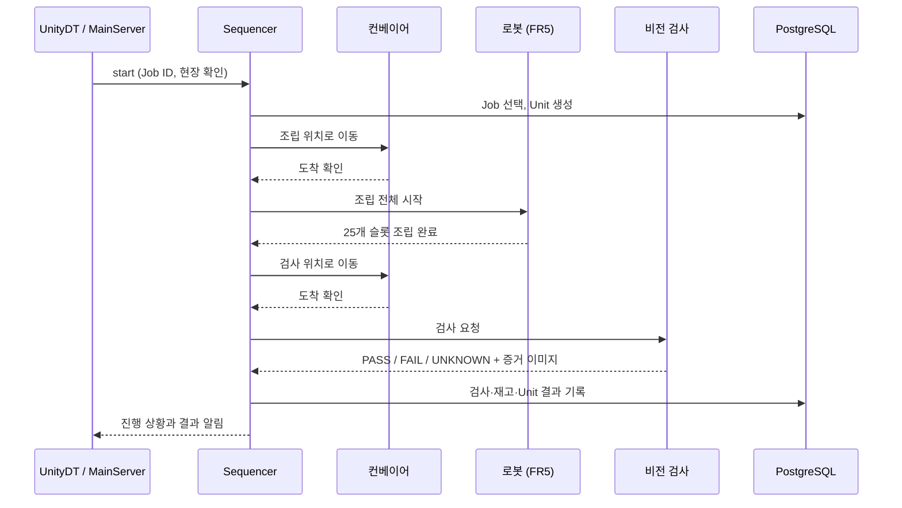
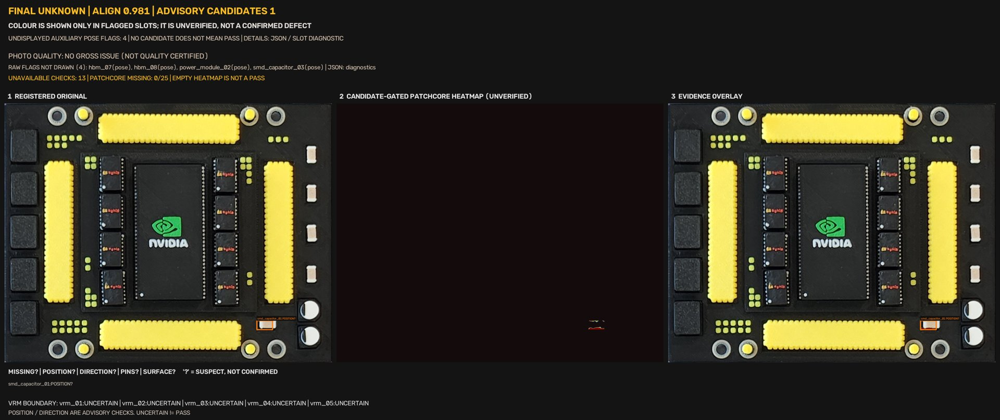

# Assembly Sequencer · 생산 공정 지휘자

> 등록된 생산 작업을 실제 조립·검사로 옮기는 ROS 2 노드입니다. 무엇을 언제 시작할지 정하고, 설비에 순서대로 지시하고, 결과를 데이터베이스에 기록합니다.

## 역할

오케스트라 지휘자에 비유할 수 있습니다. 직접 악기를 연주(로봇 관절 제어)하지 않고, **누가 언제 들어올지 순서를 정하고 연주가 제대로 끝났는지 확인**합니다.

- 대기 중인 작업(Job) 하나를 골라 실행을 시작합니다.
- 보드 한 장의 생산 시도(Unit)를 만들고 상태를 관리합니다.
- 컨베이어 → 로봇 → 컨베이어 → 비전 검사 순서로 설비에 요청합니다.
- 각 설비의 **실제 완료·실패·시간 초과**를 확인해 다음 단계로 넘어갑니다.
- 조립·검사·재고 결과를 PostgreSQL에 기록합니다.

화면 표시, HTTP 요청 처리, 좌표 계산, 로봇 하드웨어 제어는 하지 않습니다.

## 먼저 알아 둘 용어

| 용어 | 뜻 |
|---|---|
| **Job** | 작업자가 등록한 생산 요청. 예: "이 보드를 PASS 3장 만들어 주세요" |
| **Unit** | 보드 한 장을 실제로 만드는 한 번의 시도. 검사 불합격 후 다시 만들어도 이전 시도 기록이 남습니다 |
| **Recipe** | 어떤 부품을 어느 슬롯에 어떤 순서로 조립할지 정의한 파일 (`assembly-r1.yaml`) |
| **Mock / Real** | Mock은 시뮬레이션 설비, Real은 실제 로봇·컨베이어·비전 서버와 연결하는 모드 |

## 공정 흐름



각 화살표는 앞 단계가 **실제로 끝난 것을 확인한 뒤에만** 진행합니다. 요청이 접수됐다는 응답만으로는 다음 단계로 넘어가지 않습니다.



*비전 서버가 돌려준 검사 리포트 이미지 예시(원본 · 이상 탐지 히트맵 · 증거 오버레이). Sequencer는 이 이미지를 조각 단위로 받아 크기와 SHA-256 해시를 검증한 뒤 판정 JSON과 함께 보관합니다. 이 예시의 판정은 `UNKNOWN`이며, 확정되지 않은 결과는 합격으로 취급하지 않습니다.*

## 설계에서 신경 쓴 점

1. **완료는 확인될 때만 완료**
   로봇이 "조립 완료"를 보내면 실행 ID, 25개 슬롯 목록, 조립 계획 해시까지 대조합니다. 요청 수락이나 개별 동작 완료를 전체 완료로 착각하지 않습니다.
2. **한 번에 하나의 작업**
   동시에 실행 중인 Job은 하나뿐입니다. 이 규칙은 코드뿐 아니라 데이터베이스 제약으로도 보장합니다.
3. **불확실하면 멈춘다**
   시간 초과나 결과가 불분명한 상황은 안전 정지(`SAFETY_STOP`)로 알리고 자동 재시도하지 않습니다. 검사 결과가 `UNKNOWN`이면 합격으로 바꾸지 않고 작업을 실패로 끝냅니다.
4. **불량이 나오면 사람이 판단**
   검사 불합격이 확정되면 Job을 일시정지(`PAUSED`) 상태로 두고, 작업자가 재개나 취소를 결정할 때까지 다음 보드를 만들지 않습니다.
5. **저수준 제어 금지**
   로봇 SDK나 드라이버를 직접 호출하지 않고 설비가 공개한 API만 사용합니다. 이 원칙은 테스트로 회귀를 검사합니다.

## 기술 스택

| 분야 | 사용 기술 |
|---|---|
| 런타임 | ROS 2 Jazzy, Python 3 (`rclpy`) |
| 데이터 | PostgreSQL (`psycopg` 3) |
| 설정 | YAML 레시피 |
| 인터페이스 | 자체 ROS 인터페이스 `vision_interfaces` (메시지 4종, 서비스 3종) |
| 테스트 | pytest (단위 + DB 통합) |

## 폴더 구조

```text
ASSEMBLY_SEQUENCER/
├── API.md                         # ROS service·topic 계약
├── DIRECT_API_TEST.md             # 컨베이어·비전 API 직접 점검 절차
├── tools/                         # 직접 점검 스크립트, 검사 결과 다운로드
└── src/
    ├── assembly_sequencer/
    │   ├── assembly_sequencer/
    │   │   ├── sequencer_node.py  # Job·Unit 흐름의 중심 노드
    │   │   ├── recipe_contract.py # 요청·상태·레시피 검증
    │   │   ├── mock_backend.py    # Mock 설비 연결
    │   │   ├── real_backend.py    # 실제 로봇·컨베이어·비전 연결
    │   │   ├── api_contracts.py   # Real 설비 API 주소·형식·대기 시간
    │   │   └── db/                # 생산 DB 기록
    │   ├── config/recipes/assembly-r1.yaml
    │   └── test/
    └── vision_interfaces/         # 비전 검사 msg·srv 정의
```

## 외부와 주고받는 방법

| 방향 | 이름 | 형식 |
|---|---|---|
| 요청 받기 | `/unity/assembly/start` | ROS service, JSON 명령 (`status`, `start`, `pause`, `resume`, `cancel` 등) |
| 결과 알리기 | `/unity/assembly/feedback` | ROS topic, JSON 진행 상황 |
| Real 설비 호출 | `/real/*`, `/conveyor/*`, `/vision/inspection/*` | 다른 팀 설비가 제공하는 ROS API |

자세한 형식은 [Assembly Sequencer ROS API](API.md)를 참고하세요.

## 실행과 테스트

실행은 [최상단 실행 절차](../README.md#실행)의 `assembly_mock` / `assembly_real` 런치를 사용합니다.

```bash
cd ASSEMBLY_SEQUENCER
# DB 통합 테스트는 이름이 _test로 끝나는 전용 DB가 필요합니다.
PRODUCTION_DB_TEST_DSN="dbname=<name>_test" python3 -m pytest src/assembly_sequencer/test -q
```

## 관련 문서

- [시스템 아키텍처](../docs/architecture/index.md)
- [공개 API 목록](../README.md#공개-api)
- [production 데이터 설계](../DATA_STATION/DB/README.md)

---

## 구현 상세

<details>
<summary>실행 경계</summary>

Sequencer는 생산 공정을 조정하고 로봇 실행기는 조립 내부 순서를 소유합니다.
Real은 YAML을 읽거나 개별 MoveJoint·Pick·Place를 실행하지 않습니다.
공정 책임은 **컨베이어 조립 위치 이동 → 로봇 전체 Start → 컨베이어 검사 위치 이동 → 검사**입니다.
로봇의 준비 촬영·계획 생성·Pick/Place는 전체 Start 내부 책임이며, 외부 단계로 재실행하지 않습니다.
검사 후 로봇 PCB 이송·배출은 이 공정의 필수 조건이 아닙니다.
Real은 새 현장 확인을 포함한 명시적 `start`에서 준비 상태와 생산 슬롯을 검증한 뒤 Job을 claim하고
네 단계를 순서대로 실행합니다. 준비 실패는 claim 전에 `NOT_READY`로 반환합니다.
PENDING Job만으로 자동 기동하지 않으며, 다음 Unit에도 새 실행 ID와 현장 확인이 필요합니다.
Mock은 기존 YAML 실행 경로를 사용하며, 통신·timeout·실제 완료 판정은 backend가 완결합니다.

Job·Unit, 수량, 검사 FAIL, 재시작과 안전정지의 공통 의미는 [시스템 아키텍처](../docs/architecture/index.md)가 소유합니다.

</details>

<details>
<summary>모듈 책임과 Real backend</summary>

`sequencer_node.py`는 Job·Unit 흐름과 Mock YAML 실행을, `recipe_contract.py`는
공통 요청·상태 검증과 Mock 레시피 검증을 소유합니다.
`mock_backend.py`는 Mock 동작 완료와 Unity 컨베이어 신호 대기·난수 검사를 소유합니다.
Mock YAML의 `before_all`·`per_step`·`after_all`은 필수 동작과 순서까지 검증합니다.
Mock 컨베이어 피드백은 이동마다 Job·Unit·이동 UUID를 대조합니다.
Real 컨베이어는 수락된 motion_id와 서버 instance·도착 상태를 대조합니다. 외부에서 이미 완료된 이동을 현재 Job·Unit에 연결하거나 재사용하는 기능은 없습니다.

`real_backend.py`는 `/real/robot/status`와 `/real/assembly/status`의 생산 v2 capability를
조회하고 컨베이어 이동·도착 대기, 로봇 전체 Start와 Vision ROS 검사 경계를 소유합니다.
Sequencer가 `execute_assembly()`를 호출하면 단일 Start를 발행하고 실행 식별자가 일치하는
진행·전체 완료·실패를 기다립니다.
요청을 `DEFECT_IMAGE_ROOT/executions/<unit_id>/request.json`에 발행 전에 저장하고,
소비한 callback snapshot을 `events.jsonl`에 남깁니다. 이 로그는 모든 원격 event의 무손실 보관을 보장하지 않습니다.
전체 완료는 25개 슬롯 집합·생산 식별자·정지·복구 해제·non-SMD/SMD 계획 해시를 검증합니다.
수락·개별 동작 완료는 전체 완료가 아니며, event 없는 거절과 서버 변경도 처리합니다.
1800초 전체 완료 timeout 또는 전송 후 불명확한 결과는 `SAFETY_STOP`으로 전달합니다.
로봇 개별 동작 publisher, 동작별 재전송, 취소형 Pause 연결과 로컬 파지 상태는 없습니다.
생산 v2 Pause/Resume/Cancel은 로봇 조립 중 연결되어 있습니다. 일시정지는 전달된 동작 종료 후 확인하며, 제어 ID와 실제 상태를 대조합니다. 취소를 상태 보존형 일시정지로 표현하지 않습니다.
Unity의 실측·Ghost·부품 이벤트 수신과 수동 로봇 조작은 이 제거 범위에 포함되지 않습니다.

</details>

<details>
<summary>Runner의 SDK·저수준 제어 금지</summary>

Real runner와 Real backend는 로봇 SDK, 드라이버 서비스, 직접 IO, 장비 소켓 또는
외부 프로세스를 통한 저수준 제어를 사용하지 않습니다. TCP·IK·그리퍼 세부 동작은
로봇 PC가 소유합니다. Sequencer는 기존 장비 공개 API의 의미 단위 완료만 기다립니다.
API 부재·실패·timeout 시 직접 제어로 우회하지 않고 실행을 거절하거나 보류합니다.
기존 Mock 내부 서비스는 이 Real 장비 제어 경로와 별개입니다.
기존 테스트에서 Real backend의 import·ROS endpoint 허용 목록과 저수준 호출 부재를 검사합니다.
이는 코드 회귀 검사이며 운영체제 수준의 네트워크 접근 차단을 뜻하지 않습니다.

Mock·Real 공개 실행 진입점은 [최상단 실행 절차](../README.md#실행)를 따릅니다. Real 런치는 MoveIt과 `ros2_control`을 시작하지 않습니다.

</details>

<details>
<summary>Real 연결 설정</summary>

Real 검사는 `vision_interfaces`의 submit/get/get_image 서비스와 health를 사용합니다.
시작 전 서버 가용성을 확인하고, 검사 위치 도착 후 촬영 준비 조건을 확인합니다.
`DEFECT_IMAGE_ROOT`는 실행 원문과 검사 자료를 보존할 공유 저장소입니다.
생산 DB에는 제품·버전·25개 슬롯과 실제 재고가 준비되어 있어야 합니다. 테스트 성공 기록에서
재고를 추정하거나 생성하지 않습니다. `fr5_interlock_required=false`는 제공 서버의 미사용 계약을
따르며, true일 때만 FR5 clear와 freshness를 요구합니다. 누락·잘못된 형식은 준비 실패입니다.

</details>

<details>
<summary>검사 자료 저장 경계</summary>

검사 저장은 Unit 실행 완료가 아닙니다. 전체 workflow 성공 뒤 `DbWriter.unit_completed(unit_id)`를 기록하고 `flush()`를 확인한 후 다음 Unit 또는 Job 완료로 진행합니다. 실패 시 이미 저장된 검사 자료는 유지합니다.

`RealBackend.inspect_unit()`은 ROS 비동기 서비스로 검사 요청·완료 조회·PNG 조각 수신을 수행합니다.
같은 Job·Unit은 같은 검사 UUID를 사용하며 응답 유실 시 같은 ID를 조회합니다.
PNG의 식별자·offset·전체 크기·SHA256을 검증한 뒤 기존 DB writer에 전달합니다.
전체 조립 완료 기록과 검사 위치 도착을 확인한 뒤 호출합니다.

기존 `DbWriter.inspection_recorded(unit_id, result, defects, image_path=None)`는
선택적 `inspection`, `image_bytes` 키워드 인자로 Vision 자료를 받을 수 있습니다.
이 경우 `result`는 원본 decision, `defects=None`, `image_path=None`으로 전달합니다.
`flush()`가 성공해야 저장 완료이며, 하위 `production_store.record_inspection()`의
동기 반환값은 `slot_code`와 `unit_defect_id`의 매핑 목록입니다.
생산 lifecycle은 고정된 프로세스 모드와 같은 DB만 사용하며 Vision 자료 저장은 Real 프로세스·DB만 허용합니다.

Unit당 재검사는 허용하지 않습니다. 같은 내용은 기존 UID를 복구하고 다른 내용은 거절합니다.
모든 제품 슬롯을 검사 JSON과 대조하고, 확정 불량 없는 슬롯은 `defect_type=NULL`로 저장합니다.
`UNKNOWN`은 원본 검사 증거를 저장한 후 `INSPECTION_UNKNOWN`으로 Job·Unit을 실패 종료합니다. 확정 불량이나 PASS로 변환하지 않고 발행 대기를 만들지 않습니다.
제품 슬롯 수는 DB 구성과 정확히 일치해야 하며 누락된 검사 상세를 만들어 넣지 않습니다.

`DEFECT_IMAGE_ROOT` 아래 `inspections/<unit_id>/response.json`에 원본 응답,
`result.json`에 원본 `data`와 `unit_defects` UID 매핑, `02_annotated_report.png`에 이미지를 보관합니다.
파일은 DB commit보다 먼저 준비하며 조회자는 UID를 DB와 대조합니다.
DB rollback 뒤 파일은 삭제하지 않고 같은 요청으로 복구합니다.
파일 보관과 데이터베이스를 함께 백업해야 기존 결과 비교와 UID 연결을 보존할 수 있습니다.

확정 코드 `COMPONENT_MISSING`은 `MISSING`, `DIRECTION_ERROR`는 `ORIENTATION_ERROR`로 대응합니다.
`SEATING_ERROR`, `UNCLASSIFIED_ANOMALY`는 같은 이름으로 저장합니다.
원본 코드는 JSON에 유지하며 미지원 코드·한 슬롯의 여러 확정 유형은 자동 축약하지 않고 거절합니다.
이미지 미준비 FAIL은 결과를 보존하지만 대책서 발행 대기는 생성하지 않습니다.

</details>

<details>
<summary>Real API 선언 관리와 제어 복구</summary>

`src/assembly_sequencer/assembly_sequencer/api_contracts.py`는 Real에서 소비하는 endpoint·schema·통신 대기 시간과 조회 주기의 단일 원본입니다. RealBackend가 직접 참조하며 동작·완료 판정은 기존 backend에 유지합니다. 같은 책임의 APIManager·Registry·별도 설정 원본을 추가하지 않습니다. 계약 교체 시 대체된 참조·호환 분기와 문서를 함께 제거합니다. 제공자가 사용하는 버전 문자열은 유지하며 버전 번호만으로 레거시를 판단하지 않습니다.

Real 제어 결과 재확인은 기존 주기 작업이 담당하며 UI 상태 조회 유무에 의존하지 않습니다. 상태 조회는 실행 중 취소의 DB 확정이나 제어 대기 해제를 수행하지 않습니다. Sequencer가 모든 취소 경로의 생산 종료 반영을 한곳에서 처리하고, RealBackend는 장비 결과의 동일성 검증과 정지 확인을 담당합니다. 비동기 조회 중 교체된 실행·제어에 이전 응답을 적용하지 않습니다.

</details>
