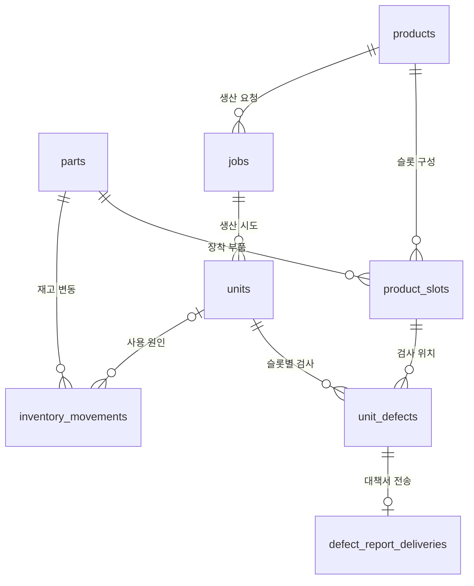

# DATA_STATION · 생산 데이터베이스 설계

> 무엇을 만들었고, 어떤 부품을 썼고, 검사에서 무엇이 나왔는지를 기록하는 PostgreSQL 스키마입니다.

## 역할

`DATA_STATION/DB`는 실행 프로그램이 아니라, **MainServer와 Assembly Sequencer가 함께 지키는 데이터 약속**입니다. 두 프로그램이 같은 데이터베이스를 쓰기 때문에, 어떤 테이블에 무엇을 어떤 규칙으로 저장할지를 한곳에서 정의합니다.

- 생산 요청, 생산 시도, 검사 결과, 재고 변동을 기록하는 테이블 구조
- 잘못된 데이터가 들어오지 못하게 막는 제약조건
- 프로그램별로 필요한 만큼만 허용하는 권한
- 기존 데이터를 보존하면서 구조를 바꾸는 migration
- 로컬 Mock 실행용 샘플 데이터

## 데이터 구조

| 테이블 | 쉽게 말하면 |
|---|---|
| `products` | 만들 제품과 버전 (예: HBM Accelerator Package Board) |
| `parts` | 부품 종류와 현재 재고 |
| `product_slots` | 제품의 어느 자리(슬롯)에 어떤 부품이 들어가는지. 이 보드는 25개 슬롯 |
| `jobs` | 작업자가 등록한 생산 요청과 목표 PASS 수량 |
| `units` | 보드 한 장을 실제로 만든 한 번의 시도와 조립·검사 결과 |
| `unit_defects` | Unit의 슬롯별 검사 기록. 불량이 없으면 불량 유형이 비어 있습니다 |
| `inventory_movements` | 재고가 언제, 왜 늘거나 줄었는지 남기는 원장 |
| `defect_report_deliveries` | 확정 불량마다 불량대책서 전송 상태와 재시도 기록 |

## 설계에서 신경 쓴 점

1. **요청(Job)과 시도(Unit)를 분리**
   검사에서 불합격한 보드를 다시 만들어도 요청 수량과 모든 시도 이력이 그대로 남습니다. 목표 수량은 "시도 횟수"가 아니라 "PASS 개수"입니다.
2. **규칙을 데이터베이스가 직접 지킴**
   "동시에 실행 중인 작업은 하나" 같은 규칙을 프로그램 코드에만 맡기지 않고 DB 제약조건으로 보장합니다. 프로그램에 버그가 있어도 잘못된 상태가 저장되지 않습니다.
3. **최소 권한**
   조회 전용(`datastation_reader`), 작업 등록(`job_submitter`), 실행 기록(`production_writer`) 역할을 나눕니다. MainServer는 작업을 등록할 수 있지만 실행 결과를 고칠 수 없습니다.
4. **Mock DB와 Real DB 혼동 방지**
   DB마다 `app.runtime_mode`(mock/real)를 설정하고, 프로그램이 연결할 때마다 자신의 모드와 비교해 다르면 쓰기 전에 차단합니다.
5. **저장하지 않는 것도 정함**
   로봇 좌표, 실시간 영상, 레시피 본문 같은 데이터는 DB에 복제하지 않고 각 담당 시스템에 둡니다.

## 파일 구성

| 파일 | 용도 |
|---|---|
| `DB/production_schema.sql` | 신규 DB의 기준 스키마 |
| `DB/005_roles.sql` | 역할과 권한 |
| `DB/006`~`010_*_migration.sql` | 기존 DB 구조 변경 (번호 순서대로 적용) |
| `DB/002_query_samples.sql` | 조회 예제 |
| `DB/003_smoke_test.sql` | 적용 후 기본 검증 |
| `DB/004_mock_seed.sql`, `DB/005_mock_sample_data.sql` | 로컬 Mock 실행용 데이터 |
| `DB/diagrams/` | DBML·draw.io 도식, [자동 생성 스키마 문서](DB/diagrams/db-schema.generated.md) |
| `DB/tbls.yml` | [tbls](https://github.com/k1LoW/tbls) 스키마 문서 생성 설정 |

## 기술 스택

PostgreSQL · SQL (DDL·제약조건·역할) · DBML · tbls

## 관련 문서

- [production 데이터 설계 상세](DB/README.md): 불변 조건, 쓰기 권한, 변경·검증 절차
- [시스템 아키텍처](../docs/architecture/index.md)
