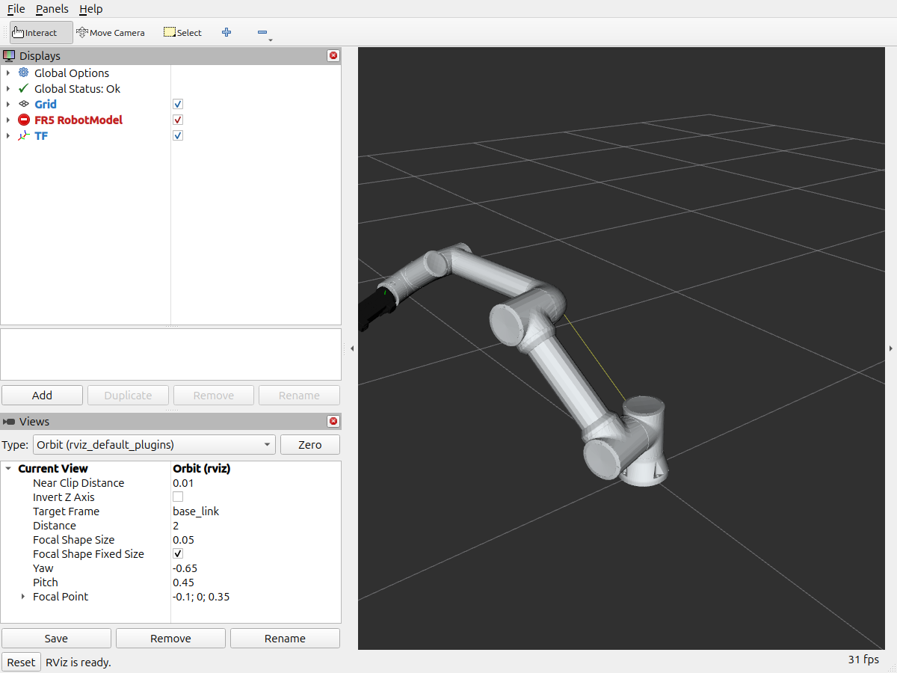
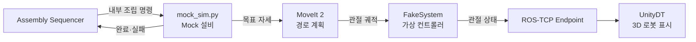

# Farino_AIO_Mock · FR5 로봇 구성과 Mock 설비

> FAIRINO FR5 협동로봇의 3D 모델·동작 계획 설정을 담고, 실제 설비 없이 조립 공정을 재현하는 **Mock 설비**를 제공하는 ROS 2 워크스페이스입니다.



*ROS 2 시각화 도구 RViz에 불러온 FR5 로봇 모델.*

## 역할

실물 로봇은 한 대뿐이고, 잘못된 명령은 장비 파손이나 안전사고로 이어질 수 있습니다. 그래서 이 워크스페이스는 **소프트웨어 전체를 시뮬레이션으로 먼저 검증**할 수 있게 합니다.

- FR5 로봇의 3D 모델과 관절 구조를 제공합니다.
- 충돌 없이 목표 자세까지 가는 경로를 계산하는 MoveIt 2 설정을 제공합니다.
- 실제 로봇 대신 명령을 받아 움직이는 **Mock 로봇**을 실행합니다.
- Real 연결에 필요한 FAIRINO 하드웨어 인터페이스와 메시지 정의를 포함합니다.

작업 선택, 생산 순서, HTTP 요청, 생산 DB 기록은 담당하지 않습니다.

## 쉽게 풀어 본 핵심 개념

| 개념 | 쉬운 설명 |
|---|---|
| **URDF** | 로봇의 뼈대(링크)와 관절, 겉모양을 적은 설계도 파일 |
| **MoveIt 2** | "손끝을 여기로 옮겨라"라는 목표를 받아, 부딪히지 않는 관절 움직임 경로를 계산하는 ROS 라이브러리 |
| **역기구학 (IK)** | 손끝 위치에서 거꾸로 각 관절 각도를 구하는 계산 |
| **TCP** | 공구 끝점(Tool Center Point). 그리퍼가 실제로 부품을 잡는 기준점 |
| **ros2_control FakeSystem** | 실제 모터 대신 명령받은 관절 값을 그대로 따라가는 가상 하드웨어 |

## Mock 설비는 이렇게 동작합니다



1. Sequencer가 "이 부품을 집어 이 슬롯에 놓아라" 같은 의미 단위 명령을 보냅니다.
2. `mock_sim.py`가 MoveIt 2로 경로를 계산하고 가상 컨트롤러로 실행합니다.
3. 관절 상태가 Unity로 전달되어 3D 로봇이 똑같이 움직입니다.
4. 동작이 실제로 끝났을 때만 완료를, 계획 실패나 시간 초과는 실패를 돌려줍니다.

Mock에서도 "요청 접수"를 성공으로 취급하지 않습니다. Real에서 지원하지 않는 기능은 임시로 성공 처리하지 않고 명시적으로 실패합니다.

## 구성

| 패키지·폴더 | 내용 |
|---|---|
| `src/fairino_description` | FR 시리즈 URDF 모델과 3D 메시 (이 셀은 `fairino5_v6` 사용) |
| `src/fairino5_v6_moveit2_config` | MoveIt 2 설정(관절 한계·충돌 모델·컨트롤러), launch 파일, Mock 실행기 설치 |
| `src/fairino_hardware_v3_9_7` | FAIRINO SDK 기반 `ros2_control` 하드웨어 인터페이스 |
| `src/fairino_msgs` | 로봇 원격 명령·상태 메시지와 서비스 정의 |
| `src/mock_db_mvp` | Mock 조립 내부 토픽 이름공간용 패키지 |
| `notebooks/mock_sim.py` | Mock 설비 본체 (MoveIt 기반 의미 단위 동작 실행) |
| `notebooks/Twin_Visual.py` | Unity 목표를 MoveIt에서 검증해 직선 이동 미리보기 경로 반환 |
| `notebooks/` 기타 | 카메라-로봇 좌표 보정(ArUco 마커, Kabsch 알고리즘), HSV 색상 기반 물체 인식 pick & place 실험 |

## 기술 스택

ROS 2 Jazzy · MoveIt 2 · ros2_control · URDF/xacro · C++ (하드웨어 인터페이스) · Python · OpenCV (보정 실험)

## 실행

Mock 전체 구성은 [최상단 실행 절차](../README.md#실행)의 `assembly_mock` 런치가 이 워크스페이스의 MoveIt 데모와 `mock_sim.py`를 함께 시작합니다. ROS domain은 `42`입니다.

## 관련 문서

- [시스템 아키텍처](../docs/architecture/index.md)
- [공개 API 목록](../README.md#공개-api)
- [Assembly Sequencer](../ASSEMBLY_SEQUENCER/README.md)

---

## 운영 참고

<details>
<summary>Mock 실행 환경 (DB 준비·권한)</summary>

저장소 루트에서 DB와 역할 권한을 먼저 적용합니다. 기존 DB는 migration을, 신규 DB는
기준 DDL을 사용합니다. `DB_ADMIN_DSN`은 DDL과 역할 변경 권한이 있는 운영용 접속
문자열이며 애플리케이션에 전달하지 않습니다.

기존 DB:

```bash
psql "$DB_ADMIN_DSN" -f DATA_STATION/DB/007_defect_report_delivery_migration.sql
psql "$DB_ADMIN_DSN" -v ON_ERROR_STOP=1 -f DATA_STATION/DB/008_vision_slot_results_migration.sql
psql "$DB_ADMIN_DSN" -v ON_ERROR_STOP=1 -f DATA_STATION/DB/009_unit_execution_completion_migration.sql
psql "$DB_ADMIN_DSN" -f DATA_STATION/DB/005_roles.sql
```

신규 Mock DB:

```bash
psql "$DB_ADMIN_DSN" -f DATA_STATION/DB/production_schema.sql
psql "$DB_ADMIN_DSN" -f DATA_STATION/DB/004_mock_seed.sql
psql "$DB_ADMIN_DSN" -f DATA_STATION/DB/005_roles.sql
```

DB 관리자는 접속 대상이 **Mock 전용 DB인지 먼저 확인**하고 환경을 지정합니다.
다음 명령은 접속한 DB에 적용되므로 Real DB에 실행하지 않습니다.

```bash
psql "$DB_ADMIN_DSN" <<'SQL'
SELECT format('ALTER DATABASE %I SET app.runtime_mode = %L', current_database(), 'mock') \gexec
SQL
```

MainServer·Sequencer는 `pg_db_role_setting`의 DB 전체 설정을 검사합니다.
세션 옵션으로 환경 식별값을 대신할 수 없으며, 미설정·불일치면 쓰기 전에 연결을 닫습니다.
애플리케이션 계정에는 DB 소유자·관리자 권한을 부여하지 않습니다.
Mock 계정의 Real DB 접근 및 실제 설비망 접근은 배포 관리자가 별도로 차단해야 합니다.

최상단 Mock Assembly 런치는 자식 프로세스에 `ROS_DOMAIN_ID=42`를 지정합니다.
외부 ROS CLI도 `export ROS_DOMAIN_ID=42`를 사용합니다.
불량 보고 프로세스를 개별 실행할 때도 `export MAIN_SERVER_MODE=mock`을 지정합니다.
HTTP health 외 요청에는 `X-Runtime-Mode: mock` 헤더가 필요합니다.

실행 전에 `PRODUCTION_DB_DSN`은 `production_writer`, `MAIN_SERVER_DB_DSN`은
`job_submitter` 권한을 상속한 배포 계정으로 export해야 합니다.
두 DSN은 서로 다른 비슈퍼유저 계정을 사용하고, 각 계정에는 해당 역할만 부여합니다.
두 역할 모두 production 테이블을 조회할 수 있지만 쓰기 권한은 분리됩니다.
계정에 반대 역할, 테이블 소유권 또는 별도 쓰기 권한을 부여하면 이 제한을 우회할 수 있습니다.

</details>

<details>
<summary>Mock 로봇 보정값과 동작 정책</summary>

Mock의 손목→TCP 기본 보정은 현재 Unity의 단축된 그리퍼에 맞춘
FLU 기준 `(-0.115, 0, 254.364536) mm`, 회전 `(0, 0, 0)°`입니다.
URDF 원본의 공구 길이나 Real 현장 보정값과 혼용하지 않습니다.
PTP 접근은 현재 관절값으로 IK를 요청한 뒤 관절 목표로 계획하며,
현재 J5에서 90°를 초과해 벗어나는 궤적은 실행 전에 거절합니다.
이는 현재 조립의 손목 자세를 유지하는 Mock 정책이며 설비 안전 인증을 대신하지 않습니다.

Mock 수동 명령은 Unity가 상태 service의 모드를 확인한 뒤 발행합니다.
Mock 실행기는 arm·gripper trajectory 전송 전에 활성 FakeSystem 구성을 확인합니다.
동일 도메인에 별도 controller manager나 동일 이름의 실행 서버를 중복 배치하지 않습니다.
검증 실패·timeout은 자동 명령 재시도 없이 로그와 호출자 오류로 전달합니다.

</details>

<details>
<summary>불량대책서 생성과 이메일 설정</summary>

올인원 실행은 대책서를 기본 로컬 모드로 생성합니다. 기본 저장 위치는
`MAIN_SERVER/reports/defects`이며 SMTP 설정 없이 동작합니다.
`DEFECT_REPORT_OUTPUT_DIR`을 변경하면 MainServer와 생성기에 같은 경로를 전달해야 합니다.
두 프로세스는 문서 파일을 읽을 수 있는 같은 운영 계정으로 실행합니다.

이메일은 기본 비활성입니다. 이후 명시적으로 활성화할 때 아래 변수를 launch 프로세스에 전달합니다.
SMTP 비밀번호 파일은 배포 secret으로 만들고 소유자 읽기만 허용하며 저장소에 두지 않습니다.

| 변수 | 필수/기본값 | 의미 |
|---|---|---|
| `DEFECT_MAIL_ENABLED` | `false` | 기본 로컬 생성, `true`일 때 이메일 모드로 실행 |
| `DEFECT_REPORT_OUTPUT_DIR` | `MAIN_SERVER/reports/defects` | 생성기·MainServer 공통 문서 보관 경로 |
| `DEFECT_MAIL_HOST` | 활성 시 필수 | SMTP 서버 |
| `DEFECT_MAIL_SECURITY` | `ssl` | `ssl` 또는 `starttls` |
| `DEFECT_MAIL_PORT` | SSL `465`, STARTTLS `587` | SMTP 포트 |
| `DEFECT_MAIL_FROM` | 활성 시 필수 | 발신 주소 |
| `DEFECT_MAIL_TO` | 활성 시 필수 | 쉼표로 구분한 수신 주소 |
| `DEFECT_MAIL_ALLOWED_DOMAINS` | 활성 시 필수 | 수신 허용 도메인 목록 |
| `DEFECT_MAIL_USERNAME` | 선택 | SMTP 인증 사용자 |
| `DEFECT_MAIL_SECRET_FILE` | 인증 시 필수 | 권한 `0600`인 비밀번호 파일 |
| `DEFECT_IMAGE_ROOT` | `UnityDT/Assets/StreamingAssets` | 검사 JSON·이미지 허용 루트. Vision 저장 호출 시 명시 필수 |
| `DEFECT_IMAGE_MAX_BYTES` | `10485760` | 문서에 포함할 이미지 상한 |
| `DEFECT_MAIL_MAX_ATTACHMENT_BYTES` | `10485760` | XLSX 첨부 상한 |
| `DEFECT_MAIL_TIMEOUT_SECONDS` | `10` | SMTP timeout |
| `DEFECT_MAIL_POLL_SECONDS` | `2` | 대기 DB poll 간격 |
| `DEFECT_MAIL_MAX_ATTEMPTS` | `10` | 최종 실패 전 전송 시도 횟수 |

활성 예시는 실제 비밀값을 환경 변수에 노출하지 않습니다.

```bash
export DEFECT_MAIL_ENABLED=true
export DEFECT_MAIL_HOST=smtp.example.com
export DEFECT_MAIL_FROM=quality@example.com
export DEFECT_MAIL_TO=owner@example.com
export DEFECT_MAIL_ALLOWED_DOMAINS=example.com
export DEFECT_MAIL_USERNAME=quality@example.com
export DEFECT_MAIL_SECRET_FILE=/run/secrets/defect_smtp_password

# 공개 실행 명령은 최상단 README의 실행 절차를 사용합니다.
```

확정 불량 한 건 또는 전체를 로컬 생성하는 기존 진입점:

```bash
# MAIN_SERVER_MODE와 MAIN_SERVER_DB_DSN은 대상 DB에 맞게 설정한 상태
python3 MAIN_SERVER/generate_defect_reports.py --unit-defect-id 42
python3 MAIN_SERVER/generate_defect_reports.py --once
```

`--watch`는 2초 간격으로 확인하며 이미 존재하는 파일은 건너뜁니다.
`--mode email`을 명시할 때만 기존 SMTP 설정을 읽고 발송합니다.
로컬 생성 실패는 로그로 남고 watch에서 재시도합니다. 단일 실행 실패는 비정상 종료합니다.

검증은 메일 서버 없이 다음 self-check로 수행합니다. 실제 SMTP 전송은 승인된 테스트
수신 주소로 별도 확인합니다.

```bash
python3 MAIN_SERVER/generate_defect_reports.py --self-check
```

</details>

<details>
<summary>Real 실행 환경과 명령 계약</summary>

Real 통신 프로세스와 외부 ROS CLI는 `ROS_DOMAIN_ID=5`를 사용합니다.
최상단 Real 런치는 자식 프로세스에 5를 지정합니다. MainServer는 `MAIN_SERVER_MODE=real`과 관리자 설정
`app.runtime_mode=real`인 전용 DB를 사용합니다. 위 SQL은 확인한 Real DB에 한해서
환경 값을 `real`로 지정하여 사용합니다.

공통 Sequencer 실행 파일은 `sequencer_node`입니다. 최상단 Mock·Real Assembly 런치가
각각 `ASSEMBLY_SEQUENCER_MODE=mock`, `ASSEMBLY_SEQUENCER_MODE=real`을 고정합니다.
Real은 `start_endpoint:=false`로 이미 실행 중인 endpoint를 재사용할 수 있습니다.
Real Sequencer도 `PRODUCTION_DB_DSN`을 요구하고 관리자 설정이 Real인 DB만 사용합니다.
Real Sequencer는 로컬 YAML을 사용하지 않으며 Real 런치는 `recipe` 인자를 제공하지 않습니다.
Real 런치는 MoveIt·`ros2_control`·로봇 드라이버를 시작하지 않고 외부 장비 서버의 공개 API만 소비합니다.

`/fairino_remote_command_service`의 `cmd_str`는 실제 LF를 포함한 `real\n` 접두사 뒤에
기존 `Function(arguments)`를 전달합니다. 누락·다른 접두사는 `MODE_MISMATCH`를 반환하고
SDK를 호출하지 않습니다. 읽기 전용 `GetRuntimeMode()`는 접두사 없이 `real`을 반환합니다.
외부 호출자도 갱신해야 하며 접두사는 인증·설비망 접근 통제를 대체하지 않습니다.

검사 자료를 공유할 때 Sequencer와 MainServer·대책서 worker의 `DEFECT_IMAGE_ROOT`는
동일한 파일을 가리키는 보관 루트여야 합니다. 서로 다른 PC에서는 공유 마운트를 사용합니다.
배포 시 보관 루트를 먼저 만들고 두 계정이 공유하는 그룹과 디렉터리 setgid를 설정합니다.
Sequencer는 파일을 `0640`으로 저장하므로 조회 계정에는 그룹 읽기와 경로 탐색 권한이 필요합니다.
기존 Mock 샘플을 유지하려면 같은 루트에서 `InspectionSamples`도 읽을 수 있어야 합니다.

</details>

<details>
<summary>안전 경계</summary>

backend는 timeout, 통신 실패와 로봇 fault를 호출자에게 전달합니다. 물리 E-Stop은 하드와이어드 안전회로가 수행하고 소프트웨어는 안전 상태 수신, 신규 명령 차단과 실패 전달을 담당합니다.

</details>
