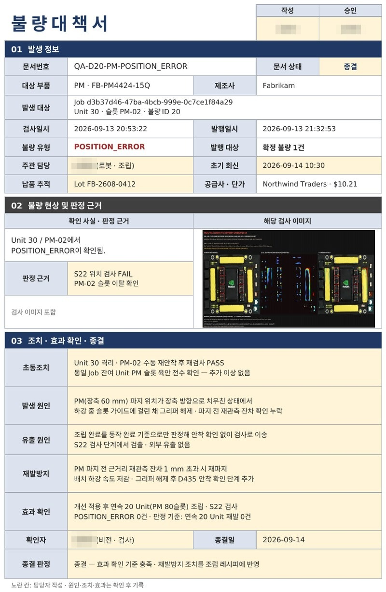

# KSMC · 비전 기반 반도체 패키지 조립·검사

### 팀 KSMC · 협동로봇 프로젝트

> **카메라로 부품을 찾고, 로봇이 조립하며, 검사 결과까지 하나의 관제 화면으로 연결합니다.**

FR5 협동로봇 · D435 조립 비전 · 컨베이어 · S22 검사 · Unity 디지털 트윈을 연동한 소형 스마트팩토리 프로젝트입니다. 직접 제작한 **반도체 패키지 모형의 6종 25개 부품**을 대상으로 작업 등록부터 조립, 검사, 결과 조회까지 연결합니다.

관리자는 Unity에서 공정을 시작·제어하고, 장비 상태와 진행 단계, 검사 결과를 확인할 수 있습니다.

### 시연 영상 · 디지털 트윈 통합관제

https://github.com/user-attachments/assets/40f07c0c-eaa9-4121-b7cc-1ee656a76587

Unity 기반 디지털 트윈과 공정·설비 상태를 확인하는 통합관제 시연 영상입니다.

<!-- 추가 실물 조립 영상: GitHub에 업로드한 영상 URL을 이 자리에 단독 줄로 삽입하세요. -->


---

## 1. 팀 구성 및 역할

| 담⁠당⁠자 | 담당 파트 | 주요 기여 |
| :---: | :---: | --- |
| 손⁠영⁠빈<br>(⁠팀⁠장⁠) | 로봇 ·<br>조립 비전 | FR5 · ROS 2 제어, D435 · YOLO segmentation · OpenCV 인식, Hand–Eye 좌표 변환, 부품별 조립 · SMD 재관측 |
| 박⁠태⁠진 | 하드웨어 | 공정 배치, 부품 트레이 · 기판 모형 설계 및 3D 출력, 그리퍼 핑거 · 카메라 브래킷 구성 |
| 임⁠현⁠찬 | 검사 비전 ·<br>컨베이어 | S22 촬영, YOLO · PatchCore · OpenCV 기반 검사, 컨베이어 이송 · 정지, GoPro 영상 연동 |
| 김⁠현⁠수 | Main · GUI ·<br>디지털 트윈 · DB | Unity 관제, MainServer, 공정 순서 제어, PostgreSQL 작업 · 검사 이력 관리 |

## 2. 프로젝트 주제

**비전 인식부터 조립·검사까지 이어지는 소형 스마트팩토리**

카메라로 기판과 트레이 부품의 실제 위치·방향을 인식하고, FR5가 계산된 좌표로 부품을 집어 배치합니다. 조립 후 기판을 검사 위치로 옮겨 촬영·검사하고, 결과를 생산 이력과 연결합니다. 컨베이어는 조립·검사 위치에 **정지한 상태**로 작업합니다.

### 조립 대상과 공정 결과

#### PACKAGE · 반도체 패키지 모형

<p align="center">
  
</p>

**6종 · 25개 부품** — 01 GPU 1 · 02 HBM 8 · 03 Power Module 4 · 04 VRM 5 · 05 Inductor 2 · 06 SMD Capacitor 5

실제 기판 사진을 바탕으로 부품 종류별 위치와 수량을 표시한 구성도입니다. [기판 원본 사진 보기](https://github.com/user-attachments/assets/01fe4664-0886-4061-999f-e36306dd532a)

#### INSPECTION · 조립 결과 확인

<p align="center">
  
</p>

S22로 촬영한 기판의 **원본 → PatchCore 히트맵 → 검사 근거 오버레이**를 나란히 확인합니다. 위 사례는 **운영 판정 FINAL PASS · 표시 후보 0건**이며, 검사 결과와 이미지는 Unity INSPECT에서 조회합니다. 히트맵 색상은 정상 기준 대비 외관 차이를 뜻하며, 그 자체가 불량 확정이나 품질 인증을 의미하지는 않습니다.

<p align="center">
  
</p>

실제 반도체 제조용 미세 조립 장비가 아닌, 로봇·비전·검사·관제의 통합을 검증하기 위한 제작 모형입니다.

## 3. 주제 선정 이유

우리는 **정해진 좌표를 반복하는 로봇을 넘어, 실제 작업물을 보고 조립하고 결과를 확인하는 시스템**을 만들고자 했습니다. 크기와 방향이 다른 패키지 모형 부품은 비전 인식·좌표 보정·여러 파지 동작을 한 공정에서 검증하기에 적합했습니다.

- **위치 변화에 대응** : 기판과 부품이 놓인 위치가 달라져도 인식 결과를 기준으로 작업 좌표를 계산합니다.
- **다양한 부품 조립** : 6종 부품별 레시피를 만들고, 작은 SMD는 근접 재관측으로 보정합니다.
- **조립 결과 확인** : 로봇의 동작 완료와 별도로 촬영·검사 공정을 구성합니다.
- **장비 간 공정 연결** : 이송·조립·검사의 실제 완료 신호를 연결하고 이력을 남깁니다.
- **팀 기술의 통합** : 하드웨어 제작, 로봇·비전, Unity·DB를 하나의 소형 공정으로 구현합니다.

## 4. 로봇 작업공간 구성

<p align="center">
  
</p>

실제 작업공간 사진에 주요 장비와 구역을 표시했습니다.

- **01 · 부품 트레이** — 조립할 부품을 준비하고, D435로 파지 위치와 방향을 인식합니다.
- **02 · FR5 협동로봇** — 인식한 좌표를 기준으로 부품을 집어 기판의 목표 위치에 배치합니다.
- **03 · 그리퍼 · D435** — 전동 그리퍼가 부품을 파지하고, 손목에 장착한 카메라가 기판·부품을 관측합니다.
- **04 · 기판 이송 구역** — 컨베이어가 기판을 조립 위치와 검사 위치 사이로 이송합니다.
- **05 · 검사 구역** — 조립을 마친 기판을 이송·정지한 뒤 카메라로 촬영해 조립 상태를 검사하고, 검사 결과를 Unity 관제 화면으로 전달합니다.
- **06 · 조립 구역** — 사진 앞쪽 첫 번째 기판이 놓인 위치입니다. 컨베이어를 정지한 뒤 기판의 위치·자세를 인식하고, FR5가 트레이의 부품을 집어 정밀 배치·조립합니다.

## 5. 사용자 요구사항 (User Requirements)

발표자료의 사용자 요구사항입니다. 필수·권장은 우선순위이며, 구현·검증 결과는 별도 항목에서 설명합니다.

| ID | 사용자 요구사항 | 우선순위 |
|---|---|---|
| UR-01 | 로봇팔은 배치할 부품을 집을 수 있어야 한다. | 필수 |
| UR-02 | 로봇팔은 조립 부품을 지정된 위치에 배치할 수 있어야 한다. | 필수 |
| UR-03 | 컨베이어 벨트는 조립 대상 패키지 기판을 작업 위치까지 운반할 수 있어야 한다. | 필수 |
| UR-04 | 컨베이어 벨트는 조립 및 검사에 필요한 지정 위치에서 일시 정지할 수 있어야 한다. | 필수 |
| UR-05 | 컨베이어 벨트는 조립이 완료될 경우 운반을 재개할 수 있어야 한다. | 필수 |
| UR-06 | 관리자는 현재 조립 및 검사 공정의 진행 상황을 확인할 수 있어야 한다. | 필수 |
| UR-07 | 관리자는 로봇팔 및 주요 장비의 연결 상태와 동작 상태를 확인할 수 있어야 한다. | 필수 |
| UR-08 | 관리자는 진행 중인 자동 작업을 일시 정지하고 재개할 수 있어야 한다. | 필수 |
| UR-09 | 관리자는 조립 완료 후 검사 결과를 정상 또는 불량으로 확인할 수 있어야 한다. | 필수 |
| UR-10 | 관리자는 수행된 작업 이력과 검사 결과를 확인할 수 있어야 한다. | 필수 |
| UR-11 | 관리자는 남은 부품 수량을 확인할 수 있어야 한다. | 권장 |
| UR-12 | 관리자는 로봇팔의 이동 경로 및 동작 계획을 확인할 수 있어야 한다. | 권장 |
| UR-13 | 카메라에 사람이 인식되면 로봇팔은 즉시 작업을 정지할 수 있어야 한다. | 권장 |

## 6. 시스템 요구사항 (System Requirements)

발표자료의 ID·기능명·요구사항·우선순위를 기준으로 정리했습니다.

| ID | SR-NAME | 시스템 요구사항 | 우선순위 |
|---|---|---|---|
| SR-01 | 부품 픽업 기능 | 로봇은 조립에 사용할 부품을 지정된 위치에서 집어야 한다. | 필수 |
| SR-02 | 부품 배치 기능 | 로봇은 조립 부품을 지정된 위치에 배치해야 한다.<br>● 부품<br>&nbsp;&nbsp;&nbsp;&nbsp;○ GPU * 1<br>&nbsp;&nbsp;&nbsp;&nbsp;○ HBM * 8<br>&nbsp;&nbsp;&nbsp;&nbsp;○ Power Module * 4<br>&nbsp;&nbsp;&nbsp;&nbsp;○ VRM * 5<br>&nbsp;&nbsp;&nbsp;&nbsp;○ Inductor * 2<br>&nbsp;&nbsp;&nbsp;&nbsp;○ SMD Capacitor * 5 | 필수 |
| SR-03 | 부품 운송 기능 | 컨베이어 벨트는 패키지 기판을 조립 위치까지 운반해야 한다. | 필수 |
| SR-04 | 작업 위치 정지 기능 | 컨베이어 벨트는 패키지 기판이 지정된 조립 위치에 도착하면 정지해야 한다. | 필수 |
| SR-05 | 작업 재개 기능 | 컨베이어 벨트는 조립이 완료되면 운반을 재개해야 한다. | 필수 |
| SR-06 | 부품 인식 기능 | AI Server는 카메라를 이용하여 패키지 기판과 조립 부품의 위치 및 방향을 인식해야 한다. | 필수 |
| SR-07 | 위치 보정 기능 | 시스템은 AI Server에서 인식한 패키지 기판의 위치 및 방향 정보를 기반으로 위치 및 회전 오차를 보정해야 한다. | 필수 |
| SR-08 | 로봇 및 장비 상태 확인 기능 | 시스템은 로봇 및 주요 장비(컨베이어 벨트, 카메라 등)의 연결 상태와 동작 상태를 관리자에게 제공해야 한다.<br>● 상태<br>&nbsp;&nbsp;&nbsp;&nbsp;○ 대기 중<br>&nbsp;&nbsp;&nbsp;&nbsp;○ 작업 중<br>&nbsp;&nbsp;&nbsp;&nbsp;○ 정지<br>&nbsp;&nbsp;&nbsp;&nbsp;○ 비상 정지<br>&nbsp;&nbsp;&nbsp;&nbsp;○ 오류 | 필수 |
| SR-09 | 조립 품질 검사 기능 | AI Server는 카메라 영상을 기반으로 조립된 부품의 상태를 검사해야 한다.<br>● 검사 항목<br>&nbsp;&nbsp;&nbsp;&nbsp;○ 부품 누락<br>&nbsp;&nbsp;&nbsp;&nbsp;○ 위치 오류<br>&nbsp;&nbsp;&nbsp;&nbsp;○ 방향 오류<br>&nbsp;&nbsp;&nbsp;&nbsp;○ 부품 크랙 | 필수 |
| SR-10 | 공정 진행 상황 확인 기능 | 시스템은 현재 진행 중인 조립 및 검사 공정의 진행 상황을 관리자에게 제공해야 한다.<br>● 진행 상황<br>&nbsp;&nbsp;&nbsp;&nbsp;○ 진행률<br>&nbsp;&nbsp;&nbsp;&nbsp;○ 처리 중인 기판 번호 | 필수 |
| SR-11 | 검사 결과 판정 기능 | AI Server는 조립 품질 검사 결과를 정상(PASS) 또는 불량(FAIL)으로 판정해야 한다. | 필수 |
| SR-12 | 공정 제어 기능 | 시스템은 관리자의 요청에 따라 자동 조립 및 검사 공정을 시작하거나 중지해야 한다. | 필수 |
| SR-13 | 작업 이력 확인 기능 | 시스템은 자동 조립 및 검사 공정에서 발생한 작업 내용을 기록해야 한다.<br>● 작업 기록<br>&nbsp;&nbsp;&nbsp;&nbsp;○ 수행한 작업 횟수<br>&nbsp;&nbsp;&nbsp;&nbsp;○ PASS/FAIL 비율<br>&nbsp;&nbsp;&nbsp;&nbsp;○ 취소/에러 이벤트 | 필수 |
| SR-15 | 긴급 정지 기능 | 시스템은 관리자가 비상 정지 명령을 입력하면 진행 중인 로봇 및 컨베이어 작업을 즉시 정지시켜야 한다. | 필수 |
| SR-14 | 안전 정지 기능 | 카메라가 작업 반경 내 사람을 인식하면 로봇팔은 즉시 작업을 정지해야 한다. | 권장 |
| SR-16 | 부품 수량 확인 기능 | 시스템은 남아 있는 조립 부품의 수량을 확인하여 관리자에게 제공해야 한다. | 권장 |
| SR-17 | 로봇 경로 시각화 기능 | 시스템은 로봇의 이동 경로 및 동작 계획을 관리자에게 시각화하여 제공해야 한다. | 권장 |

---

## 7. 시스템 아키텍처

### 하드웨어 아키텍처

<p align="center">
  
</p>

### 소프트웨어 아키텍처

<p align="center">
  
</p>


## 8. 운영 시나리오

아래는 정상·불량·긴급 정지 상황의 **설계 시나리오**입니다. NG Rack 자동 분류·이송, 크랙 판별, 즉시 정지·재개 등의 구현·검증 여부는 별도로 확인하며, 현재 검증 범위는 ‘구현 결과와 검증’ 항목을 기준으로 합니다.

### Scenario 1. 정상 작업 흐름

1. 작업자가 시스템에서 **작업 시작 명령**
2. 컨베이어 구동 및 **반도체 패키지 기판 이송**
3. 기판이 **조립 공정 위치에 도착하면 컨베이어 정지**
4. AI Server는 카메라를 이용하여 **기판 및 조립 대상 위치 인식**
5. 로봇팔이 대상 **패키지 부품 Pick**
6. 로봇팔이 부품을 지정 위치에 **정밀 배치·조립**
7. 조립 완료 후 로봇이 **공정 완료 신호 전송**
8. 컨베이어 재가동 후 기판을 **검사 공정 위치로 이송**
9. AI Server는 카메라를 이용하여 **조립 상태 및 품질 검사**
10. 정상 판정 시 컨베이어를 통해 **정상 제품 배출 지점으로 이송**
11. 시스템은 **조립 공정 정보 및 검사 결과 저장**

### Scenario 2. 불량 발생 흐름

1. 로봇팔이 **패키지 부품 조립 완료**
2. 컨베이어를 통해 **검사 공정 위치로 이송**
3. AI Server는 카메라를 이용하여 **조립 품질 검사**
4. AI Server는 **부품 누락 / 위치 오류 / 방향 오류 / 부품 크랙 여부 판별**
5. 이상 검출 시 AI Server는 해당 제품을 **불량(NG)으로 판정**
6. 로봇팔은 불량 제품을 **불량품 보관 랙(NG Rack)으로 분류·이송**
7. 시스템은 **불량 부품 종류, 불량 유형 및 검사 결과 저장**

### Scenario 3. 긴급 정지 흐름

1. 자동 조립 또는 검사 공정 중 **비상 상황이 발생한다.**
2. 작업자가 시스템에서 **비상 정지 명령을 입력한다.**
3. 시스템은 진행 중인 **로봇팔 및 컨베이어 작업을 즉시 정지시킨다.**
4. 시스템은 로봇 및 주요 장비의 상태를 **비상 정지 상태로 변경하여 관리자에게 제공한다.**
5. 시스템은 **비상 정지 발생 이력을 기록한다.**
6. 비상 상황이 해제되고 관리자가 **작업 재개 명령을 입력하면 공정을 재개한다.**

## 9. 시퀀스 다이어그램

운영 시나리오의 장비 간 명령·응답과 작업 순서를 나타낸 설계 다이어그램입니다.

### Scenario 1. 정상 작업 흐름

<p align="center">
  
</p>

### Scenario 2. 불량 발생 흐름

<p align="center">
  
</p>

### Scenario 3. 긴급 정지 흐름

<p align="center">
  
</p>

## 10. 공정 상태 다이어그램

정상·불량 분기와 긴급 정지·재개를 포함한 공정 설계 상태도입니다.

<p align="center">
  
</p>

## 11. 소스 구성

```text
.
├── main-server/       # Unity · MainServer · Sequencer · DB · ROS-TCP Endpoint
├── robot-server/      # FR5 · D435 · 좌표 보정 · 부품별 조립 실행
├── vision-server/     # S22 검사 · 컨베이어 · GoPro · 카메라 수신
├── docs/integration/  # 통합 출처 · 운영 절차 · 검증 기록
├── scripts/           # 통합 구조·인터페이스 점검
├── COLCON_IGNORE      # 서로 다른 PC용 workspace의 일괄 빌드 방지
└── README.md          # 프로젝트 공통 안내
```

| 문서 | 내용 |
|---|---|
| [Main Server](main-server/README.md) | Unity·서버·DB 구성과 Mock/Real 실행 |
| [Robot Server](robot-server/README.md) | 로봇·조립 비전 환경과 실행 |
| [Vision Server](vision-server/README.md) | 검사·컨베이어·영상 구성 |
| [통합 운영 안내](docs/integration/OPERATIONS.md) | PC별 환경, 실행 순서, Endpoint 소유권 |
| [통합 검증](docs/integration/VALIDATION.md) | 테스트 결과와 실물 검증 범위 |
| [통합 출처](docs/integration/sources.json) | 담당 브랜치별 기준 커밋 |

담당 브랜치의 소스·이력을 서버별 디렉터리로 통합했습니다. 각 영역의 기존 내부 경로를 유지하며 동명 ROS 패키지를 서로 덮어쓰지 않습니다.

## 12. 핵심 기술과 문제 해결

| 과제 | 적용 기술·접근 | 의미 |
|---|---|---|
| 기판 위치·방향 변화 | OpenCV 기판 특징과 자세 추정, 슬롯 배치 목표 변환 | 먼저 본 기판을 기준으로 조립 위치 결정 |
| 트레이 위치 변화와 부품 검출 | SIFT·RANSAC 정합 + YOLO segmentation | 트레이 기준과 실제 부품 마스크를 함께 사용 |
| 영상 좌표를 로봇 동작에 연결 | D435 정렬 깊이, Hand–Eye, 로봇 자세·TCP 변환 | 픽셀 위치를 로봇 기준 목표로 변환 |
| 작은 부품·불안정한 깊이 | 부품별 관측 조건, 유효 깊이·반복 관측 확인 | 배경 깊이와 불안정한 관측의 영향 완화 |
| 작은 SMD의 파지·배치 오차 | 근접 뷰 재관측과 추가 보정 | 초기 전체 트레이 관측만으로 작업하지 않음 |
| 오래된 영상·잘못 연결된 결과 | 새 촬영·소스 바인딩 및 요청별 완료 확인 | 현재 작업에 해당하는 관측·결과 사용 |
| 검사 근거 해석 | 슬롯 검사 + YOLO 보조 + PatchCore 이상 후보 | 히트맵을 확정 불량과 구분하여 기록 |

관련 기록: [비전 안정화](robot-server/docs/VISION_STABILITY_KO_20260911.md) · [트레이 촬영 신뢰성](robot-server/docs/TRAY_CAPTURE_RELIABILITY_KO_20260913.md) · [SMD 근접 뷰 경로](robot-server/docs/SINGLE_MOVEL_TRAY_RETURN_SMD_VIEW_KO_20260910.md) · [검사 구성과 제한사항](vision-server/vision_assembly/README.md)

### 트레이 부품 인식

<p align="center">
  
</p>

트레이를 정합한 뒤 YOLO segmentation으로 부품 영역을 검출하고, 중심·방향·깊이를 계산해 Pick 목표를 만듭니다. 사진에는 <strong>2세트(50개)</strong>가 보이며, 실제 조립에는 <strong>1세트(25개)</strong>를 선택합니다.

### 부품별 관측·파지 보완

<table>
  <tr><th width="33%">IND · 검출 보완</th><th width="33%">VRM · 깊이 안정화</th><th width="34%">SMD · 근접 재관측</th></tr>
  <tr>
    <td align="center"></td>
    <td align="center"></td>
    <td align="center"></td>
  </tr>
  <tr>
    <td>약한 검출만 640 → 960으로 재검출하고 중심·방향 일치를 확인합니다.<br><strong>검출 점수 0.328 → 0.853</strong><br>동일 관측 사례의 점수이며 정확도 수치가 아닙니다.</td>
    <td>부품 내부 5×5 영역의 깊이를 측정해 경계의 바닥 깊이 혼입을 줄입니다.<br><strong>최대 Z 변동폭 0.507 mm</strong><br>32초·49회 관측 기록입니다.</td>
    <td>가까이서 위치를 다시 관측하고 원본 기준 방향·파지 방향·슬롯별 높이를 적용합니다.<br><strong>SMD 5개 배치·해제 확인</strong><br>최종 안착 정밀도는 별도 검증 항목입니다.</td>
  </tr>
</table>

### 정상 기판 검사 결과

<p align="center">
  
</p>

정상 기준을 보강한 뒤 **25개 슬롯 운영 PASS · 표시 후보 0건**을 확인한 사례입니다. 발표자료의 동일 기판·주변광 조건에서 3회 연속 운영 PASS 기록은 독립 샘플 정확도 평가와 구분합니다. 히트맵은 정상 대비 외관 차이를 보여주며, 색 반응만으로 불량을 확정하지 않습니다.

## 13. 구현 결과와 검증

### 13.1 기록으로 확인한 범위

| 구분 | 확인 내용 | 해석 범위 |
|---|---|---|
| 실물 조립 기록 | 2026-09-08 단일 런처 호출로 25개 배치·해제 동작 완료 | 동작 완료 기록이며 25개 모두의 안착 품질 합격을 뜻하지 않음 |
| 통합 소프트웨어 점검 | 2026-09-15 기록 기준 **1,735 passed · 3 skipped** | 로봇·Sequencer·컨베이어·검사 코드 테스트; 실제 장비 운전 제외 |
| 공통 검사 인터페이스 | 3개 서비스 정의의 제공자·소비자 일치 확인 | 메시지 계약 확인이며 네트워크·실물 응답 검증과 별도 |
| 정적 점검 | Python 683개 구문 및 실행 스크립트·구조 점검 | 코드 구문·구조 점검 |

근거: [실물 사이클 기록](robot-server/docs/FR5_CYCLE_LAUNCHER_KO.md) · [통합 검증 기록](docs/integration/VALIDATION.md)

### 13.2 검사 결과의 의미

현재 S22 검사는 **임시 PASS/FAIL 운영 정책**을 사용합니다. 화면에 표시하는 운영 판정(`operational_decision`)과 엄격한 검증 판정(`validated_decision`)을 구분해 보존합니다. PatchCore 히트맵의 이상 후보는 그 자체로 확정 불량이 아니며, 핀·표면·안착 등 미검증 범위는 별도로 남깁니다.

소프트웨어 테스트 통과, 로봇 동작 완료, 최종 조립 품질 합격은 서로 다른 결과입니다. 반복 조립 성공률과 검사 정확도는 별도의 실물·라벨 데이터 평가가 필요합니다.

## 14. 프로젝트 타임라인

### Jira 작업 이력

<p align="center">
  
</p>

**프로젝트 기간 [ 2026년 8월 3일 ~ 2026년 9월 17일 ]**

<details>
<summary>단계별 주요 작업</summary>

| 단계 | 주요 작업 |
|---|---|
| 1. 기획·역할 분담 | 공정 시나리오, 요구사항과 서버 간 책임 협의 |
| 2. 하드웨어 설계·제작 | 트레이·기판·핑거·카메라 브래킷 설계 및 3D 출력, 셀 배치 |
| 3. 개별 기능 개발 | 로봇 제어·비전 인식·좌표 보정·컨베이어·GUI·DB 구현 |
| 4. 조립·검사 개선 | 부품별 레시피, SMD 재관측, 촬영·검사 및 상태 처리 보완 |
| 5. 공정 통합 | 이송 → 조립 → 검사 → 결과 조회 연동 |
| 6. 검증·문서화 | 실물 작업 기록, 소프트웨어 회귀 점검과 main 통합 |

</details>

## 15. 프로젝트 기술 스택

### Robot & Middleware

<p>
  
  
  
  
  
  
</p>

### Vision & AI

<p>
  
  
  
  
  
</p>

### Cameras & Sensors

<p>
  
  
  
</p>

### Backend & Data

<p>
  
  
  
  
  
</p>

### GUI & Digital Twin

<p>
  
  
  
  
</p>

### Integration & Validation

<p>
  
</p>

### 협업·프로젝트 관리

<p>
  
  
  
  
  
</p>

## 16. 설치와 실행

### 16.1 저장소 준비와 정적 점검

```bash
git clone https://github.com/eduwing-robotics/ros2-ai-cobot-repo1.git
cd ros2-ai-cobot-repo1
python3 scripts/check_integration.py
```

점검 스크립트는 소스 구조·구문·공통 인터페이스를 확인하며 로봇이나 컨베이어를 움직이지 않습니다. 위 명령이 전체 테스트 1,735개를 실행하는 것은 아닙니다.

### 16.2 PC별 설치

**저장소 루트에서 전체 `colcon build`를 실행하지 않습니다.** 담당 PC의 workspace를 별도로 준비합니다.

| PC | 작업 디렉터리 | 먼저 준비할 항목 |
|---|---|---|
| 관제 | `main-server` | PostgreSQL 스키마·계정, 모드별 설정, Unity 프로젝트 |
| 로봇 | `robot-server` | FR5·D435, Hand–Eye·TCP 보정, 교시점, 학습 모델 |
| 비전 | `vision-server` | S22·GoPro, 컨베이어, 정상 기준 이미지, 검사 모델 |

설치·빌드 명령은 각 [Main](main-server/README.md#실행), [Robot](robot-server/README.md), [Vision](vision-server/docs/CONVEYOR_VISION_SERVER.md) 안내를 따릅니다. 기존 개별 저장소 경로 예시는 통합 저장소의 해당 서버 디렉터리로 바꿉니다.

### 16.3 통합 실행 순서

1. 같은 Real ROS domain과 네트워크를 설정하고 공통 메시지를 준비합니다.
2. 로봇·카메라·컨베이어·검사 서비스를 각 PC에서 실행합니다.
3. MainServer와 Real Sequencer를 실행합니다.
4. Unity에서 연결 상태와 관측·장비 준비 상태를 확인한 뒤 작업을 시작합니다.

기준 배치에서는 로봇 스택이 Unity Endpoint를 실행하므로, 관제 측에서 중복 실행하지 않습니다. 아래 두 명령은 각각 별도 터미널에서 실행합니다.

```bash
# 관제 PC, 저장소 루트 기준
cd main-server
ros2 launch launch/main_real.launch.py
```

```bash
# 관제 PC의 별도 터미널, 저장소 루트 기준
cd main-server
ros2 launch launch/assembly_real.launch.py start_endpoint:=false
```

Mock은 domain 42, Real은 domain 5를 사용합니다. 세부 설정과 Endpoint 배치 변경은 [통합 운영 안내](docs/integration/OPERATIONS.md)를 기준으로 합니다.

## 17. 현재 한계와 확장 목표

| 현재 확보한 기반 | 다음 검증·개선 목표 |
|---|---|
| 25개 모형 부품의 파지·배치 실행 | 반복 횟수·조건을 명시한 조립 성공률과 안착 오차 측정 |
| 정지한 기판의 인식·조립 | 기판 위치·조명 변화에 따른 인식·조립 안정성 평가 |
| SMD 근접 재관측·보정 | 파지 편차·크기 변화에 대한 반복 시험 |
| S22 슬롯 검사와 이상 후보 표시 | 불량 종류별 라벨 데이터 확보 및 정확도·미검출 평가 |
| 완료 이벤트 기반 장비 연동 | 전체 실물 공정 반복 실행과 통신 장애·복구 시험 |
| Unity 상태·이력 확인 | 운전 데이터 축적과 공정 시간 분석 |
| GoPro 모니터링 | 사람 감지와 정지 연동의 별도 구현·검증 |

이동 중인 기판을 추적하는 조립은 현재 운전 방식에 포함하지 않습니다.

## 18. 로컬 준비 항목과 문서 출처

DB 접속 정보·카메라 인증 정보·장비별 환경 설정, 학습 가중치, 정상 기준 이미지와 실행 데이터는 각 장비에서 별도로 준비합니다. 비밀번호·토큰은 README나 Git에 기록하지 않습니다. 저장소를 받는 것만으로 현장 모델·보정값·DB가 설치되지는 않습니다.

기술 내용과 검증 범위는 이 저장소의 서버별 문서·작업 기록을 기준으로 정리했습니다.

---

<details>
<summary><strong>사진·영상 교체 가이드</strong></summary>

사진은 아래 제안 경로에 추가한 뒤 해당 절의 주석을 해제하면 됩니다. 영상은 GitHub 편집 화면에 업로드해 생성된 URL을 독립된 줄에 넣으면 재생 형태로 표시할 수 있습니다. 상단에는 디지털 트윈 통합관제 영상을 등록했습니다. 나머지 사진·영상은 추후 추가합니다.

| 넣을 위치 | 제안 파일·영상 | 담을 내용 |
|---|---|---|
| 문서 상단 | 전체 공정 영상 URL | 컨베이어·일반 부품·SMD·검사까지 대표 흐름 |
| 문서 상단 | 디지털 트윈 통합관제 영상 등록 완료 | DT_GUI_통합관제.mp4 |
| 4. 작업공간 | 구역 표시 사진 등록 완료 | 트레이·FR5·그리퍼/D435·컨베이어·검사 구역·조립 구역 |
| 2. 프로젝트 주제 | 완성 기판·검사 결과 사진 등록 완료 | 25개 부품 모형과 원본·히트맵·오버레이 |
| 12. 핵심 기술 | 이미지 등록 완료 | 트레이 부품 검출 결과 |
| 12. 핵심 기술 | 이미지 3장 등록 완료 | IND·VRM·SMD 보완 사례 |
| 12. 핵심 기술 | 이미지 등록 완료 | 정상 기판 검사 결과 |
| 14. 프로젝트 타임라인 | Jira 작업 이력 이미지 등록 완료 | 2026.08.03 ~ 2026.09.17 |

</details>

---

**팀 KSMC**
