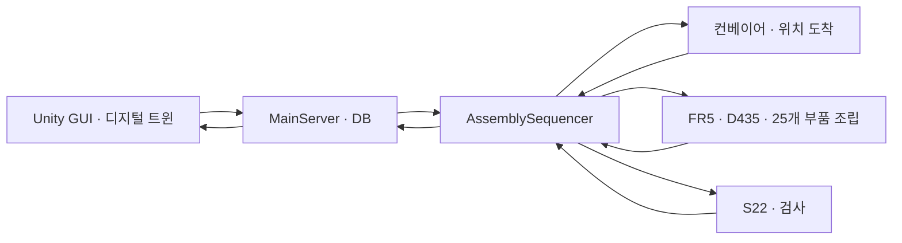

# KSMC · FR5 기반 반도체 패키지 조립·검사 시스템

FAIRINO FR5 협동로봇, D435 조립 비전, 컨베이어·S22 검사와 Unity 디지털 트윈을 연결하는 팀 통합 저장소입니다. 6종 25개 부품의 패키지 모형을 대상으로 작업 등록부터 조립, 검사 결과 조회까지 구현합니다.

## 왜 이 주제를 선택했나요?

부품 위치 인식, 좌표 변환, 로봇 파지·조립, 이송, 검사와 관제를 한 공정에서 구현하고 검증할 수 있어 선정했습니다. 실제 제조 공정의 핵심 기술과 시스템 통합을 소규모 모형으로 경험하는 것이 목표입니다.

## 담당 영역과 소스

| 경로 | 담당 | 기준 브랜치 | 주요 구성 |
|---|---|---|---|
| [main-server/](main-server/README.md) | 김현수 · 관제·디지털 트윈 | `Main_Server&DT` | Unity, MainServer, Sequencer, PostgreSQL, ROS-TCP Endpoint |
| [robot-server/](robot-server/README.md) | 손영빈 · 로봇 | `fr5-robot-control-full` | FR5 실행기, D435, Hand–Eye, 부품별 조립 |
| [vision-server/](vision-server/README.md) | 임현찬 · 비전·컨베이어 | `codex/conveyor-cell-integration` | S22 검사, 컨베이어 제어, GoPro 영상 |

박태진 담당의 지그·핑거·브래킷 등 하드웨어는 각 소스에 포함된 모델·보정 자료에서 확인합니다. 별도 하드웨어 브랜치가 있다고 가정해 소스를 만들지 않았습니다.

`vision-robot-conveyor-control`의 전체 이력은 최신 비전 통합 브랜치에 포함됩니다. 각 역할의 기존 내부 경로와 소스 이력을 보존하고, 같은 이름의 `ros2_ws`, `config`, `vision_assembly`를 서로 덮어쓰지 않았습니다. 통합 출처의 정확한 커밋은 [sources.json](docs/integration/sources.json)에 기록합니다.

## 시스템 흐름

작업 등록 → 조립 위치 이송·정지 → 기판·트레이 관측 → 부품 조립 → 검사 위치 이송·정지 → 촬영·검사 → 결과 저장·조회 순서입니다. 요청 수락과 실제 완료를 구분하며 각 장비의 완료 신호로 다음 작업을 진행합니다. 이동 중 추적 조립은 현재 실행 흐름이 아닙니다.

## 설치와 실행

**저장소 전체에서 `colcon build`를 실행하지 않습니다.** 각 PC의 담당 workspace를 별도로 빌드합니다. 루트 `COLCON_IGNORE`는 서로 다른 PC용 동명 패키지의 일괄 탐색을 방지합니다.

- 관제 PC: `cd main-server` 후 [설치·Mock/Real 실행](main-server/README.md#실행)
- 로봇 PC: `cd robot-server` 후 [환경·빌드·조립 스택](robot-server/README.md)
- 비전 PC: `cd vision-server` 후 [컨베이어·검사 서버](vision-server/docs/CONVEYOR_VISION_SERVER.md)
- 통합 순서, Endpoint 소유권, 모델·보정 준비: [운영 안내](docs/integration/OPERATIONS.md)
- 소프트웨어 검증 결과와 남은 항목: [통합 검증](docs/integration/VALIDATION.md)

장비별 `config/ksmc.env`, DB 접속 정보, 학습 가중치·정상 기준 이미지와 실행 데이터는 각 장비에서 준비합니다. 소스 통합 자체가 모델 설치·DB 구성·실물 공정 검증을 대신하지는 않습니다.

## 주요 기술

Ubuntu 24.04 · ROS 2 Jazzy · Python/C++ · Unity/C# · PostgreSQL · OpenCV · YOLO segmentation · PatchCore · RealSense D435 · Galaxy S22 · GoPro · FAIRINO FR5 · DH PGEA-100-40.

## 통합 방식

[참고 프로젝트 ros2-ai-amr-repo3](https://github.com/eduwing-robotics/ros2-ai-amr-repo3)의 담당 서버별 디렉터리 분리와 import 출처 기록 방식을 적용했습니다. 장비별 실행 경계를 유지하면서 루트 문서를 팀 공통 진입점으로 구성합니다. 최신 변경은 담당 디렉터리에 반영하며, 원본 브랜치는 삭제하지 않습니다.
