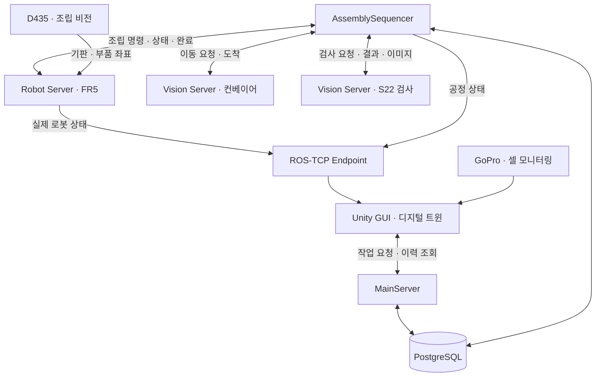
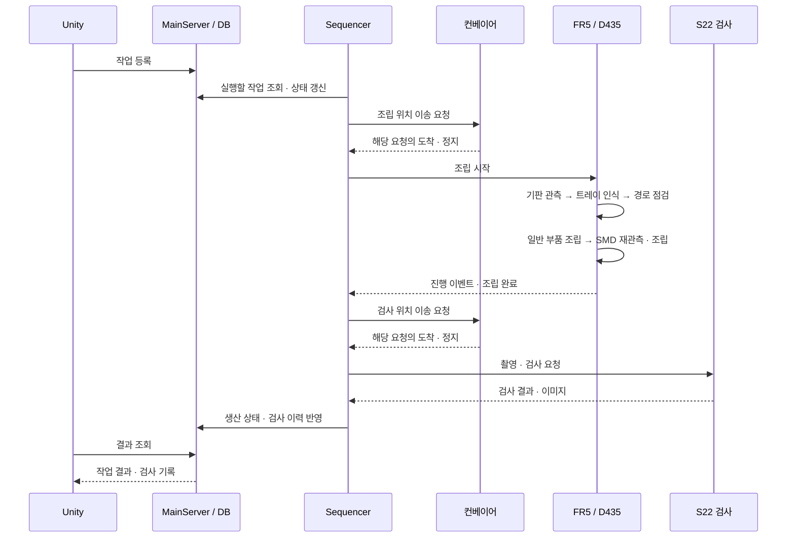
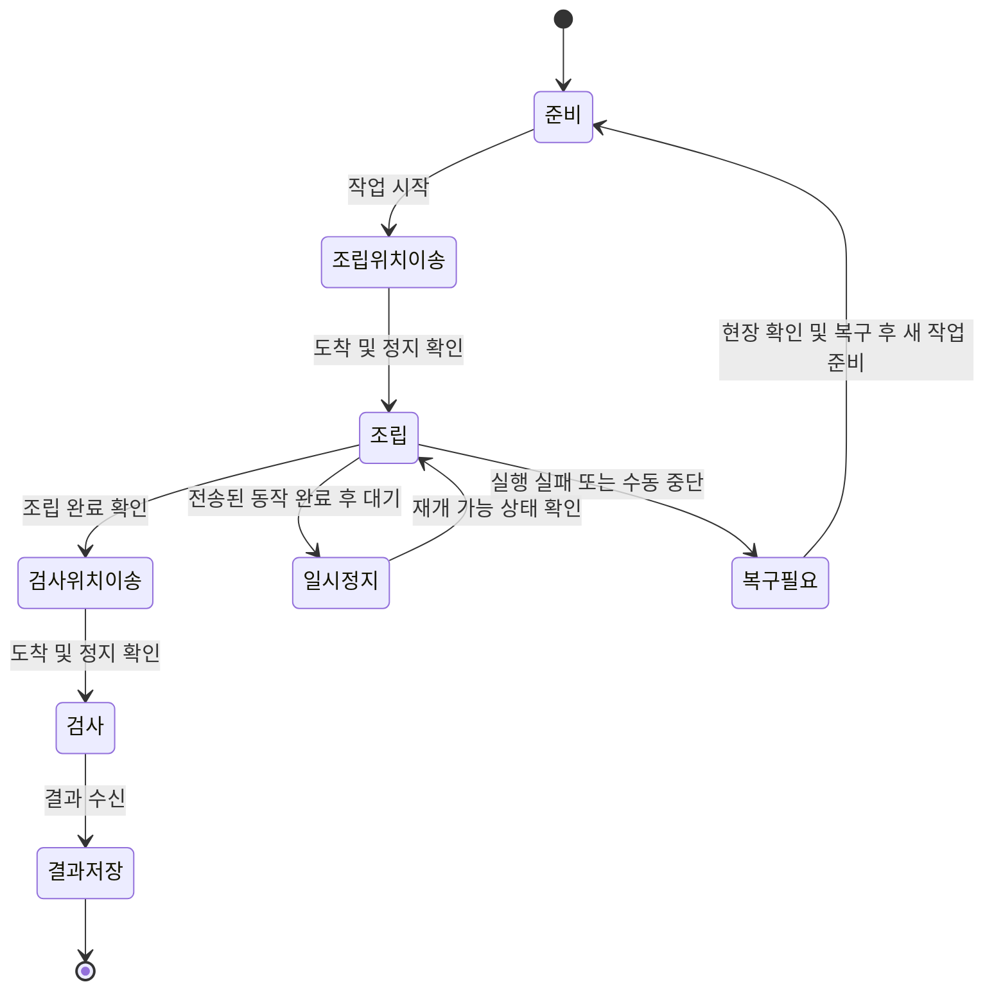

# KSMC · 비전 기반 반도체 패키지 모형 조립·검사 시스템

**FAIRINO FR5 협동로봇으로 6종 25개 부품을 조립하고, 검사 결과를 Unity 디지털 트윈에서 확인하는 ROS 2 기반 소형 스마트팩토리 프로젝트입니다.**

부품이 놓인 실제 위치를 카메라로 인식해 로봇 좌표로 변환하고, 컨베이어 이송 → 조립 → 검사 → 결과 저장을 하나의 작업 흐름으로 연결했습니다. Main Server, Robot Server, Vision Server가 역할을 나누고 장비의 완료 신호를 기준으로 다음 공정을 진행합니다.

> 대상은 직접 제작한 반도체 패키지 **모형**입니다. 실제 반도체 제조 장비의 미세 공정 정밀도를 의미하지 않습니다.

<table width="100%">
  <tr><th>🎬 전체 공정 시연</th><th>🖥️ 디지털 트윈 · 검사 결과</th></tr>
  <tr><td align="center">영상 추가 예정<br>기판 이송 → 비전 인식 → 조립 → 검사</td><td align="center">영상 추가 예정<br>실물 상태 연동 → INSPECT 화면 → 결과 조회</td></tr>
</table>

<!-- 전체 공정 영상: 업로드한 GitHub user-attachments 영상 URL을 이 자리에 단독 줄로 삽입하세요. -->
<!-- 디지털 트윈 영상: 업로드한 GitHub user-attachments 영상 URL을 이 자리에 단독 줄로 삽입하세요. -->

---

## 1. 팀 구성 및 역할

| 팀원 | 담당 영역 | 주요 역할 |
|---|---|---|
| 박태진 | 하드웨어 | 공정 배치, 부품 트레이·기판 모형 설계 및 3D 출력, 그리퍼 핑거·카메라 브래킷 구성 |
| 손영빈 | 로봇·조립 비전 제어 | FR5·ROS 2 제어, D435·YOLO segmentation·OpenCV 인식, Hand–Eye 좌표 변환, 부품별 조립·SMD 재관측 |
| 임현찬 | 검사 비전·컨베이어 | S22 촬영, YOLO·PatchCore·OpenCV 기반 검사, 컨베이어 이송·정지, GoPro 영상 연동 |
| 김현수 | Main·GUI·디지털 트윈·DB | Unity 관제, MainServer, 공정 순서 제어, PostgreSQL 작업·검사 이력 관리 |

## 2. 프로젝트 주제

| 구분 | 내용 |
|---|---|
| 개발 목표 | 작업 등록부터 부품 조립, 검사 결과 확인까지 이어지는 통합 자동화 공정 구현 |
| 조립 대상 | GPU 1 · HBM 8 · Power Module 4 · VRM 5 · Inductor 2 · SMD Capacitor 5 — 총 25개 모형 부품 |
| 로봇·그리퍼 | FAIRINO FR5 6축 협동로봇 · DH Robotics PGEA-100-40 · 제작 핑거 |
| 조립 비전 | Eye-in-Hand RealSense D435로 기판과 트레이 부품의 위치·방향 인식 |
| 검사 비전 | Galaxy S22 촬영 후 슬롯별 존재·위치·방향 및 이상 후보 확인 |
| 공정 방식 | 컨베이어를 조립·검사 위치에 **정지**시킨 뒤 작업 |
| 관제 | Unity GUI와 디지털 트윈으로 장비 상태·진행 단계·검사 결과 확인 |
| 데이터 | PostgreSQL에 작업·생산 단위·검사 결과와 이력 관리 |

## 3. 주제 선정 이유

우리는 로봇을 정해진 좌표로 움직이는 데서 한 단계 나아가, **실제 작업물을 보고 판단한 결과가 조립과 검사까지 이어지는 공정**을 만들고자 했습니다. 부품 종류와 방향이 다른 패키지 모형은 비전 인식, 좌표 보정, 다양한 파지·배치 동작을 한 작업 안에서 구현하기에 적합했습니다.

또한 로봇만 동작해도 전체 공정이 완성되는 것은 아니므로, 하드웨어 제작부터 컨베이어, 검사, 관제·DB까지 팀원의 담당 기술을 연결하는 것을 프로젝트 목표로 삼았습니다.

| 기획 배경·문제 | 선택한 개발 방향 |
|---|---|
| 실제 기판·부품의 위치가 매번 정확히 같지 않음 | 고정 교시점에만 의존하지 않고 카메라 인식 결과로 작업 좌표 계산 |
| 크기·방향이 다른 여러 부품을 조립해야 함 | 6종 부품별 파지·배치 레시피와 소형 SMD 재관측 적용 |
| 조립 동작 완료만으로 품질을 알 수 없음 | 조립 공정과 별도의 촬영·검사 공정 구성 |
| 여러 장비가 각자 움직이면 순서와 상태가 어긋날 수 있음 | 완료 이벤트 기반 공정 제어와 작업 이력 관리 |
| 개별 기술을 실제 시스템으로 연결하는 경험이 필요함 | 하드웨어·로봇·비전·Unity·DB를 소형 공정으로 통합 |

## 4. 사용자 요구사항

다음은 프로젝트에서 정의한 요구사항입니다. **필수·권장은 우선순위이며, 구현 완료 또는 성능 검증 표시가 아닙니다.**

| ID | 사용자 요구사항 | 우선순위 |
|---|---|---|
| UR-01 | 로봇팔은 배치할 부품을 집을 수 있어야 한다. | 필수 |
| UR-02 | 로봇팔은 조립 부품을 지정된 위치에 배치할 수 있어야 한다. | 필수 |
| UR-03 | 컨베이어 벨트는 조립 대상 패키지 기판을 작업 위치까지 운반할 수 있어야 한다. | 필수 |
| UR-04 | 컨베이어 벨트는 조립 및 검사에 필요한 지정 위치에서 일시 정지할 수 있어야 한다. | 필수 |
| UR-05 | 컨베이어 벨트는 조립이 완료될 경우 운반을 재개할 수 있어야 한다. | 필수 |
| UR-06 | 관리자는 현재 조립 및 검사 공정의 진행 상황을 확인할 수 있어야 한다. | 필수 |
| UR-07 | 관리자는 로봇팔 및 주요 장비의 연결 상태와 동작 상태를 확인할 수 있어야 한다. | 필수 |
| UR-08 | 관리자는 진행 중인 자동 작업을 일시 정지하고 재개할 수 있어야 한다. | 필수 |
| UR-09 | 관리자는 조립 완료 후 검사 결과를 정상 또는 불량으로 확인할 수 있어야 한다. | 필수 |
| UR-10 | 관리자는 수행된 작업 이력과 검사 결과를 확인할 수 있어야 한다. | 필수 |
| UR-11 | 관리자는 남은 부품 수량을 확인할 수 있어야 한다. | 권장 |
| UR-12 | 관리자는 로봇팔의 이동 경로 및 동작 계획을 확인할 수 있어야 한다. | 권장 |
| UR-13 | 카메라에 사람이 인식되면 로봇팔은 즉시 작업을 정지할 수 있어야 한다. | 권장 |

UR-13의 사람 감지 연동 정지는 추가 구현·검증 대상입니다. 일반 작업 일시정지는 이미 전송된 동작 완료 후 대기하는 방식이므로 비상정지와 구분합니다.

## 5. 시스템 요구사항과 구현 구성

발표 자료의 상세 SR 표를 대체하지 않고, 통합 저장소에서 각 요구를 담당하는 구성을 요약합니다.

| 기능 | 시스템에서 처리하는 내용 | 담당 구성 |
|---|---|---|
| 작업 등록·조회 | 작업 요청 검증, Job·Unit 생성과 진행·결과 조회 | MainServer · PostgreSQL |
| 공정 순서 제어 | 이송·조립·검사 요청과 완료 이벤트를 연결 | AssemblySequencer |
| 기판 위치 인식 | 기판의 위치·자세를 인식하고 슬롯별 배치 목표 생성 | D435 · OpenCV |
| 부품 인식 | 트레이 정합, 부품 종류·중심·방향·깊이 계산 | SIFT/RANSAC · YOLO segmentation |
| 로봇 좌표 변환 | 카메라 관측을 Hand–Eye·로봇 자세·TCP 기준과 연결 | Robot Server |
| 부품 조립 | 부품별 파지, 상승·이동·배치·해제 및 SMD 추가 보정 | FR5 실행기 · 조립 레시피 |
| 컨베이어 제어 | 요청한 작업 위치로 이송하고 도착·정지 상태 제공 | Vision Server · 컨베이어 노드 |
| 조립 검사 | S22 새 촬영, 슬롯 검사·이상 후보와 결과 이미지 생성 | 하이브리드 검사 파이프라인 |
| 상태·결과 표시 | 실제 장비 상태, 가상 로봇, 검사 결과·이력 표시 | Unity · ROS-TCP Endpoint |
| 중지·복구 | 실행 상태·오류·복구 필요 여부 확인 및 운영자 제어 | Sequencer · Robot Server |

---

## 6. 시스템 아키텍처

### 6.1 하드웨어 구성

| 장치 | 역할 |
|---|---|
| FAIRINO FR5 + PGEA-100-40 | 부품 파지·이동·조립 |
| RealSense D435 + 제작 브래킷 | 로봇에 장착한 카메라로 기판·트레이 근접 관측 |
| 제작 핑거·트레이·기판 모형 | 부품별 파지와 25개 슬롯 조립 환경 구성 |
| 컨베이어 벨트 | 조립 위치와 검사 위치 사이의 기판 이송 |
| Galaxy S22 | 검사 위치에 정지한 기판 촬영 |
| GoPro | 전체 셀 영상 모니터링 |

> 📷 **사진 추가 위치 — 전체 장비 배치 / 그리퍼·D435 장착부 / 6종 부품·트레이**
<!--  -->
<!--  -->
<!--  -->

### 6.2 소프트웨어 구성



관제·로봇·비전 PC의 실행 환경을 분리합니다. Unity의 실제 로봇 표현과 다음 동작 미리보기는 서로 다른 정보이며, 공정 진행은 장비의 실제 완료 결과를 기준으로 처리합니다.

## 7. 시나리오

### 7.1 작업 등록과 조립

1. 운영자가 Unity GUI에서 작업을 등록하고 설비 준비 상태를 확인합니다.
2. 컨베이어가 기판을 조립 위치로 이송한 뒤 정지합니다.
3. **기판을 먼저 관측**하여 위치·자세와 25개 슬롯의 배치 목표를 계산합니다.
4. 트레이를 관측해 부품별 파지 위치·방향을 계산하고 실행 경로를 점검합니다.
5. 일반 부품 20개를 레시피에 따라 파지·상승·이동·배치합니다. 파지 후 확인과 트레이 기준 경유 동작을 포함합니다.
6. SMD 5개는 별도 근접 관측 위치에서 다시 측정·보정한 후 배치합니다.
7. 로봇의 조립 완료 결과를 확인한 뒤 검사 위치 이송을 요청합니다.

### 7.2 촬영·검사와 결과 조회

1. 컨베이어가 기판을 검사 위치로 이송하고 정지합니다.
2. S22로 새 이미지를 촬영하고 기판 영역을 정합합니다.
3. 슬롯별 부품 존재·위치·방향과 PatchCore 이상 후보 등을 종합합니다.
4. Sequencer가 검사 결과 JSON과 이미지를 조회해 생산 이력에 연결합니다.
5. 운영자가 Unity **INSPECT**에서 판정, 슬롯별 내용, 검사 기록 이미지를 확인합니다.

### 7.3 일시정지·실패·복구

작업 일시정지는 이미 전송된 이동이 끝난 뒤 대기하고, 재개는 같은 실행의 다음 동작을 허용합니다. 실패 시에는 실행 기록과 복구 필요 상태를 남깁니다. 운영자가 부품·그리퍼·현장 상태를 확인한 뒤 복구하며, 실패한 요청을 같은 ID로 다시 보내 새 작업으로 실행하지 않습니다.

상세 동작은 [조립 제어 안내](robot-server/docs/ASSEMBLY_CONTROL_KO_20260910.md)와 [복구 안내](robot-server/docs/ASSEMBLY_RECOVER_KO_20260910.md)를 참고합니다.

## 8. 시퀀스 다이어그램



## 9. 공정 상태 다이어그램

아래는 공정 이해를 위한 요약이며, 코드의 모든 세부 상태·오류 분기를 나열한 것은 아닙니다.



## 10. 핵심 기술과 개발 중 해결한 문제

| 과제 | 적용 기술·접근 | 의미 |
|---|---|---|
| 기판 위치·방향 변화 | OpenCV 기판 특징과 자세 추정, 슬롯 배치 목표 변환 | 먼저 본 기판을 기준으로 조립 위치 결정 |
| 트레이 위치 변화와 부품 검출 | SIFT·RANSAC 정합 + YOLO segmentation | 트레이 기준과 실제 부품 마스크를 함께 사용 |
| 영상 좌표를 로봇 동작에 연결 | D435 정렬 깊이, Hand–Eye, 로봇 자세·TCP 변환 | 픽셀 위치를 로봇 기준 목표로 변환 |
| 작은 부품·불안정한 깊이 | 부품별 관측 조건, 유효 깊이·반복 관측 확인 | 배경 깊이와 불안정한 관측의 영향 완화 |
| 작은 SMD의 파지·배치 오차 | 근접 뷰 재관측과 추가 보정 | 초기 전체 트레이 관측만으로 작업하지 않음 |
| 오래된 영상·잘못 연결된 결과 | 새 촬영·소스 바인딩 및 요청별 완료 확인 | 현재 작업에 해당하는 관측·결과 사용 |
| 검사 근거 해석 | 슬롯 검사 + YOLO 보조 + PatchCore 이상 후보 | 히트맵을 확정 불량과 구분하여 기록 |

관련 기록: [비전 안정화](robot-server/docs/VISION_STABILITY_KO_20260911.md) · [트레이 촬영 신뢰성](robot-server/docs/TRAY_CAPTURE_RELIABILITY_KO_20260913.md) · [SMD 근접 뷰 경로](robot-server/docs/SINGLE_MOVEL_TRAY_RETURN_SMD_VIEW_KO_20260910.md) · [검사 구성과 제한사항](vision-server/vision_assembly/README.md)

> 📷 **사진 추가 위치 — 기판·트레이 인식 / SMD 재관측 / 검사 원본·히트맵·판정**
<!--  -->
<!--  -->
<!--  -->

## 11. 소스 구성

```text
.
├── main-server/       # Unity · MainServer · Sequencer · DB · ROS-TCP Endpoint
├── robot-server/      # FR5 · D435 · 좌표 보정 · 부품별 조립 실행
├── vision-server/     # S22 검사 · 컨베이어 · GoPro · 카메라 수신
├── docs/integration/  # 통합 출처 · 운영 절차 · 검증 기록
├── scripts/           # 통합 구조·인터페이스 점검
├── COLCON_IGNORE      # 서로 다른 PC용 workspace의 일괄 빌드 방지
└── README.md          # 프로젝트 공통 안내
```

| 문서 | 내용 |
|---|---|
| [Main Server](main-server/README.md) | Unity·서버·DB 구성과 Mock/Real 실행 |
| [Robot Server](robot-server/README.md) | 로봇·조립 비전 환경과 실행 |
| [Vision Server](vision-server/README.md) | 검사·컨베이어·영상 구성 |
| [통합 운영 안내](docs/integration/OPERATIONS.md) | PC별 환경, 실행 순서, Endpoint 소유권 |
| [통합 검증](docs/integration/VALIDATION.md) | 테스트 결과와 실물 검증 범위 |
| [통합 출처](docs/integration/sources.json) | 담당 브랜치별 기준 커밋 |

담당 브랜치의 소스·이력을 서버별 디렉터리로 통합했습니다. 각 영역의 기존 내부 경로를 유지하며 동명 ROS 패키지를 서로 덮어쓰지 않습니다.

## 12. 구현 결과와 검증

### 12.1 기록으로 확인한 범위

| 구분 | 확인 내용 | 해석 범위 |
|---|---|---|
| 실물 조립 기록 | 2026-09-08 단일 런처 호출로 25개 배치·해제 동작 완료 | 동작 완료 기록이며 25개 모두의 안착 품질 합격을 뜻하지 않음 |
| 통합 소프트웨어 점검 | 2026-09-15 기록 기준 **1,735 passed · 3 skipped** | 로봇·Sequencer·컨베이어·검사 코드 테스트; 실제 장비 운전 제외 |
| 공통 검사 인터페이스 | 3개 서비스 정의의 제공자·소비자 일치 확인 | 메시지 계약 확인이며 네트워크·실물 응답 검증과 별도 |
| 정적 점검 | Python 683개 구문 및 실행 스크립트·구조 점검 | 코드 구문·구조 점검 |

근거: [실물 사이클 기록](robot-server/docs/FR5_CYCLE_LAUNCHER_KO.md) · [통합 검증 기록](docs/integration/VALIDATION.md)

### 12.2 검사 결과의 의미

현재 S22 검사는 **임시 PASS/FAIL 운영 정책**을 사용합니다. 화면에 표시하는 운영 판정(`operational_decision`)과 엄격한 검증 판정(`validated_decision`)을 구분해 보존합니다. PatchCore 히트맵의 이상 후보는 그 자체로 확정 불량이 아니며, 핀·표면·안착 등 미검증 범위는 별도로 남깁니다.

소프트웨어 테스트 통과, 로봇 동작 완료, 최종 조립 품질 합격은 서로 다른 결과입니다. 반복 조립 성공률과 검사 정확도는 별도의 실물·라벨 데이터 평가가 필요합니다.

---

## 13. 설치와 실행

### 13.1 저장소 준비와 정적 점검

```bash
git clone https://github.com/eduwing-robotics/ros2-ai-cobot-repo1.git
cd ros2-ai-cobot-repo1
python3 scripts/check_integration.py
```

점검 스크립트는 소스 구조·구문·공통 인터페이스를 확인하며 로봇이나 컨베이어를 움직이지 않습니다. 위 명령이 전체 테스트 1,735개를 실행하는 것은 아닙니다.

### 13.2 PC별 설치

**저장소 루트에서 전체 `colcon build`를 실행하지 않습니다.** 담당 PC의 workspace를 별도로 준비합니다.

| PC | 작업 디렉터리 | 먼저 준비할 항목 |
|---|---|---|
| 관제 | `main-server` | PostgreSQL 스키마·계정, 모드별 설정, Unity 프로젝트 |
| 로봇 | `robot-server` | FR5·D435, Hand–Eye·TCP 보정, 교시점, 학습 모델 |
| 비전 | `vision-server` | S22·GoPro, 컨베이어, 정상 기준 이미지, 검사 모델 |

설치·빌드 명령은 각 [Main](main-server/README.md#실행), [Robot](robot-server/README.md), [Vision](vision-server/docs/CONVEYOR_VISION_SERVER.md) 안내를 따릅니다. 기존 개별 저장소 경로 예시는 통합 저장소의 해당 서버 디렉터리로 바꿉니다.

### 13.3 통합 실행 순서

1. 같은 Real ROS domain과 네트워크를 설정하고 공통 메시지를 준비합니다.
2. 로봇·카메라·컨베이어·검사 서비스를 각 PC에서 실행합니다.
3. MainServer와 Real Sequencer를 실행합니다.
4. Unity에서 연결 상태와 관측·장비 준비 상태를 확인한 뒤 작업을 시작합니다.

기준 배치에서는 로봇 스택이 Unity Endpoint를 실행하므로, 관제 측에서 중복 실행하지 않습니다. 아래 두 명령은 각각 별도 터미널에서 실행합니다.

```bash
# 관제 PC, 저장소 루트 기준
cd main-server
ros2 launch launch/main_real.launch.py
```

```bash
# 관제 PC의 별도 터미널, 저장소 루트 기준
cd main-server
ros2 launch launch/assembly_real.launch.py start_endpoint:=false
```

Mock은 domain 42, Real은 domain 5를 사용합니다. 세부 설정과 Endpoint 배치 변경은 [통합 운영 안내](docs/integration/OPERATIONS.md)를 기준으로 합니다.

## 14. 현재 한계와 확장 목표

| 현재 확보한 기반 | 다음 검증·개선 목표 |
|---|---|
| 25개 모형 부품의 파지·배치 실행 | 반복 횟수·조건을 명시한 조립 성공률과 안착 오차 측정 |
| 정지한 기판의 인식·조립 | 기판 위치·조명 변화에 따른 인식·조립 안정성 평가 |
| SMD 근접 재관측·보정 | 파지 편차·크기 변화에 대한 반복 시험 |
| S22 슬롯 검사와 이상 후보 표시 | 불량 종류별 라벨 데이터 확보 및 정확도·미검출 평가 |
| 완료 이벤트 기반 장비 연동 | 전체 실물 공정 반복 실행과 통신 장애·복구 시험 |
| Unity 상태·이력 확인 | 운전 데이터 축적과 공정 시간 분석 |
| GoPro 모니터링 | 사람 감지와 정지 연동의 별도 구현·검증 |

이동 중인 기판을 추적하는 조립은 현재 운전 방식에 포함하지 않습니다.

## 15. 개발 로드맵과 시연 자료

| 단계 | 주요 작업 |
|---|---|
| 1. 기획·역할 분담 | 공정 시나리오, 요구사항과 서버 간 책임 협의 |
| 2. 하드웨어 설계·제작 | 트레이·기판·핑거·카메라 브래킷 설계 및 3D 출력, 셀 배치 |
| 3. 개별 기능 개발 | 로봇 제어·비전 인식·좌표 보정·컨베이어·GUI·DB 구현 |
| 4. 조립·검사 개선 | 부품별 레시피, SMD 재관측, 촬영·검사 및 상태 처리 보완 |
| 5. 공정 통합 | 이송 → 조립 → 검사 → 결과 조회 연동 |
| 6. 검증·문서화 | 실물 작업 기록, 소프트웨어 회귀 점검과 main 통합 |

### 사진·영상 추가 가이드

사진은 아래 제안 경로에 추가한 뒤 해당 절의 주석을 해제하면 됩니다. 영상은 GitHub 편집 화면에 업로드해 생성된 URL을 독립된 줄에 넣으면 재생 형태로 표시할 수 있습니다. 아직 미디어 파일은 추가하지 않았습니다.

| 넣을 위치 | 제안 파일·영상 | 담을 내용 |
|---|---|---|
| 문서 상단 | 전체 공정 영상 URL | 컨베이어·일반 부품·SMD·검사까지 대표 흐름 |
| 문서 상단 | 디지털 트윈 영상 URL | 실제 로봇 상태와 Unity, 검사 결과 조회 |
| 6. 하드웨어 | `assets/images/cell-overview.png` | 전체 셀과 장비 이름 |
| 6. 하드웨어 | `assets/images/gripper-d435.png` | 제작 핑거와 아래를 향한 D435 |
| 6. 하드웨어 | `assets/images/parts-tray.png` | 6종 25개 부품·트레이·기판 |
| 10. 핵심 기술 | `assets/images/assembly-vision.png` | 기판·트레이 인식 결과 |
| 10. 핵심 기술 | `assets/images/smd-reobservation.png` | SMD 근접 재관측 화면 |
| 10. 핵심 기술 | `assets/images/inspection-result.png` | 원본·히트맵·슬롯 판정과 Unity 결과 |
| 15. 로드맵 | `assets/images/development-timeline.png` | 실제 개발 일정·작업 이력 |

<!--  -->

## 16. 프로젝트 기술 스택


| 영역 | 사용 기술·장비 |
|---|---|
| OS·미들웨어 | Ubuntu 24.04 · ROS 2 Jazzy · ROS-TCP Endpoint |
| 로봇·센서 | FAIRINO FR5 · PGEA-100-40 · RealSense D435 · Galaxy S22 · GoPro |
| 조립 비전 | OpenCV · YOLO segmentation · SIFT/RANSAC · Hand–Eye calibration |
| 검사 비전 | OpenCV · YOLO 보조 검출 · PatchCore · 슬롯별 검사 규칙 |
| 서버·데이터 | Python · ROS 2 서비스·토픽 · PostgreSQL |
| GUI·디지털 트윈 | Unity · C# · 실시간 상태 표시 · 동작 미리보기 |
| 개발·검증 | Python · C++ · Git/GitHub · pytest |

## 17. 로컬 준비 항목과 문서 출처

DB 접속 정보·카메라 인증 정보·장비별 환경 설정, 학습 가중치, 정상 기준 이미지와 실행 데이터는 각 장비에서 별도로 준비합니다. 비밀번호·토큰은 README나 Git에 기록하지 않습니다. 저장소를 받는 것만으로 현장 모델·보정값·DB가 설치되지는 않습니다.

README의 구성은 [E2E 물류 관제 프로젝트](https://github.com/eduwing-robotics/ros2-ai-amr-repo3/blob/main/README.md)의 형식을 참고했습니다. 기술 내용과 검증 범위는 이 저장소의 서버별 문서·작업 기록을 기준으로 정리했습니다.
