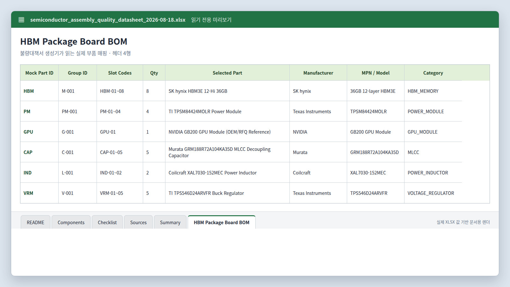

# Production DB와 파일 기반 품질 문서

## 현재 구성

2026-08-30 기준 `main_unity_mock`과 `main_unity_mock_test`에는
`production` 스키마의 아래 6개 테이블만 존재한다.

| 저장 위치 | 대상 | 소유·용도 |
|---|---|---|
| PostgreSQL `production` | `products`, `parts`, `product_slots`, `jobs`, `units`, `unit_defects` | 제품 정의와 생산 실행·검사 결과 |
| [부품 데이터시트](../../MAIN_SERVER/data/semiconductor_assembly_quality_datasheet_2026-08-18.xlsx) | 부품 후보, BOM, 검사항목, 출처 | `part_catalog`을 대신하는 읽기 전용 XLSX |
| `MAIN_SERVER/reports/defects/*.xlsx` | 불량대책서 | `defect_report`를 대신하는 자동 생성 파일 |

`part_catalog`과 `defect_report` 스키마는 두 DB에서 제거했다. 기준 DDL은
[production_schema.sql](../../DATA_STATION/DB/production_schema.sql) 하나다.

## 스키마


문서용 이미지는 현재 DDL의 테이블과 열을 기준으로 렌더했다. 편집 가능한 기존
ERD 원본은 [db-erd-guide.drawio](./db-erd-guide.drawio)다.

### 테이블 역할

| 테이블 | 기본 키 | 주요 열 | 관계 |
|---|---|---|---|
| `products` | `product_id` | `product_code`, `product_name`, `product_version`, `is_selectable` | 제품 정의 |
| `parts` | `part_id` | `part_name`, `part_category`, `stock_quantity` | 생산에 사용하는 부품과 재고 |
| `product_slots` | `product_slot_id` | `product_id`, `slot_code`, `part_id` | 제품의 슬롯별 부품 배치 |
| `jobs` | `job_id` | `product_id`, `requested_quantity`, `recipe_version`, `job_status` | 생산 요청과 실행 기간 |
| `units` | `unit_id` | `job_id`, `unit_sequence_in_job`, `unit_status`, `inspection_result` | Job에서 생산한 개별 Unit |
| `unit_defects` | `unit_defect_id` | `unit_id`, `product_slot_id`, `defect_type` | FAIL Unit의 슬롯 단위 불량 |

관계는 다음 두 흐름으로 읽는다.

```text
products ──< product_slots >── parts
products ──< jobs ──< units ──< unit_defects >── product_slots
```

### DB가 보장하는 규칙

- 제품 코드와 버전 조합은 유일하다.
- 한 제품에서 같은 `slot_code`를 중복할 수 없다.
- 동시에 `PENDING` 또는 `RUNNING`인 Job은 최대 1개다.
- Job 상태는 `PENDING`, `RUNNING`, `COMPLETED`, `FAILED`, `CANCELLED`만 허용한다.
- Unit 검사는 `PENDING`, `PASS`, `FAIL`만 허용하고, 완료 시각과 검사 시각의 순서를 검사한다.
- 불량 유형은 `MISSING`, `POSITION_ERROR`, `ORIENTATION_ERROR`, `CRACK`만 허용한다.
- 한 Unit의 같은 Product Slot에는 불량 레코드를 하나만 기록한다.

## 부품 데이터시트



이미지는 실제 XLSX의 `HBM Package Board BOM` 시트 값을 사용한 문서용
미리보기다. 생성기는 별도의 카탈로그 DB를 만들지 않고 다음 시트를 직접 읽는다.

| 시트 | 헤더 행 | 사용 내용 |
|---|---:|---|
| `HBM Package Board BOM` | 4 | Production `part_id`와 Group ID, Slot, 선택 부품 연결 |
| `Components` | 4 | 제조사, 모델, 대체 후보, 핵심 사양과 불량 연관성 |
| `Checklist` | 3 | 입고·조립·신뢰성 검사와 이상 시 조치 |
| `Sources` | 3 | 근거 출처와 확인일 |

현재 Production 부품 연결은 다음과 같다.

| Part ID | Group ID | Slot | 수량 | 선택 부품 |
|---|---|---|---:|---|
| `HBM` | `M-001` | `HBM-01~08` | 8 | SK hynix HBM3E 12-Hi 36GB |
| `PM` | `PM-001` | `PM-01~04` | 4 | TI TPSM84424MOLR Power Module |
| `GPU` | `G-001` | `GPU-01` | 1 | NVIDIA GB200 GPU Module |
| `CAP` | `C-001` | `CAP-01~05` | 5 | Murata GRM188R72A104KA35D MLCC |
| `IND` | `L-001` | `IND-01~02` | 2 | Coilcraft XAL7030-152MEC |
| `VRM` | `V-001` | `VRM-01~05` | 5 | TI TPS546D24ARVFR |

## 불량대책서


이미지는 테스트 DB의 Job 22에서 실제 생성한
`QA-J22-HBM-MISSING.xlsx` 값을 사용한 문서용 미리보기다.

[generate_defect_reports.py](../../MAIN_SERVER/generate_defect_reports.py)는 완료된
Job의 FAIL Unit을 읽고, Job·Part·불량 유형별로 묶어서
`MAIN_SERVER/reports/defects`에 파일을 만든다.

```text
production.jobs / units / unit_defects / product_slots / parts
                              +
semiconductor_assembly_quality_datasheet_2026-08-18.xlsx
                              ↓
QA-J{job_id}-{part_id}-{defect_type}.xlsx
```

생성 규칙은 다음과 같다.

- 파일명에 사용할 수 없는 문자는 `_`로 바꾼다.
- 기존 파일은 덮어쓰지 않아 담당자가 입력한 회신을 보호한다.
- 임시 파일을 완성한 뒤 원자적으로 이동한다.
- 데이터시트에 Part가 없으면 `데이터시트 연결 없음`으로 표시하되 보고서 생성은 계속한다.
- DB에는 보고서 상태나 회신을 다시 저장하지 않는다.

수동 생성 명령:

```bash
cd /home/codlab/Main_Unity
MAIN_SERVER_DB_DSN='dbname=main_unity_mock_test' \
  python3 MAIN_SERVER/generate_defect_reports.py
```

운영 자동 생성은 같은 명령을 1분마다 실행하며, `flock`으로 중복 실행을 막는다.

## 실행 흐름과 소유권

1. ROS2 생산 노드가 `production`의 Job, Unit, 검사 결과를 기록한다.
2. MainServer는 같은 6개 테이블을 읽어 제품·재고·작업·불량 API를 제공한다.
3. 불량대책서 생성기가 완료된 FAIL 기록과 데이터시트를 결합해 XLSX를 발행한다.
4. Unity/Scenario는 DB나 파일을 직접 다루지 않고 주입된 로봇 인터페이스를 사용한다.

## 검증

두 DB에서 사용자 테이블을 조회한 결과가 아래 6개로 동일함을 확인했다.

```text
production.jobs
production.parts
production.product_slots
production.products
production.unit_defects
production.units
```

검증용 SQL은 [003_smoke_test.sql](../../DATA_STATION/DB/003_smoke_test.sql),
조회 예시는 [002_query_samples.sql](../../DATA_STATION/DB/002_query_samples.sql)을
사용한다.
