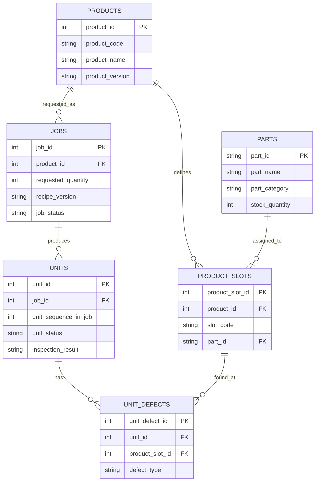

# 조립 작업 DB 설계 (MVP)

## 이 문서의 범위

이 문서는 `production` 스키마 하나만 다룬다. 조립과 검사를 실행하면서 생기는 기록과, 그 기록이
참조 무결성으로 의존하는 기준정보가 전부다.

어떤 데이터가 이 스키마에 들어갈 자격이 있는지는 다음 셋으로 판단하고, 하나라도 만족하지
않으면 넣지 않는다.

1. 조립·검사 실행 중에 생성되는가, 또는 실행이 참조 무결성으로 의존하는가
2. 그 값이 사라지면 과거 작업 기록의 의미가 깨지는가
3. 이 스키마가 그 값의 유일한 소유자인가

`unit_defects`가 `product_slots`를 외래키로 참조하므로 슬롯 정의가 없으면 과거 불량 기록이
미아가 된다. 그래서 `product_slots`는 들어온다. 조립 레시피 본문은 로봇 제어가 소유하고
`jobs.recipe_version` 문자열만으로 참조가 성립하므로 들어오지 않는다.

| 데이터 | 위치 | 이유 |
|---|---|---|
| 작업 기록과 기준정보 | `production` — 이 문서 | 세 기준을 모두 만족한다 |
| 조립 레시피 본문 | DB 밖. 로봇 제어와 형상관리 | `jobs.recipe_version` 참조로 충분하다 |
| 제조사·대체품·가격·출처 | `part_catalog` 스키마 | 조인은 필요하지만 소유자가 다르다 |
| 불량률 임계값과 대책서 발행 이력 | `defect_report` 스키마 | 판정 정책이지 작업 기록이 아니다 |

`production`에서 다른 스키마로 나가는 외래키는 만들지 않는다. 조인만 하고 무결성은 각 스키마가
따로 책임진다. 외래키를 걸면 데이터시트에서 부품 하나가 빠질 때 작업 기록이 인질이 된다.

`recipe_version`이 참조로만 성립하려면 백엔드가 레시피 버전을 덮어쓰지 않고 추가만 하는
방식으로 보관해야 한다. 이 계약이 깨지면 과거 작업이 어떤 조건으로 실행되었는지 복원할 수
없고, `recipe_version`은 의미 없는 문자열이 된다.

세 스키마 전체 구성과 연동 방식은 [DB3.md](./DB3.md)를, Unity·조립 노드·로봇의 계층 분담과
이 스키마에 무엇이 기록되는 시점은 [Architecture.md](./Architecture.md)를, 로봇이 소유하는
레시피 파일 규격은 [Recipe.md](./Recipe.md)를 참고한다.

## 결정 요약

사용자가 완성체와 수량을 선택하면 시스템이 조립하고, 완성품별 검사 결과와 불량 슬롯을
기록하는 데 필요한 테이블만 둔다.

| 구분 | 테이블 | 한 행의 의미 |
|---|---|---|
| 기준정보 | `parts` | 재사용 가능한 부품 한 종류 |
| 기준정보 | `products` | 사용자가 선택할 완성체 한 버전 |
| 기준정보 | `product_slots` | 완성체에서 부품 하나가 장착되는 슬롯 한 곳 |
| 실행 | `jobs` | 사용자가 요청한 완성체와 수량 한 건 |
| 실행 | `units` | 실제 조립을 시작한 완성품 한 대 |
| 검사 | `unit_defects` | 검사에서 불량으로 판정된 완성품 슬롯 한 곳 |

총 6개 테이블이다. 정상 슬롯은 행으로 저장하지 않는다. 검사 완료된 `units`와
`product_slots`로 정상 수량을 계산하고, 불량이 발생한 슬롯만 `unit_defects`에 저장한다.

### 이름 변경 및 제거

| 기존 | 변경 | 이유 |
|---|---|---|
| `assemblies` | `products` | 사용자에게 보이는 선택 대상이 완성체 제품이기 때문이다 |
| `bom_items` | `product_slots` | 한 행이 단순 BOM 합계가 아니라 장착 슬롯 한 곳이기 때문이다 |
| `production_units` | `units` | `jobs` 아래의 실제 완성품 한 대라는 문맥이 분명하다 |
| `unit_slots` | `unit_defects` | 정상 슬롯 전체 대신 불량 슬롯만 저장한다 |
| `defect_types` | 제거 | 고정된 불량 코드 4종은 `CHECK` 제약으로 충분하다 |
| `process_events` | 제거 | 실시간 상태와 이벤트 이력은 현재 DB 요구사항이 아니다 |
| `stock_movements` | 제거 | 재고 이력 없이 `parts.stock_quantity`의 현재고만 필요하다 |

## 기능 범위

이 DB는 다음 질문에 답한다.

1. 어떤 완성체를 선택할 수 있는가?
2. 선택한 완성체를 요청 수량만큼 만들 재고가 있는가?
3. 사용자가 몇 대를 요청했고 실제로 몇 대를 완료했는가?
4. 완성품 한 대의 검사 결과가 PASS인가 FAIL인가?
5. FAIL이면 어느 슬롯의 어떤 부품이 어떤 유형으로 불량인가?
6. 슬롯별·부품별 누적 불량률은 얼마인가?
7. 공정 개선(레시피 변경) 전후로 불량률이 실제로 낮아졌는가?

다음 데이터는 담지 않는다.

- 로봇의 현재 상태, 관절 이력과 ROS 메시지 원문
- 슬롯의 3D Pose, 카메라 검출 Pose와 좌표 보정값
- 조립 레시피 본문(조립 순서, 속도, 힘, 툴 파라미터)
- 공정 이벤트와 알람 이력
- 재고 입출고 및 조정 이력
- 재검사·재작업 이력
- 정상 슬롯별 실행 행

## 사용자 작업 흐름

```text
완성체 선택
  → 요청 수량과 현재고 검증
  → jobs 1행 생성
  → 실제 조립을 시작할 때 units 1행 생성
  → 완성체 한 대 조립 완료 및 재고 차감
  → 검사 결과 기록
  → FAIL 슬롯만 unit_defects에 기록
  → 작업 완료 수량과 불량률 조회
```

`jobs.requested_quantity`는 재시작 후에도 요청 수량과 진행률을 복구하기 위해 저장한다.
완료 수량은 별도 칼럼에 중복 저장하지 않고 완료된 `units`를 `COUNT(*)`하여 계산한다.

## 참조 구조

다이어그램

| 파일 | 내용 |
|---|---|
| [db-erd-guide.drawio](./db-erd-guide.drawio) | `production` ERD. 발표·문서 삽입용 |
| [db-schema-overview.drawio](./db-schema-overview.drawio) | 설계 원칙 6가지 |
| [db3-erd.drawio](./db3-erd.drawio) | 3스키마 흐름과 통합 ERD |



```text
products
├── product_slots ──► parts
└── jobs
     └── units
          └── unit_defects ──► product_slots
```

참조 순환은 없다. `unit_defects`가 `product_slots`를 참조하므로 슬롯에서 부품을 찾을 수 있고,
검사 요청에서 `part_id`를 중복 입력받지 않는다.

## 테이블과 전체 칼럼 평가

### parts

부품 기준정보와 현재고를 함께 보관한다.

| 칼럼 | 역할 | 명확성 평가 |
|---|---|---|
| `part_id` (PK) | Unity와 DB가 공통으로 사용하는 부품 식별자 | 명확함. 모든 참조에서 같은 의미다 |
| `part_name` | 사용자에게 표시할 부품명 | 명확함 |
| `part_category` | GPU, HBM, HEATSINK 같은 부품 분류 | 역할을 문서화하면 명확함. 개별 부품 인스턴스 ID가 아니다 |
| `stock_quantity` | 현재 사용 가능한 부품 수량 | 명확함. 이력이나 예약 수량을 의미하지 않는다 |

`stock_quantity`는 0 이상이어야 한다. 입고·실사 조정은 이 값을 직접 변경하며 변경 이력은
남기지 않는다.

제조사, 대체 후보, 가격, 출처는 이 테이블에 담지 않고 외부 데이터시트에서 조회한다.
조인 키는 `parts.part_id` = 데이터시트 `Components` 시트의 `Group ID`이고,
`parts.part_name`에는 해당 그룹 주품목의 제조사 P/N을 그대로 넣는다. 이 두 계약이 깨지면
불량 대책서가 부품 정보를 채우지 못한다.

### products

사용자가 선택할 수 있는 완성체의 버전을 정의한다.

| 칼럼 | 역할 | 명확성 평가 |
|---|---|---|
| `product_id` (PK) | 완성체 버전의 내부 식별자 | 명확함 |
| `product_code` | 버전이 달라도 같은 제품군을 묶는 고정 코드 | `product_id`와 역할이 구분되어 명확함 |
| `product_name` | 사용자에게 표시할 완성체 이름 | 명확함 |
| `product_version` | 슬롯 구성이 달라지는 완성체 버전 | 기존 `version`보다 대상이 명확함 |
| `is_selectable` | 신규 `jobs`에서 선택 가능한지 | 기존 `is_active`보다 사용 목적이 명확함 |
| `definition_locked_at` | 제품 슬롯 정의가 잠긴 시각 | 기존 `locked_at`보다 무엇이 잠기는지 명확함 |

`(product_code, product_version)`은 중복되지 않는다. 첫 `jobs`가 생성되면
`definition_locked_at`을 설정한다. 잠긴 뒤에도 `is_selectable`은 변경할 수 있지만, 제품 코드·이름·버전과 `product_slots`는 수정·삭제하지 않는다.
구성이 바뀌면 새 `product_version`을 만든다.

### product_slots

완성체 한 대의 장착 위치와 부품을 정의한다. **한 슬롯에는 부품 하나만 들어간다.**

| 칼럼 | 역할 | 명확성 평가 |
|---|---|---|
| `product_slot_id` (PK) | 제품 버전 안의 슬롯 정의 식별자 | 명확함. `slot_code`와 구분된다 |
| `product_id` (FK) | 슬롯이 속한 완성체 버전 | 명확함 |
| `slot_code` | Unity와 검사 시스템이 공통으로 쓰는 장착 위치 코드 | 기존 `slot_id`보다 DB PK가 아닌 외부 코드임이 명확함 |
| `part_id` (FK) | 해당 슬롯에 장착할 부품 | 명확함 |

`(product_id, slot_code)`는 중복되지 않는다.
한 행이 물리 슬롯 하나이므로 `required_quantity`는 두지 않는다. 부품별 대당 필요 수량은
`product_slots`를 `part_id`로 묶어 `COUNT(*)`하여 계산한다.

이 테이블은 **구조**만 정의한다. 무엇이 어디에 들어가는지는 담고, 어떤 순서와 조건으로
넣는지는 담지 않는다. 조립 순서는 로봇 제어 레시피가 소유하며 DB는 실행에 사용된
레시피 버전만 `jobs.recipe_version`에 기록한다. 순서를 두 곳에 저장하면 레시피를 튜닝할
때마다 DB 값이 조용히 낡은 계획으로 남기 때문이다.

### jobs

사용자가 선택한 완성체와 요청 수량을 저장하는 진입점이다.

| 칼럼 | 역할 | 명확성 평가 |
|---|---|---|
| `job_id` (PK) | 사용자 조립 요청 식별자 | 명확함 |
| `product_id` (FK) | 만들 완성체 버전 | 명확함 |
| `requested_quantity` | 사용자가 요청한 완성품 수량 | 명확함. 완료 수량이 아니다 |
| `recipe_version` | 이 작업을 실행한 조립 레시피 버전 | 제품 버전과 구분되어 명확함. 레시피 본문은 담지 않는다 |
| `job_status` | 요청 전체의 진행 상태 | `units.unit_status`와 구분되어 명확함 |
| `requested_at` | 사용자가 요청을 확정한 시각 | 기존 `created_at`보다 사건이 명확함 |
| `job_started_at` | 첫 완성품 조립을 시작한 시각 | 대상이 명확함 |
| `job_finished_at` | 요청 전체가 완료·실패·취소된 시각 | 대상과 종료 조건이 명확함 |

`job_status` 값은 `PENDING`, `RUNNING`, `COMPLETED`, `FAILED`, `CANCELLED`다.
완료 수량과 진행률은 저장하지 않고 다음처럼 계산한다.

```text
completed_quantity = unit_status가 COMPLETED인 units 수
progress_percent = completed_quantity / requested_quantity * 100
```

`recipe_version`은 **전역 고유 값**이어야 한다. 레시피는 특정 제품 버전의 슬롯 구성에서
파생되므로 제품마다 따로 존재하는데, `R1` 같은 제품 내 일련번호를 쓰면 서로 다른 제품이 같은
값을 갖게 되어 레시피 버전만으로 조인하는 쿼리가 조용히 틀린다. `{product_code}-{product_version}-R{n}`
형식을 쓴다. 예: `SEMICON-QA-ASSEMBLY-2026.08-R2`.

`recipe_version`은 레시피 본문이 아니라 식별자만 저장한다. 조립 순서와 공정 조건은 백엔드가
소유하고, DB는 "이 요청이 어떤 레시피로 실행되었는가"라는 실행 사실만 남긴다. 불량 대책으로
공정 조건을 수정하면 새 `recipe_version`으로 실행하고, 같은 제품 안에서 적용 전후 불량률을
비교해 대책의 효과를 검증한다. MVP는 로봇 한 대와 활성 작업 한 건만 허용하므로 작업 도중
레시피가 바뀌지 않는다. 작업 중간에 교체할 필요가 생기면 이 칼럼을 `units`로 내린다.

### units

실제로 조립을 시작한 완성품 한 대의 실행과 검사 결과다.

| 칼럼 | 역할 | 명확성 평가 |
|---|---|---|
| `unit_id` (PK) | 실제 완성품 한 대의 식별자 | 명확함 |
| `job_id` (FK) | 이 완성품을 만든 사용자 요청 | 명확함 |
| `unit_sequence_in_job` | 해당 작업 안에서 몇 번째 완성품인지 나타내는 1부터 시작하는 번호 | 완성품 순번과 그 범위가 이름에 모두 드러나 명확함 |
| `unit_status` | 완성품 한 대의 전체 실행 상태 | `job_status`와 구분되어 명확함 |
| `inspection_result` | 최종 검사 판정 | `unit_status`와 역할이 다름을 이름이 드러낸다 |
| `inspection_image_path` | 최종 검사 이미지의 저장 경로 | 파일 자체가 아니라 경로임이 명확함 |
| `assembly_started_at` | 해당 완성품 조립을 시작한 시각 | 명확함 |
| `assembly_completed_at` | 해당 완성품 조립을 완료한 시각 | 검사 완료와 구분되어 명확함 |
| `inspected_at` | 최종 검사 판정을 확정한 시각 | 명확함 |

`(job_id, unit_sequence_in_job)`는 중복되지 않는다. `unit_status` 값은 `RUNNING`, `COMPLETED`,
`FAILED`다. `inspection_result` 값은 `PENDING`, `PASS`, `FAIL`이다.

- `units`는 실제 조립을 시작할 때 생성하므로 `PENDING` 상태를 두지 않는다.
- PASS 또는 FAIL이면 `unit_status = 'COMPLETED'`이고 `inspected_at`이 있어야 한다.
- 조립 자체가 실패하면 `unit_status = 'FAILED'`, `inspection_result = 'PENDING'`이다.

### unit_defects

검사에서 불량으로 판정된 슬롯만 저장한다. 정상 슬롯은 행을 만들지 않는다.

| 칼럼 | 역할 | 명확성 평가 |
|---|---|---|
| `unit_defect_id` (PK) | 완성품 슬롯 불량 기록 식별자 | 기존 `defect_id`보다 소속이 명확함 |
| `unit_id` (FK) | 불량이 발견된 실제 완성품 | 명확함 |
| `product_slot_id` (FK) | 불량이 발견된 제품 슬롯 | 슬롯과 부품을 함께 확정하므로 명확함 |
| `defect_type` | 불량 유형 코드 | 고정 코드임을 문서화하면 명확함 |

`(unit_id, product_slot_id)`는 중복되지 않는다. 현재는 한 슬롯에 불량 유형 하나만 기록한다.
`defect_type`은 `MISSING`, `POSITION_ERROR`, `ORIENTATION_ERROR`, `CRACK` 중 하나다.
발견 시각은 같은 검사의 `units.inspected_at`을 사용하므로 중복 저장하지 않는다.

## 칼럼 명명 최종 평가

현재 칼럼 중 다른 테이블과 조인했을 때 역할이 모호한 이름은 없다.

| 검토 항목 | 결론 |
|---|---|
| 일반적인 `status` | `job_status`, `unit_status`로 소유 대상을 명시했다 |
| 일반적인 `version` | `product_version`으로 대상을 명시했다 |
| 일반적인 `version` 두 종류 | 제품 구조는 `product_version`, 실행 방법은 `jobs.recipe_version`으로 분리했다 |
| PK처럼 보이던 `slot_id` | 내부 PK는 `product_slot_id`, 외부 위치 코드는 `slot_code`로 분리했다 |
| 일반적인 `created_at` | 사용자 요청은 `requested_at`, 조립은 `assembly_started_at`으로 사건을 명시했다 |
| 일반적인 `finished_at` | `job_finished_at`, `assembly_completed_at`, `inspected_at`으로 종료 대상을 분리했다 |
| 일반적인 `locked_at` | `definition_locked_at`으로 잠기는 대상을 명시했다 |
| `inspection_result`와 `unit_status` | 검사의 품질 판정과 실행 완료 여부이므로 둘 다 필요하다 |

FK의 `product_id`, `job_id`, `unit_id`, `part_id`는 대상 테이블이 이름에 포함된 표준적인
참조명이므로 그대로 둔다.

## 무결성 계약

### 수량과 상태 제약

```sql
ALTER TABLE parts
    ADD CONSTRAINT ck_parts_stock CHECK (stock_quantity >= 0);

ALTER TABLE jobs
    ADD CONSTRAINT ck_jobs_quantity CHECK (requested_quantity > 0),
    ADD CONSTRAINT ck_jobs_status CHECK (
        job_status IN ('PENDING','RUNNING','COMPLETED','FAILED','CANCELLED'));

ALTER TABLE units
    ADD CONSTRAINT ck_units_sequence CHECK (unit_sequence_in_job > 0),
    ADD CONSTRAINT ck_units_status CHECK (
        unit_status IN ('RUNNING','COMPLETED','FAILED')),
    ADD CONSTRAINT ck_units_inspection CHECK (
        inspection_result IN ('PENDING','PASS','FAIL')),
    ADD CONSTRAINT ck_units_inspected CHECK (
        (inspection_result = 'PENDING' AND inspected_at IS NULL)
        OR
        (inspection_result IN ('PASS','FAIL')
         AND unit_status = 'COMPLETED'
         AND assembly_completed_at IS NOT NULL
         AND inspected_at IS NOT NULL));

ALTER TABLE unit_defects
    ADD CONSTRAINT ck_unit_defects_type CHECK (
        defect_type IN ('MISSING','POSITION_ERROR','ORIENTATION_ERROR','CRACK'));
```

PASS에는 `unit_defects`가 없어야 하고 FAIL에는 하나 이상 있어야 한다. 이 규칙은 여러 행을
함께 확인해야 하므로 검사 결과 저장 함수가 하나의 트랜잭션에서 검증한다.

### 슬롯·부품 정합성

검사 호출자는 `part_id`나 `product_slot_id`를 직접 보내지 않고 `unit_id`, `slot_code`,
`defect_type`만 보낸다. 하위 DB 컴포넌트가 다음 경로로 슬롯을 확정한다.

```text
unit_id → units.job_id → jobs.product_id
        → product_slots(product_id, slot_code)
```

이 경로로 찾은 `product_slot_id`만 `unit_defects`에 기록한다. 호출자가 다른 제품의 슬롯을
잘못 연결할 수 없도록 이 검증과 INSERT를 하나의 공개 함수 안에서 완결한다.

### 제품 정의 불변성

첫 `jobs` 생성 시 `products.definition_locked_at`을 설정한다. 잠긴 뒤에도 `products.is_selectable`은 바꿀 수 있지만 제품 정의 칼럼과
`product_slots`는 수정·삭제하지 않는다. 과거 불량 기록이 같은 슬롯과 부품을 계속 가리키게
하려면 이 불변성이 필요하다.

잠기는 대상은 **구조**뿐이다. 조립 순서와 공정 조건을 바꾸는 것은 새 `product_version`이
아니라 새 `recipe_version`으로 처리한다. 구조가 그대로면 슬롯과 부품 참조가 유지되므로
적용 전후 불량률을 같은 제품 안에서 비교할 수 있다.

### 검사 기록 불변성

검사가 확정된 뒤에는 `units`와 `unit_defects`를 추가만 하고 수정·삭제하지 않는다.
`inspection_result`가 `PASS` 또는 `FAIL`이 되고 `inspected_at`이 채워진 시점부터 그 행은
확정 기록이다.

`defect_report` 스키마가 발행 시점의 집계값을 스냅샷으로 복사해 두기 때문에 이 불변성이
필요하다. 확정된 판정이 사후에 뒤집히면 스냅샷과 현재 값의 차이가 시점 차이인지 정정인지
구분할 수 없고, 발행된 대책서의 숫자를 신뢰할 근거가 사라진다.

정정이 필요한 상황은 재검사이므로, 기존 행을 고치지 않고 재검사 이력 테이블을 추가해
새 판정을 별도 행으로 남긴다. 그 요구가 실제로 생기기 전까지는 정정 경로를 두지 않는다.

## 재고 계약

`parts.stock_quantity`는 현재고다. 재고 이력, 예약 수량과 조정 사유는 저장하지 않는다.

1. 작업 요청 시 부품별 필요 수량을 계산해 `requested_quantity` 전체를 만들 수 있는지 확인한다.
2. 실제 완성품 한 대의 조립이 완료될 때 그 한 대에 사용된 부품을 차감한다.
3. 조립 완료 처리와 모든 부품 재고 차감은 하나의 트랜잭션으로 실행한다.
4. 차감 직전에도 재고를 다시 확인하고, 하나라도 부족하면 전체 트랜잭션을 실패시킨다.
5. MVP는 로봇 한 대와 활성 작업 한 건만 허용하므로 재고 예약은 두지 않는다.

부품별 전체 필요 수량은 한 슬롯에 부품 하나라는 계약에 따라 계산한다.

```text
대당 필요 수량 = product_slots를 part_id로 묶은 행 수
전체 필요 수량 = 대당 필요 수량 × jobs.requested_quantity
```

재고 변경 이력이나 여러 작업의 동시 예약이 필요해질 때만 별도 재고 이동 테이블을 추가한다.

## 샘플 데이터

참조 파일: `semiconductor_assembly_quality_datasheet_2026-08-13.xlsx`

- `parts`는 `Components` 시트에서 각 그룹의 대표 부품(`대체 # = 1`) 6종을 사용한다.
- `part_category`는 `Checklist` 시트의 검사 대상 명칭에 맞춰 정규화한 예시 코드다.
- 대체품, 제조사 비교, 가격, 출처 정보는 현재 6개 테이블의 범위가 아니므로 포함하지 않는다.
- 재고 수량, 완성체 정보, 작업 ID, 시간은 관계 확인을 위한 예시값이며 원본 데이터시트의 측정값이 아니다.
- 불량 예시는 `Checklist`의 검사 항목을 현재 허용된 네 가지 `defect_type`으로 표현했다.

### `parts` 샘플

| part_id | part_name | part_category | stock_quantity |
|---|---|---|---:|
| `C-001` | `GRM188R72A104KA35D` | `MLCC` | 240 |
| `P-001` | `TPS61023DRLR` | `BOOST_IC` | 80 |
| `AI-001` | `Jetson Orin NX 16GB (900-13767-0000-001)` | `AI_MODULE` | 12 |
| `M-001` | `HBM3E 12-Hi 36GB` | `HBM` | 32 |
| `E-001` | `EEU-FR1E471B` | `ELECTROLYTIC_CAPACITOR` | 100 |
| `MOD-001` | `KSM32ED8/32HD` | `ECC_UDIMM` | 24 |

### `products` 샘플

| product_id | product_code | product_name | product_version | is_selectable | definition_locked_at |
|---:|---|---|---|---|---|
| 1001 | `SEMICON-QA-ASSEMBLY` | 반도체 조립 품질 샘플 | `2026.08` | `true` | `2026-08-19 08:50:00+09` |

### `product_slots` 샘플

| product_slot_id | product_id | slot_code | part_id |
|---:|---:|---|---|
| 5001 | 1001 | `C01` | `C-001` |
| 5002 | 1001 | `U01` | `P-001` |
| 5003 | 1001 | `MODULE01` | `AI-001` |
| 5004 | 1001 | `HBM01` | `M-001` |
| 5005 | 1001 | `EC01` | `E-001` |
| 5006 | 1001 | `DIMM01` | `MOD-001` |

### `jobs` 샘플

| job_id | product_id | requested_quantity | recipe_version | job_status | requested_at | job_started_at | job_finished_at |
|---:|---:|---:|---|---|---|---|---|
| 7001 | 1001 | 3 | `SEMICON-QA-ASSEMBLY-2026.08-R1` | `COMPLETED` | `2026-08-19 08:50:00+09` | `2026-08-19 09:00:00+09` | `2026-08-19 09:58:00+09` |

### `units` 샘플

| unit_id | job_id | unit_sequence_in_job | unit_status | inspection_result | inspection_image_path | assembly_started_at | assembly_completed_at | inspected_at |
|---:|---:|---:|---|---|---|---|---|---|
| 8001 | 7001 | 1 | `COMPLETED` | `PASS` | `/inspection/2026-08-19/unit-8001.jpg` | `2026-08-19 09:00:00+09` | `2026-08-19 09:15:00+09` | `2026-08-19 09:18:00+09` |
| 8002 | 7001 | 2 | `COMPLETED` | `FAIL` | `/inspection/2026-08-19/unit-8002.jpg` | `2026-08-19 09:20:00+09` | `2026-08-19 09:35:00+09` | `2026-08-19 09:38:00+09` |
| 8003 | 7001 | 3 | `COMPLETED` | `FAIL` | `/inspection/2026-08-19/unit-8003.jpg` | `2026-08-19 09:40:00+09` | `2026-08-19 09:55:00+09` | `2026-08-19 09:58:00+09` |

### `unit_defects` 샘플

| unit_defect_id | unit_id | product_slot_id | defect_type |
|---:|---:|---:|---|
| 9001 | 8002 | 5001 | `CRACK` |
| 9002 | 8002 | 5002 | `ORIENTATION_ERROR` |
| 9003 | 8003 | 5003 | `POSITION_ERROR` |
| 9004 | 8003 | 5004 | `MISSING` |

`unit_id = 8001`은 합격품이므로 `unit_defects` 행이 없다. 불량품도 정상 슬롯은 기록하지 않고, 불량이 발견된 슬롯만 기록한다.

### 샘플 불량률 조회 결과

아래 표는 저장 테이블이 아니라 위 샘플 데이터에 불량률 조회 쿼리를 실행했을 때의 예상 결과다. 검사 완료 완성품은 3대이므로 불량 1건이 발생한 각 슬롯의 불량률은 `33.33%`다.

| slot_code | part_id | part_name | inspected_quantity | defective_quantity | defect_rate_percent |
|---|---|---|---:|---:|---:|
| `C01` | `C-001` | `GRM188R72A104KA35D` | 3 | 1 | 33.33 |
| `DIMM01` | `MOD-001` | `KSM32ED8/32HD` | 3 | 0 | 0.00 |
| `EC01` | `E-001` | `EEU-FR1E471B` | 3 | 0 | 0.00 |
| `HBM01` | `M-001` | `HBM3E 12-Hi 36GB` | 3 | 1 | 33.33 |
| `MODULE01` | `AI-001` | `Jetson Orin NX 16GB (900-13767-0000-001)` | 3 | 1 | 33.33 |
| `U01` | `P-001` | `TPS61023DRLR` | 3 | 1 | 33.33 |

## 주요 조회

PostgreSQL 문법을 쓴다.

### 선택 가능한 완성체와 생산 가능 수량

```sql
WITH required_parts AS (
    SELECT product_id, part_id, COUNT(*) AS quantity_per_product
    FROM product_slots
    GROUP BY product_id, part_id
)
SELECT pr.product_id, pr.product_code, pr.product_name, pr.product_version,
       MIN(FLOOR(p.stock_quantity::numeric / rp.quantity_per_product)) AS buildable_quantity
FROM products pr
JOIN required_parts rp ON rp.product_id = pr.product_id
JOIN parts p ON p.part_id = rp.part_id
WHERE pr.is_selectable
GROUP BY pr.product_id, pr.product_code, pr.product_name, pr.product_version
ORDER BY pr.product_code, pr.product_version;
```

### 요청 수량 검증용 부품 목록

```sql
SELECT p.part_id, p.part_name, p.part_category,
       COUNT(*) AS quantity_per_product,
       COUNT(*) * :requested_quantity AS required_quantity,
       p.stock_quantity,
       GREATEST(COUNT(*) * :requested_quantity - p.stock_quantity, 0) AS shortage_quantity
FROM product_slots ps
JOIN parts p ON p.part_id = ps.part_id
WHERE ps.product_id = :product_id
GROUP BY p.part_id, p.part_name, p.part_category, p.stock_quantity
ORDER BY p.part_id;
```

### 작업 진행률

```sql
SELECT j.job_id, j.requested_quantity,
       COUNT(u.unit_id) FILTER (WHERE u.unit_status = 'COMPLETED') AS completed_quantity,
       ROUND(100.0 * COUNT(u.unit_id) FILTER (WHERE u.unit_status = 'COMPLETED')
             / j.requested_quantity, 2) AS progress_percent
FROM jobs j
LEFT JOIN units u ON u.job_id = j.job_id
WHERE j.job_id = :job_id
GROUP BY j.job_id, j.requested_quantity;
```

### 불량 이력

```sql
SELECT u.unit_id, u.inspected_at,
       pr.product_code, pr.product_version,
       ps.slot_code, p.part_id, p.part_name,
       ud.defect_type, u.inspection_image_path
FROM unit_defects ud
JOIN units u ON u.unit_id = ud.unit_id
JOIN jobs j ON j.job_id = u.job_id
JOIN products pr ON pr.product_id = j.product_id
JOIN product_slots ps ON ps.product_slot_id = ud.product_slot_id
JOIN parts p ON p.part_id = ps.part_id
WHERE j.product_id = :product_id
ORDER BY u.inspected_at DESC;
```

### 슬롯·부품별 불량률

검사 완료된 완성품과 해당 제품의 모든 슬롯을 먼저 조합한다. 정상 슬롯 행을 저장하지 않아도
각 슬롯의 검사 횟수와 불량 횟수를 계산할 수 있다.

```sql
SELECT ps.slot_code, p.part_id, p.part_name,
       COUNT(*) AS inspected_quantity,
       COUNT(ud.unit_defect_id) AS defective_quantity,
       ROUND(100.0 * COUNT(ud.unit_defect_id) / NULLIF(COUNT(*), 0), 2)
           AS defect_rate_percent
FROM jobs j
JOIN units u ON u.job_id = j.job_id
JOIN product_slots ps ON ps.product_id = j.product_id
JOIN parts p ON p.part_id = ps.part_id
LEFT JOIN unit_defects ud
       ON ud.unit_id = u.unit_id
      AND ud.product_slot_id = ps.product_slot_id
WHERE j.product_id = :product_id
  AND u.inspection_result IN ('PASS','FAIL')
GROUP BY ps.product_slot_id, ps.slot_code, p.part_id, p.part_name
ORDER BY ps.slot_code;
```

### 부품별 누적 불량률

같은 부품이 여러 슬롯에 사용되면 슬롯을 합쳐 부품 전체 불량률도 계산한다.

```sql
SELECT p.part_id, p.part_name,
       COUNT(*) AS inspected_quantity,
       COUNT(ud.unit_defect_id) AS defective_quantity,
       ROUND(100.0 * COUNT(ud.unit_defect_id) / NULLIF(COUNT(*), 0), 2)
           AS defect_rate_percent
FROM jobs j
JOIN units u ON u.job_id = j.job_id
JOIN product_slots ps ON ps.product_id = j.product_id
JOIN parts p ON p.part_id = ps.part_id
LEFT JOIN unit_defects ud
       ON ud.unit_id = u.unit_id
      AND ud.product_slot_id = ps.product_slot_id
WHERE u.inspection_result IN ('PASS','FAIL')
GROUP BY p.part_id, p.part_name
ORDER BY defect_rate_percent DESC;
```


### 기간·부품·불량유형별 불량률 (대책서 자동집계)

불량 대책서는 부품 하나와 불량 유형 하나를 지정해 발행한다. 임계값과 발송 이력은 문서 작성
백엔드가 소유하고, DB는 집계 결과만 제공한다.

```sql
SELECT p.part_id, p.part_name, p.part_category,
       :defect_type AS defect_type,
       COUNT(*) AS inspected_quantity,
       COUNT(ud.unit_defect_id) AS defective_quantity,
       ROUND(100.0 * COUNT(ud.unit_defect_id) / NULLIF(COUNT(*), 0), 4)
           AS defect_rate_percent,
       MIN(u.inspected_at) FILTER (WHERE ud.unit_defect_id IS NOT NULL)
           AS first_defect_at
FROM jobs j
JOIN units u ON u.job_id = j.job_id
JOIN product_slots ps ON ps.product_id = j.product_id
JOIN parts p ON p.part_id = ps.part_id
LEFT JOIN unit_defects ud
       ON ud.unit_id = u.unit_id
      AND ud.product_slot_id = ps.product_slot_id
      AND ud.defect_type = :defect_type
WHERE p.part_id = :part_id
  AND u.inspection_result IN ('PASS','FAIL')
  AND u.inspected_at >= :period_start
  AND u.inspected_at <  :period_end
GROUP BY p.part_id, p.part_name, p.part_category;
```

`defect_type` 조건은 반드시 `LEFT JOIN` 안에 둔다. `WHERE`로 옮기면 불량이 없는 정상 슬롯
행이 사라져 분모가 무너지고 불량률이 항상 100%로 나온다.

`inspected_quantity`는 완성품 대수가 아니라 **부품 장착 검사 건수**다. 한 완성체에 같은 부품이
두 슬롯에 쓰이면 완성품 한 대가 검사 두 건으로 집계된다. 완성품 대수가 따로 필요하면
`COUNT(DISTINCT u.unit_id)`를 함께 조회한다.

### 분기 리포트용 유형별 분해

분모를 부품 검사 건수로 고정하고 분자만 유형별로 센다.

```sql
SELECT p.part_id, p.part_name,
       COUNT(*) AS inspected_quantity,
       COUNT(DISTINCT u.unit_id) AS inspected_unit_quantity,
       COUNT(*) FILTER (WHERE ud.defect_type = 'MISSING') AS missing_quantity,
       COUNT(*) FILTER (WHERE ud.defect_type = 'POSITION_ERROR') AS position_error_quantity,
       COUNT(*) FILTER (WHERE ud.defect_type = 'ORIENTATION_ERROR') AS orientation_error_quantity,
       COUNT(*) FILTER (WHERE ud.defect_type = 'CRACK') AS crack_quantity,
       ROUND(100.0 * COUNT(ud.unit_defect_id) / NULLIF(COUNT(*), 0), 4)
           AS defect_rate_percent
FROM jobs j
JOIN units u ON u.job_id = j.job_id
JOIN product_slots ps ON ps.product_id = j.product_id
JOIN parts p ON p.part_id = ps.part_id
LEFT JOIN unit_defects ud
       ON ud.unit_id = u.unit_id
      AND ud.product_slot_id = ps.product_slot_id
WHERE u.inspection_result IN ('PASS','FAIL')
  AND u.inspected_at >= :period_start
  AND u.inspected_at <  :period_end
GROUP BY p.part_id, p.part_name
ORDER BY defect_rate_percent DESC;
```

### 레시피 버전별 효과 검증

불량 대책으로 공정 조건을 수정한 뒤 새 `recipe_version`으로 실행하면, 같은 제품과 같은 부품
안에서 적용 전후 불량률을 비교할 수 있다.

```sql
SELECT j.recipe_version,
       MIN(u.inspected_at) AS first_inspected_at,
       MAX(u.inspected_at) AS last_inspected_at,
       COUNT(*) AS inspected_quantity,
       COUNT(ud.unit_defect_id) AS defective_quantity,
       ROUND(100.0 * COUNT(ud.unit_defect_id) / NULLIF(COUNT(*), 0), 4)
           AS defect_rate_percent
FROM jobs j
JOIN units u ON u.job_id = j.job_id
JOIN product_slots ps ON ps.product_id = j.product_id
LEFT JOIN unit_defects ud
       ON ud.unit_id = u.unit_id
      AND ud.product_slot_id = ps.product_slot_id
      AND ud.defect_type = :defect_type
WHERE j.product_id = :product_id
  AND ps.part_id = :part_id
  AND u.inspection_result IN ('PASS','FAIL')
GROUP BY j.recipe_version
ORDER BY first_inspected_at;
```

제품 구조가 바뀌면 `product_version`이 올라가 비교 대상이 갈라지고, 공정 조건만 바뀌면
`recipe_version`이 올라가 같은 제품 안에서 비교가 유지된다.

### 대책서 근거 불량 건과 검사 이미지

집계 수치의 근거가 된 개별 불량 건과 이미지 경로를 첨부용으로 조회한다.

```sql
SELECT u.unit_id, u.inspected_at, u.inspection_image_path,
       j.job_id, j.recipe_version,
       ps.slot_code, ud.defect_type
FROM unit_defects ud
JOIN units u ON u.unit_id = ud.unit_id
JOIN jobs j ON j.job_id = u.job_id
JOIN product_slots ps ON ps.product_slot_id = ud.product_slot_id
WHERE ps.part_id = :part_id
  AND ud.defect_type = :defect_type
  AND u.inspected_at >= :period_start
  AND u.inspected_at <  :period_end
ORDER BY u.inspected_at;
```

부품 Lot 정보는 저장하지 않으므로 격리 대상은 Lot이 아니라 `job_id`와 `unit_id` 범위로
지정한다.

## 인덱스

| 테이블 | 인덱스 |
|---|---|
| `parts` | PK `(part_id)` |
| `products` | UNIQUE `(product_code, product_version)` |
| `product_slots` | UNIQUE `(product_id, slot_code)`, `(part_id)` |
| `jobs` | `(product_id, job_status)`, `(requested_at)`, `(product_id, recipe_version)` |
| `units` | UNIQUE `(job_id, unit_sequence_in_job)`, `(inspected_at)` |
| `unit_defects` | UNIQUE `(unit_id, product_slot_id)`, `(product_slot_id)` |

## 후속 조건

아래 요구가 실제로 생길 때만 테이블을 추가한다.

| 요구 | 그때 추가할 것 |
|---|---|
| 재고 입출고·조정 이력 | 재고 이동 테이블 |
| 여러 작업 동시 실행·예약 | 재고 예약 테이블 또는 예약 수량 |
| 한 슬롯에 복수 불량 유형 | `unit_defects`의 UNIQUE 변경 |
| 재검사·재작업 이력 | 검사 실행 및 재작업 관계 테이블 |
| 공정 이벤트 장기 보관 | 이벤트 테이블 |
| 작업 도중 레시피 교체 | `recipe_version`을 `units`로 이동 |
| 레시피 본문을 DB에서 조회 | 레시피 정의 테이블 |

DBML 원본은 [schema.dbml](./schema.dbml) 한 곳에서 관리한다. 문서에 같은 DBML을 복사하지
않아 두 파일이 서로 달라지는 문제를 막는다.
