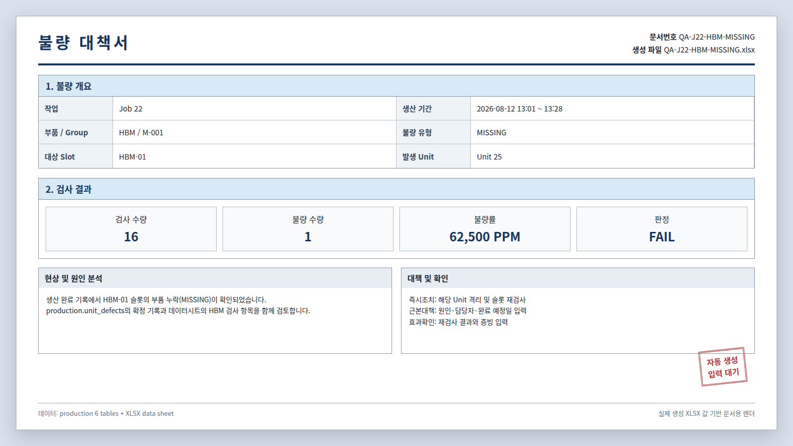

# Production DB와 파일 기반 품질 문서

## 현재 구성

2026-09-02 기준 DDL은 `production` 7개 테이블을 정의한다.

| 저장 위치 | 대상 | 소유·용도 |
|---|---|---|
| PostgreSQL `production` | `products`, `parts`, `product_slots`, `jobs`, `units`, `unit_defects`, `inventory_movements` | 제품 정의와 생산 실행·검사·재고 변동 기록 |
| [부품 데이터시트](../../MAIN_SERVER/data/semiconductor_assembly_quality_datasheet_2026-08-18.xlsx) | 부품 후보, 단가, 검사항목 | `part_catalog`을 대신하는 읽기 전용 XLSX |
| `MAIN_SERVER/reports/defects/*.xlsx` | 불량대책서 | `defect_report`를 대신하는 자동 생성 파일 |

`part_catalog`과 `defect_report` 스키마는 제거했다. 기준 DDL은
[production_schema.sql](../../DATA_STATION/DB/production_schema.sql) 하나다.
기존 `control.assembly_requests` DB는 MainServer와 Sequencer를 중지하고 백업한 뒤
[006_jobs_entrypoint_migration.sql](../../DATA_STATION/DB/006_jobs_entrypoint_migration.sql)을 한 번 실행하고 [005_roles.sql](../../DATA_STATION/DB/005_roles.sql)로 권한을 갱신한다.

## 스키마

테이블·열·FK는 [자동 생성 Mermaid ERD](./db-schema.generated.md)에서
확인한다. 이 파일은 [tbls 설정](../../DATA_STATION/DB/tbls.yml)으로 생성하고
직접 편집하지 않는다.

격리 테스트 DB에 `production_schema.sql`을 적용한 뒤 저장소 루트에서
다음 명령으로 Mermaid를 갱신한다. `PRODUCTION_DB_TEST_DSN`은
`postgres://...` URL 형식을 사용한다.

~~~bash
(
  printf '```mermaid\n' &&
  ~/.local/bin/tbls out -c DATA_STATION/DB/tbls.yml -t mermaid &&
  printf '```\n'
) > /tmp/db-schema.generated.md &&
mv /tmp/db-schema.generated.md UnityDT/Docs/db-schema.generated.md
~~~

### 테이블 역할

| 테이블 | 기본 키 | 주요 열 | 관계 |
|---|---|---|---|
| `products` | `product_id` | `product_code`, `product_name`, `product_version`, `is_selectable` | 제품 정의 |
| `parts` | `part_id` | `part_name`, `part_category`, `stock_quantity` | 생산에 사용하는 부품과 재고 |
| `product_slots` | `product_slot_id` | `product_id`, `slot_code`, `part_id` | 제품의 슬롯별 부품 배치 |
| `jobs` | UUID `job_id` | `product_id`, `requested_quantity`, `recipe_version`, `job_status` | 영속 요청 큐와 생산 실행 기간 |
| `units` | `unit_id` | `job_id`, `unit_sequence_in_job`, `unit_status`, `inspection_result` | Job에서 생산한 개별 Unit |
| `unit_defects` | `unit_defect_id` | `unit_id`, `product_slot_id`, `defect_type` | FAIL Unit의 슬롯 단위 불량 |
| `inventory_movements` | `inventory_movement_id` | `part_id`, `quantity_delta`, `movement_type`, `unit_id` | 현재고의 증감 사유와 시각을 보존하는 원장 |

관계는 다음과 같이 읽는다.

```text
products ──< product_slots >── parts
products ──< jobs ──< units ──< unit_defects >── product_slots
parts ──< inventory_movements >── units
```

### DB가 보장하는 규칙

- 제품 코드와 버전 조합은 유일하다.
- 한 제품에서 같은 `slot_code`를 중복할 수 없다.
- `PENDING` Job은 여러 개 대기할 수 있지만 `RUNNING` Job은 최대 1개다.
- Job 상태는 `PENDING`, `RUNNING`, `COMPLETED`, `FAILED`, `CANCELLED`만 허용한다.
- 한 Job에서 `RUNNING` Unit은 최대 1개다.
- Unit 상태는 `RUNNING`, `COMPLETED`, `FAILED`, 검사는 `PENDING`, `PASS`, `FAIL`만 허용하고 완료·검사 시각의 순서를 검사한다.
- 불량 유형은 `MISSING`, `POSITION_ERROR`, `ORIENTATION_ERROR`, `CRACK`만 허용한다.
- 한 Unit의 같은 Product Slot에는 불량 레코드를 하나만 기록한다.
- 재고 변동량은 0일 수 없고 `CONSUMPTION`은 음수이며 Unit과 연결된다.
- 한 Unit의 같은 Part 소비와 Part별 `OPENING` 기준값은 한 번만 기록한다.

## 재고 원장

`production.parts.stock_quantity`는 빠른 조회용 현재고이고,
`production.inventory_movements`는 변경 사유·증감량·기록 시각을 보존하는
append-only 원장이다. AssemblySequencer는 조립 완료 시 현재고 차감과
`CONSUMPTION` 기록을 같은 트랜잭션에서 처리한다.

기존 재고는 원장 도입 시점의 `OPENING`으로 한 번만 기록했다. 따라서 도입 이전의
개별 입고·소비·보정 내역은 복원하지 않으며, 이후 현재고는 원장 증감량 합계와
일치해야 한다. 부품 데이터시트는 재고를 소유하거나 동기화하지 않는다.

## 부품 데이터시트

부품 하나가 한 행이고, 같은 `부품 타입`이면 서로 대체 후보다. 보드당 수량과 슬롯
배치는 시트에 없다 — `production.product_slots`가 갖고 있다. 별도의 카탈로그 DB는
만들지 않고 [datasheet.py](../../MAIN_SERVER/datasheet.py)가 다음 시트를 직접 읽는다.

| 시트 | 헤더 행 | 사용 내용 |
|---|---:|---|
| `Components` | 4 | 부품 타입, MPN, 핵심 정격, 공급사, 단가, 기준 수량, 확인일 |
| `Checklist` | 3 | 부품 타입별 입고·조립·신뢰성 검사와 이상 시 조치 |

두 축은 `part_category`로 만난다. DB가 보드당 수량을, 데이터시트가 단가를 갖고
있어 보드 원가는 둘을 곱해야 나온다.

```text
production.parts.part_category  ==  데이터시트 '부품 타입'
production.parts.part_name      ==  후보 3종 중 하나의 'MPN'   → unit_price_selected
```

데이터시트 운영 원본은 지정된 부품·품질 데이터 담당자만 수정하고 다른 담당자가
필수값·단가·검사 기준을 검토한 커밋만 배포한다. 로더는 필수 문자열, 양수 단가,
`YYYY-MM-DD` 확인일, `(부품 타입, MPN)` 중복과 두 시트의 카테고리 일치를 검사한다.
DB 선택 MPN이 없으면 최저가로 대체하지 않고 오류를 반환하며, 불량대책서는 사용한
원본의 파일명과 SHA-256을 보존한다.

현재 Production 부품 연결은 다음과 같다. 단가는 후보 3종의 폭이다.

| Part ID | 부품 타입 | Slot | 수량 | 선택 부품 | 단가 |
|---|---|---|---:|---|---|
| `HBM` | `HBM_MEMORY` | `HBM-01~08` | 8 | SK hynix HBM3E 12-Hi 36GB | $352.00 ($338~$361) |
| `PM` | `POWER_MODULE` | `PM-01~04` | 4 | Fabrikam FB-PM4424-15Q | $10.21 ($5.75~$11.90) |
| `GPU` | `GPU_MODULE` | `GPU-01` | 1 | NVIDIA GB200 GPU Module | $32,000 ($16,800~$32,000) |
| `CAP` | `MLCC` | `CAP-01~05` | 5 | Contoso CX-0603X7R104K100 | $0.15 ($0.09~$0.15) |
| `IND` | `POWER_INDUCTOR` | `IND-01~02` | 2 | Contoso CX-XL7030-152M | $4.07 ($3.62~$4.48) |
| `VRM` | `VOLTAGE_REGULATOR` | `VRM-01~05` | 5 | Fabrikam FB-VR546D24 | $12.26 ($9.45~$12.26) |

`GET /api/v1/products/{id}/requirements`가 이 둘을 합쳐 보드당 원가를 낸다. 주품목
기준 $34,927.03이고, 후보를 바꾸면 $19,581.94 ~ $35,006.61 사이에서 움직인다.

제조사명과 P/N은 MLCC·인덕터·파워모듈·VRM 4종이 문서용 가상 사명이다. HBM·GPU는
UI 스프라이트에 제조사 로고가 포함되어 있어 실존 제품명을 쓴다. 단가는 시뮬레이션용
근사값이지 발주 근거가 아니다.

## 불량대책서



이미지는 테스트 DB의 Job 22에서 실제 생성한
`QA-J22-HBM-MISSING.xlsx` 값을 사용한 문서용 미리보기다.

[generate_defect_reports.py](../../MAIN_SERVER/generate_defect_reports.py)는 완료된
Job의 FAIL Unit을 읽고, Job·Part·불량 유형별로 묶어서
`MAIN_SERVER/reports/defects`에 파일을 만든다.

```text
production.jobs / units / unit_defects / product_slots / parts
                              +
semiconductor_assembly_quality_datasheet_2026-08-18.xlsx
                              ↓
QA-J{job_id}-{part_id}-{defect_type}.xlsx
```

생성 규칙은 다음과 같다.

- 파일명에 사용할 수 없는 문자는 `_`로 바꾼다.
- 기존 파일은 덮어쓰지 않아 담당자가 입력한 회신을 보호한다.
- 임시 파일을 완성한 뒤 원자적으로 이동한다.
- 데이터시트에 해당 부품 타입이 없으면 `데이터시트 연결 없음`으로 표시하되 보고서 생성은 계속한다.
- DB에는 보고서 상태나 회신을 다시 저장하지 않는다.

수동 생성 명령:

```bash
cd /home/codlab/Main_Unity
MAIN_SERVER_DB_DSN='dbname=main_unity_mock_test' \
  python3 MAIN_SERVER/generate_defect_reports.py
```

운영 자동 생성은 같은 명령을 1분마다 실행하며, `flock`으로 중복 실행을 막는다.

## 실행 흐름과 소유권

1. Unity가 클라이언트 생성 UUID `job_id`, 제품, 목표 PASS 수량을 MainServer HTTP API에 보낸다.
2. MainServer는 유효한 요청을 `PENDING` Job으로 등록하고, 같은 `job_id` 재요청에는 기존 Job을 반환한다.
3. AssemblySequencer는 실행 중 Job이 없을 때 가장 오래된 `PENDING` Job을 선택하고 `recipe_version`의 YAML을 검증한 뒤 `RUNNING`으로 전이한다.
4. Sequencer는 Unit별로 YAML 순서를 실행하고 Backend의 실제 완료를 기다린다. 안전정지 중에는 Job과 Unit을 `RUNNING`으로 유지한다.
5. PASS 수가 `requested_quantity`에 도달하면 Job을 완료한다. 검사 FAIL은 완료된 생산 시도로 남기고 새 Unit을 만들며, 실행 실패는 Unit `FAILED`로 기록한다.
6. Sequencer는 실제 조립한 Unit의 재고 변동을 기록하고, 불량대책서 생성기는 완료된 FAIL 기록으로 XLSX를 발행한다.
7. Unity/Scenario는 DB나 파일을 직접 다루지 않고 주입된 로봇 인터페이스를 사용한다.

## 검증

격리된 Mock test DB에서 아래 7개 production 테이블을 확인한다.

```text
production.jobs
production.inventory_movements
production.parts
production.product_slots
production.products
production.unit_defects
production.units
```

검증용 SQL은 [003_smoke_test.sql](../../DATA_STATION/DB/003_smoke_test.sql),
조회 예시는 [002_query_samples.sql](../../DATA_STATION/DB/002_query_samples.sql)을
사용한다.
