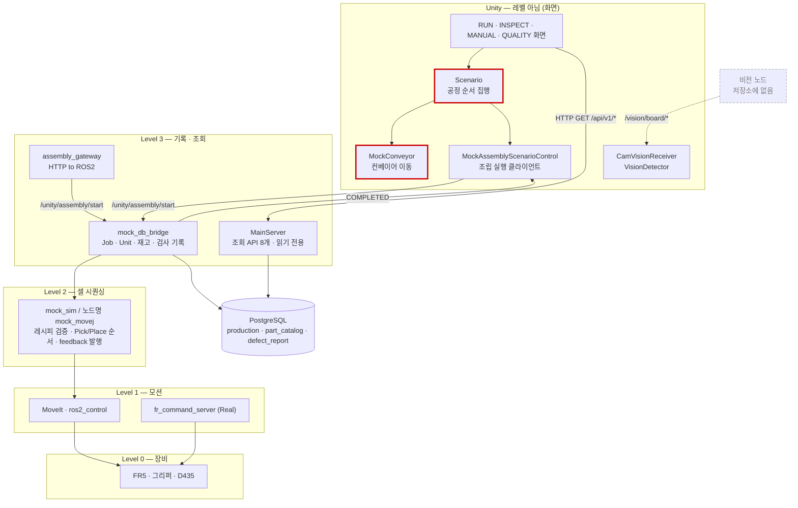
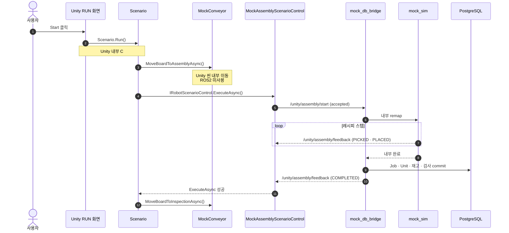
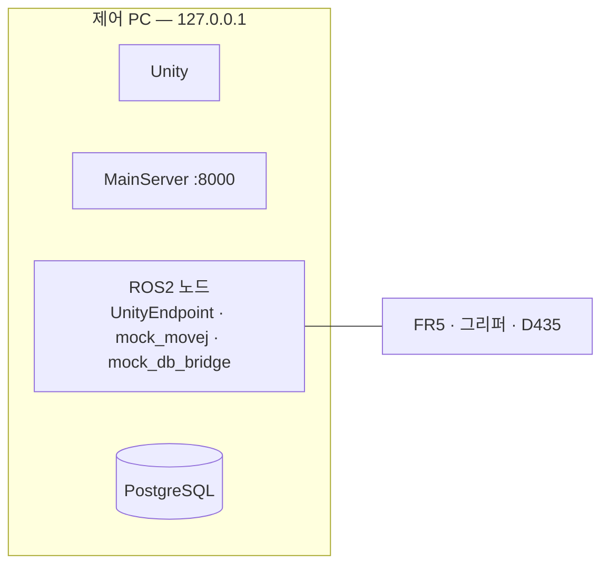

# ISA-95 기준 현재 구조

이 문서는 **2026-08-26 기준으로 실제 실행되는 코드**를 ISA-95 참조 모델에 대입해 정리한다.
목표 구조가 아니라 현재 상태이며, 계층 경계를 위반하는 지점도 그대로 적는다.

기준 문서: [ISA-95 레벨 정리](https://ros2-ai-cobot-project-01-team-01.atlassian.net/wiki/spaces/KSMC/pages/9568269/ISA-95) ·
[현재 시스템 구조](Architecture.md) · [ROS2 API](API.md) · [MainServer API](../../MAIN_SERVER/Main_serverAPI.md)

---

## 1. 계층 배치

| 레벨 | 반응 단위 | 담당 | 구현 |
|---|---|---|---|
| Level 4 | 일~월 | **없음** | ERP 없음. 사람이 Unity 화면에서 직접 요청 |
| Level 3 | 분~시간 | 작업 기록 · 재고 · 조회 | `MAIN_SERVER/` (읽기), `mock_db_bridge.py` (쓰기) |
| Level 2 | 초 | 레시피 시퀀싱 | `mock_sim.py` (노드 `mock_movej`) |
| Level 1 | 밀리초 | 모션 실행 | MoveIt / `ros2_control`, `fr_command_server` (Real) |
| Level 0 | — | 물리 장비 | FR5 · 그리퍼 · D435 · 컨베이어(실물) |
| — | — | 화면 | Unity (`UnityDT/`) — **레벨이 아님** |

Level 3이 **두 곳으로 나뉘어 있다.** MainServer가 읽기를, `mock_db_bridge`가 쓰기를 담당한다.

Level 2 본체인 `mock_sim.py`(1185줄)는 ROS 패키지가 아니라 `Farino_AIO/notebooks/`에 있고,
`fairino5_v6_moveit2_config/CMakeLists.txt:12`가 `install(PROGRAMS ../../notebooks/mock_sim.py ...)`로
패키지 밖을 참조해 설치한다. 시스템에서 가장 핵심적인 제어 코드가 실험용 디렉터리에 있다.

---

## 2. 현재 구조도

빨간 테두리 두 개가 **계층 위반**이다(4절). 점선은 저장소에 구현이 없는 부분이다.

---

## 3. 현재 실행 흐름

Unity RUN 화면의 Start 버튼을 누른 경우다.

핵심 계약 두 가지.

- 서비스 응답의 `accepted=true`는 **수락**일 뿐 완료가 아니다.
- `COMPLETED`는 DB commit이 끝난 뒤에 발행된다.

---

## 4. 계층 위반 사항

### 4-1. 화면이 Level 2를 소유한다

`Scenario.cs:20`의 `Run()`이 컨베이어 이동 → 조립 → 컨베이어 이동 순서를 직접 집행한다.
공정 순서는 Level 2 책임인데 화면이 갖고 있다.

팀 ISA-95 문서의 원칙과 충돌한다.

> "Unity가 아무것도 소유하지 않는다. 그래서 모니터를 꺼도 요리는 계속된다."

현재는 Unity를 종료하면 진행 중인 공정 순서가 사라진다.

### 4-2. 컨베이어와 로봇의 주인이 다르다

컨베이어는 `MockConveyor.cs`(207줄, ROS 참조 0건)로 Unity 안에서만 움직이고, 로봇은 ROS2가 움직인다.
그 결과 **`POST /api/v1/assemblies`로 조립을 시작하면 기판이 이송되지 않은 채 로봇만 동작한다.**

> 2026-08-26 팀 결정: 컨베이어 제어를 ROS2로 이관한다.

### 4-3. 디지털 트윈이 조용히 갈라질 수 있다

`MockAssemblyScenarioControl.cs:491`이 `feedback.request_id != activeRequestId`인 피드백을 버린다.
Unity가 idle일 때 MainServer가 조립을 시작하면 로봇은 움직이는데 화면은 반응하지 않는다.

### 4-4. 정지 경로가 없다

`Scenario`에 `Stop`·`Cancel`·`Abort`가 없고 조립 서비스에도 취소 명령이 없다.
E-STOP 관련 코드는 전부 수신 전용이다 — Real `/nonrt_state_data`의 `EmergencyStop` 비트를 읽어
표시만 한다(`RobotStatusManager.cs:120`, `FR5RunBinder.cs:409`).

**SR-12(공정 제어 — 중지)와 SR-15(긴급 정지)의 정지 쪽이 미충족이다.**

### 4-5. 진입점이 두 곳이다

`Scenario.Run()`과 `POST /api/v1/assemblies`가 각각 독립적으로 조립을 시작할 수 있다.
`mock_sim.py:606`의 뮤텍스가 동시 실행은 막지만, 공정 소유권은 정해져 있지 않다.

---

## 5. 인터페이스

### Unity ↔ ROS2 (Mock)

| 방향 | 이름 | 타입 | 용도 |
|---|---|---|---|
| Unity → ROS2 | `/unity/assembly/start` | `fairino_msgs/srv/RemoteCmdInterface` | 조립 1회 실행 요청 |
| ROS2 → Unity | `/unity/assembly/feedback` | `std_msgs/String` | `STARTED` `PICKED` `PLACED` `COMPLETED` `FAILED` |
| Unity → ROS2 | `/unity/joint_target` | `sensor_msgs/JointState` | 수동 관절 |
| Unity → ROS2 | `/unity/movej_target` · `/unity/tcp_target` | `geometry_msgs/PoseStamped` | 수동 이동 |
| Unity → ROS2 | `/unity/gripper_target` | `std_msgs/Float32` | 그리퍼 |
| ROS2 → Unity | `/joint_states` | `sensor_msgs/JointState` | 관절 상태 (`MockRobotStateSource.cs:16`) |
| ROS2 → Unity | `/twin_visual/status` | `std_msgs/String` | 수동 명령 결과 |

### Real 경로

`RealStatusSubscriber`가 `/nonrt_state_data`를 받고 `RealMoveControl`이
`/fairino_remote_command_service`로 이동을 요청한다. 다만 다음 두 곳이 미지원이다.

| 파일 | 상태 |
|---|---|
| `RealAssemblyScenarioControl.cs:13` | 자동 조립 `NotSupportedException` |
| `RealRobotControl.cs:24` | 일부 수동 제어 `NotSupportedException` |

즉 **Real은 상태 수신과 일부 이동만 되고 자동 조립은 되지 않는다.**

### 비전 (Mock · Real 공통)

| 이름 | 타입 | 용도 | 구독 | 발행 |
|---|---|---|---|---|
| `/vision/board/image/compressed` | `sensor_msgs/CompressedImage` | HUD 영상 | `CamVisionReceiver.cs` | **없음** |
| `/vision/board/capture/target_pose` | `geometry_msgs/PoseStamped` | 검출 Pose | `VisionDetector.cs` | **없음** |
| `/vision/board/selected_target` | `std_msgs/String` | 선택 대상 ID | `FR5InspectBinder.cs` | **없음** |

> 세 토픽을 **발행하는 ROS 노드가 저장소에 없다.** Unity 구독 코드만 존재한다.
> `ch14_vision.launch.py`는 `fairino_hardware_v3_9_7`의 `ros2_cmd_server`를 띄우며 비전 노드가 아니다.
> 따라서 현재 비전 경로는 계약만 정의된 상태다.

### Unity ↔ MainServer (HTTP)

`FR5RequestBinder.cs` · `FR5InspectBinder.cs` · `FR5QualityBinder.cs`가 조회 라우트를 호출한다.
조립 시작은 HTTP를 쓰지 않고 ROS2 서비스를 직접 호출한다.

전체 라우트는 [MainServer API](../../MAIN_SERVER/Main_serverAPI.md) 참조.

---

## 6. 배포

Unity, MainServer, ROS2 노드, PostgreSQL이 **모두 같은 PC**에서 돈다
(`server.py:254` 기본 바인딩 `127.0.0.1`, `FR5RequestBinder.cs:68` `http://127.0.0.1:8000`).
프로세스는 서로 분리되어 있다.

---

## 7. 미구현

| 항목 | 상태 |
|---|---|
| 컨베이어 ROS2 제어 | 미구현 (Unity 내부 Mock) — ROS2 이관 결정됨 |
| 정지 · 비상정지 명령 | 미구현 (SR-12 · SR-15) |
| Real 자동 조립 | `RealAssemblyScenarioControl.ExecuteAsync()`가 `NotSupportedException` |
| 비전 노드 (ROS 발행자) | 저장소에 없음. Unity 구독 코드와 토픽 계약만 존재 |
| AI 불량 검사 | 미구현 |
| 작업 큐 · 다중 셀 · ROS2 Action | 없음. 고정 레시피 1개 · 수량 1 · 동시 1건 |

구현 순서는 [TODO](../../TODO.md)에서 관리한다.

---

## 8. 판단 기준으로 쓸 표준

설계나 권한 경계가 헷갈릴 때 참조할 기준이다. ISA-95만으로는 답이 안 나오는 질문이 많다.

| 헷갈리는 질문 | 기준 | 답해주는 것 |
|---|---|---|
| 이 기능이 어느 계층인가 | **ISA-95** (IEC 62264) | 반응 시간으로 층을 나눔. 현재 사용 중 |
| 레시피는 누가 소유하나 · 스텝은 누가 펼치나 | **ISA-88** (IEC 61512) | 레시피와 설비 제어의 분리, 설비 계층 모델 |
| 다이어그램 박스가 프로세스인가 기계인가 | **C4 model** | 추상화 수준 4단계 + 배포도 분리 |
| 정지를 어디에 두나 | **IEC 60204-1** | 정지 범주 0 · 1 · 2 |
| 협동로봇 안전 요구 | **ISO 10218-1/-2**, **ISO/TS 15066** | 구속력 있는 규격. SR-14 · SR-15 근거 |
| 장시간 명령의 계약 | **ROS 2 Action** | goal · feedback · result · **cancel** |

### 8-1. ISA-88 — 지금 가장 필요한 것

"조립 순서를 로봇이 갖는가"라는 질문에 ISA-88이 직접 답한다. 세 가지를 나눈다.

| 개념 | 뜻 | 우리 대응 |
|---|---|---|
| Recipe | 무엇을 만드는가 | `mock-r1.yaml` — 제품에 속함 |
| Procedural Control | 레시피를 스텝으로 펼쳐 설비를 지휘 | `Assembly Sequencer` — **Unit 레벨** |
| Equipment Control | 설비 자체의 동작 | `Motion Controller`, 그리퍼, 컨베이어 구동 |

설비 계층 모델은 `Process Cell → Unit → Equipment Module → Control Module`이다.
우리에 대입하면 **Process Cell = 조립 셀 전체 / Unit = 조립 스테이션 / Equipment Module = FR5 · 그리퍼 ·
컨베이어 / Control Module = 개별 관절**이다.

절차 제어는 Unit 레벨에 있고 Equipment Module보다 위다.
**`Assembly Sequencer`를 `FR5 Arm` 안에 넣으면 안 되는 이유가 이 모델로 설명된다.**

### 8-2. ROS 2 Action — 이미 손으로 만들고 있는 것

`/unity/assembly/start`(서비스, `accepted`만 반환) + `/unity/assembly/feedback`(토픽, 진행·종료) 조합은
**ROS 2 Action을 수작업으로 재구현한 것**이다. Action은 goal · feedback · result에 **cancel**을 포함한다.

4-4에서 지적한 정지 부재(SR-12 · SR-15)는 Action으로 옮기면 표준 방식으로 상당 부분 해결된다.

### 8-3. C4 model — 다이어그램 논쟁의 기준

| 수준 | 뜻 |
|---|---|
| Context | 시스템과 외부 행위자 |
| **Container** | **독립 실행 단위(프로세스·앱·DB)** |
| Component | Container 내부 모듈 |
| Code | 클래스 수준 |

Container는 프로세스이지 기계가 아니다. MainServer와 ROS2 노드는 **같은 PC에서 돌아도 서로 다른
Container**다. 어디서 도는지는 별도의 **Deployment diagram**에 그린다.

"한 PC인데 박스가 둘이냐"는 C4 기준으로는 모순이 아니다. 두 그림이 다를 뿐이다.

### 8-4. 안전 — ISA-95 밖이다

팀 ISA-95 문서에도 적혀 있다.

> "로봇 쪽에서 실제로 지켜야 하는 건 안전 규격(ISO 10218, ISO/TS 15066)이다.
> 그건 안 지키면 장비를 못 판다. ISA-95는 그런 구속력이 없는 참고 지도다."

IEC 60204-1의 정지 범주가 SR-15 설계의 기준이 된다.

| 범주 | 동작 |
|---|---|
| 0 | 즉시 전원 차단 |
| 1 | 제어된 감속 후 전원 차단 |
| 2 | 제어된 정지, 전원 유지 |

비상정지는 범주 0 또는 1이어야 하며 **응용 소프트웨어 계층의 가용성에 의존하면 안 된다.**
현재 E-STOP은 `/nonrt_state_data`를 받아 표시만 하므로 어느 범주도 구현되어 있지 않다.

### 8-5. 정리

- **계층 경계**가 헷갈리면 → ISA-95
- **레시피·절차 소유권**이 헷갈리면 → ISA-88
- **그림 추상화 수준**이 헷갈리면 → C4
- **정지·안전**이 헷갈리면 → IEC 60204-1 · ISO 10218 · ISO/TS 15066
- **명령 계약**이 헷갈리면 → ROS 2 Action
