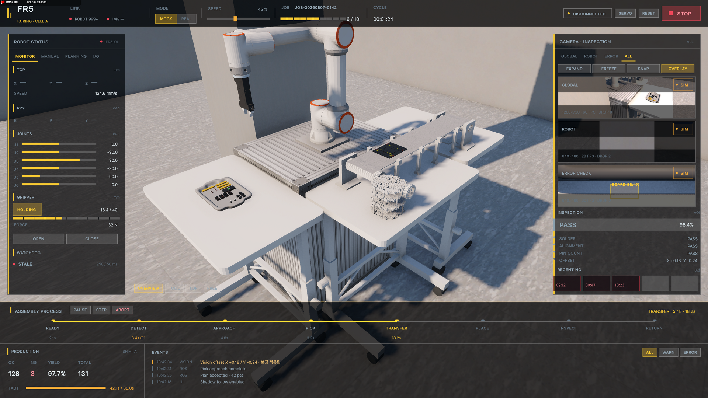
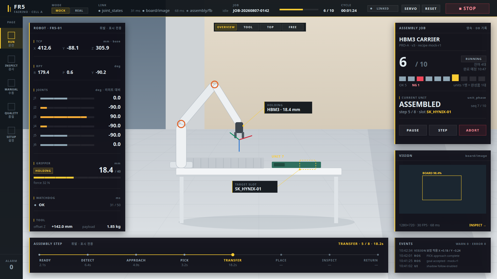
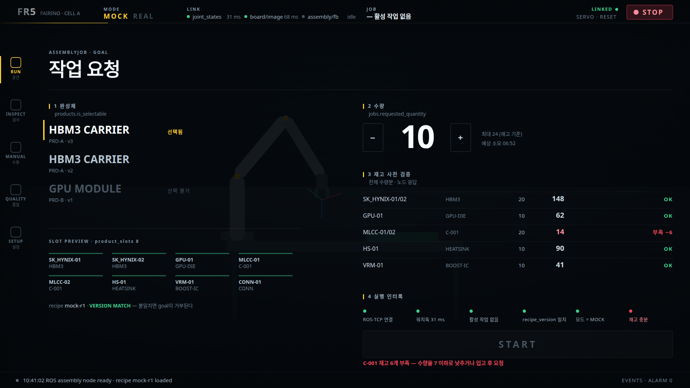
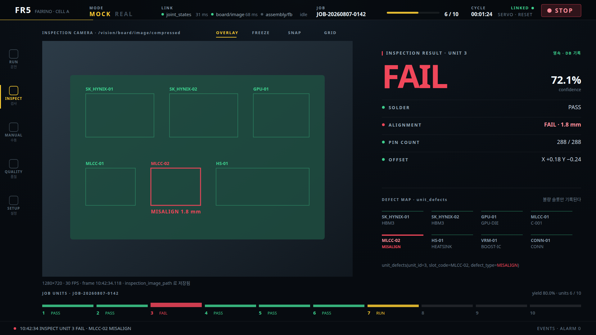
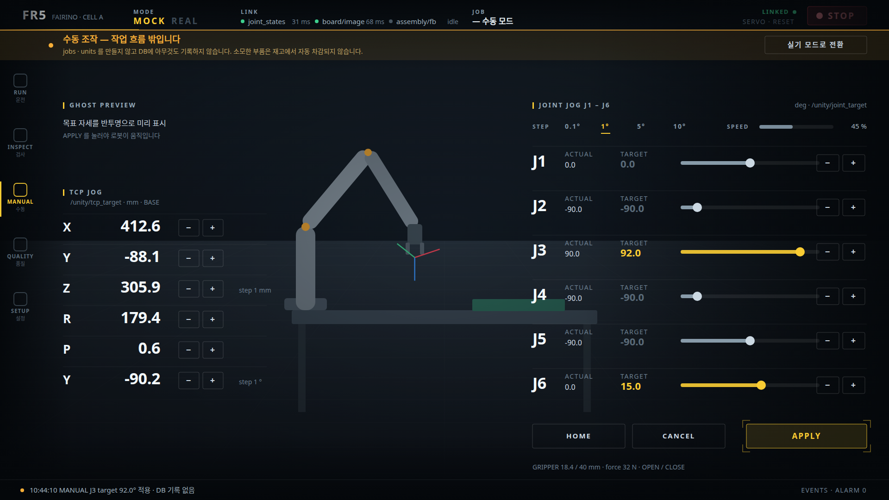
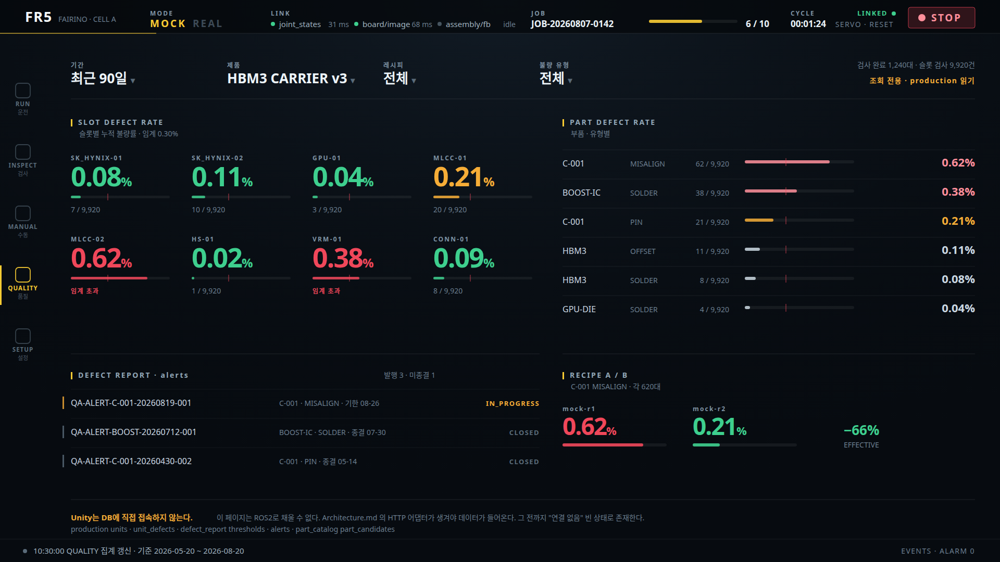
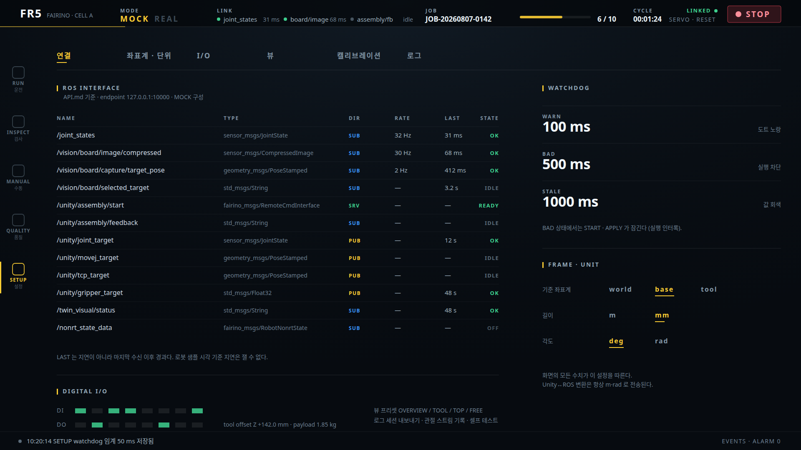

# Unity 화면 설계 — 기능 정의와 페이지 분할

## 이 문서의 범위

Unity가 **무엇을 보여주고 무엇을 조작하게 할지**, 그것을 **몇 개의 화면으로 나눌지**를 정한다.
`Assets/UI/FR5Dashboard.uxml` 의 현재 단일 HUD를 출발점으로 삼고, 재설계안을 SVG 목업으로 남긴다.

| 문서 | 이 문서가 가져오는 것 |
|---|---|
| [Architecture.md](./Architecture.md) | Unity의 책임 경계. 무엇을 소유하지 않는지 |
| [DB.md](./DB.md) | `production` 6테이블. 화면이 답해야 할 질문 7개 |
| [DB3.md](./DB3.md) | `part_catalog` · `defect_report`. 품질 화면의 데이터 출처 |
| [API.md](./API.md) | 실제로 존재하는 토픽·서비스. 지금 채울 수 있는 값의 한계 |
| [fr5-ui-requirements.md](./fr5-ui-requirements.md) | 버튼·표시 항목 원안 |
| [fr5-final-goal-feature-layers.md](./fr5-final-goal-feature-layers.md) | Layer 1 · 2 기능 목록 |

`Recipe.md`는 로봇이 소유하므로 화면에 본문이 나오지 않는다. Unity는 `recipe_version` 문자열만 다룬다.

## 산출물

| 파일 | 내용 |
|---|---|
| [ui/current-hud-2026-08-20.png](./ui/current-hud-2026-08-20.png) | 현재 SampleScene HUD 캡처 (Game View, 알파 합성 후) |
| [ui/mock-01-run.svg](./ui/mock-01-run.svg) | RUN — 작업 실행 중 **(기존 HUD 패널 언어)** |
| [ui/mock-02-run-request.svg](./ui/mock-02-run-request.svg) | RUN — 작업 요청·사전 검증 |
| [ui/mock-03-inspect.svg](./ui/mock-03-inspect.svg) | INSPECT — 검사 판정 |
| [ui/mock-04-manual.svg](./ui/mock-04-manual.svg) | MANUAL — 수동 조그 |
| [ui/mock-05-quality.svg](./ui/mock-05-quality.svg) | QUALITY — 누적 불량률·대책서 |
| [ui/mock-06-setup.svg](./ui/mock-06-setup.svg) | SETUP — 연결 진단·설정 |
| [ui/run_leg.svg](./ui/run_leg.svg) | RUN 최초안 레이아웃 + 외곽 바 정리 + 기능 보강 |

각 SVG 옆에 같은 이름의 PNG 렌더가 있다. 1920×1080 기준이다.

### RUN 페이지 후보 5안

기존 양식을 전부 버리고 **화면을 무엇을 중심으로 조직하는가**를 다르게 잡은 다섯 개다.
스킨이 아니라 구조가 다르므로, 고른 뒤 나머지 페이지도 같은 원리로 따라간다.

| 후보 | 조직 원리 | 강한 점 | 약한 점 |
|---|---|---|---|
| [A · 공정 타임라인](./ui/run-a-timeline.svg) | **시간**이 척추. 유닛·스텝·이벤트를 한 축에 놓고 NOW 선이 관통한다 | "언제 무슨 일이 있었나"가 한눈에. 실패한 U3의 위치와 원인이 축 위에서 바로 읽힌다 | 지금 이 순간의 값(관절·TCP)은 부차적으로 밀린다. 화면 폭을 많이 먹는다 |
| [B · 트윈 전면](./ui/run-b-twin.svg) | **트윈이 곧 UI.** 정보가 패널이 아니라 3D 객체에 붙는다 | 트윈이 화면의 100%. 파지 부품·목표 슬롯이 대상 옆에 있어 가장 빨리 읽힌다 | 라벨 위치를 매 프레임 월드→화면 변환으로 계산해야 한다. 정보 밀도가 낮다 |
| [C · 균등 타일](./ui/run-c-tiles.svg) | **모든 패널이 동등한 타일.** 3D도 타일 하나 | 밀도가 가장 높고 배치를 운영자가 바꿀 수 있다. Foxglove·Grafana 관습 그대로 | 초점이 없다. 3D가 특별대우를 못 받아 디지털 트윈다움이 옅다 |
| [D · 작업지시서](./ui/run-d-order.svg) | **기록이 먼저.** 유닛 목록 + 선택 상세 | `units` · `unit_defects` 구조를 화면이 그대로 닮는다. 지난 대수 추적이 자연스럽다 | 실시간감이 가장 약하다. 움직이는 로봇을 보는 화면이라기보다 조회 화면 |
| [E · 계기판](./ui/run-e-cockpit.svg) | **3m 거리 가독성.** 원형 계기와 좌우 대칭 | 서서 보는 거리에서 가장 잘 읽힌다. 물리 E-STOP 은유가 장비 옆 화면과 어울린다 | 원형 게이지는 같은 면적에서 정보량이 적다. 정밀한 수치 대조에는 불리 |


> **`mock-01-run` 만 기존 HUD의 패널 언어로 다시 그렸다.** 나머지 다섯 장은 패널을 걷어낸
> 중간 초안이라 표면 처리가 다르다. 배경이 밝은 셀임을 확인한 이상 나머지도 같은 패널
> 방식으로 맞춰야 한다.

---

## 1. 현재 화면



단일 HUD 하나에 8개 영역이 상주한다. 상단 바, 좌측 ROBOT STATUS(4탭), 우측 CAMERA·INSPECTION,
하단 ASSEMBLY PROCESS 레일, 최하단 PRODUCTION + EVENTS. 3D 트윈은 이들 사이 중앙 창에 보인다.

### 잘 되어 있는 것

- **3D가 배경이고 패널이 그 위에 뜬다.** 패널 사이에 3D를 끼워 넣지 않았다. 이 구조는 유지한다.
- **MOCK / REAL을 색 토큰으로 분기한다.** `--c-accent`가 `--c-mock`(노랑) / `--c-real`(파랑)로 갈린다.
- **정상 상태에 색을 쓰지 않는다.** `--c-ok`가 회색이라 이상만 눈에 띈다. 산업 화면의 옳은 기본값이다.
- **LINK를 토픽별로 분해했다.** 어느 스트림이 끊겼는지 개별로 읽힌다.
- **바인더가 이미 붙어 있다.** `FR5DashboardBinder`의 `Refresh*` 11개가 구현·활성 상태다.
  캡처에서 TCP·RPY가 비어 있는 것은 미구현이 아니라 Mock Backend가 그 필드를 채우지 않기 때문이다.

### 고쳐야 할 것

| # | 문제 | 근거 |
|---|---|---|
| 1 | **작업을 시작할 방법이 없다** | `job-id`는 표시 전용이다. Architecture가 Unity의 첫 번째 책임으로 규정한 "완성체 선택 + 수량 요청"에 대응하는 요소가 UXML 222개 name 중 하나도 없다 |
| 2 | 카메라 뷰포트 3개가 각 100px 높이로 쌓여 있다 | 검사 판정은 화면을 보고 내리는 결정이다. 이 크기로는 판정할 수 없고, 판정할 수 없으면 `inspection_result` 화면은 장식이다 |
| 3 | 액센트 색이 모드 신호를 잃었다 | 노랑이 관절 바·진행 바·탭·버튼·tact 바·이벤트 필터에 전부 쓰인다. 화면 전체가 액센트면 MOCK/REAL 구분이 사라진다 |
| 4 | `DISCONNECTED`가 화면에서 가장 조용하다 | 회색 칩 + 노란 점이다. 연결이 끊기면 모든 조작이 무의미해지는데, 붉은 STOP 버튼보다 약하게 표시된다 |
| 5 | 하단 22%가 저빈도 정보에 고정 배분됐다 | 스텝 레일 + 생산 집계 + 이벤트 로그가 240px를 상시 점유한다. 그중 실시간은 스텝 레일뿐이다 |
| 6 | DB 질문 7개 중 1개만 답한다 | 슬롯별·부품별 누적 불량률, 레시피 개선 전후 비교를 놓을 자리가 없다 |
| 7 | 초점이 없다 | 8개 영역이 같은 시각 비중을 갖는다. 지금 봐야 할 것이 무엇인지 화면이 말하지 않는다 |
| 8 | 10–11px 라벨 | `--fs-micro: 10px`. 실기 옆 모니터를 서서 보는 거리에서 읽히지 않는다 |

---

## 2. UI가 책임지는 기능

Architecture.md가 정한 Unity의 대화 상대별로 정리한다. **Unity는 상태를 소유하지 않고 DB에
접속하지 않는다.** 아래는 전부 "요청" 또는 "표시"다.

### A. 작업 요청 — 조립 노드 (Action goal)

| 기능 | 데이터 | 비고 |
|---|---|---|
| 완성체 선택 | `products.product_code · product_name · product_version · is_selectable` | `is_selectable=false`는 목록에 두되 선택 불가로 표시 |
| 슬롯 구성 미리보기 | `product_slots.slot_code → parts.part_id` | 이 그림을 검사·품질 화면이 재사용한다 |
| 수량 입력 | `jobs.requested_quantity` | MVP는 1 고정 |
| 레시피 버전 확인 | `jobs.recipe_version` | 불일치면 노드가 goal을 거부한다. **요청 전에** 화면에서 보여야 한다 |
| 재고 사전 검증 결과 | `parts.stock_quantity` vs 소요량 | 판정은 노드가 한다. 화면은 결과와 부족분만 표시 |
| 수락·거부 응답 | `accepted` · `error_code` · `message` | `accepted`는 수락이지 완료가 아니다 |

### B. 작업 진행 — 조립 노드 (feedback)

| 기능 | 데이터 | 영속 |
|---|---|---|
| 요청 대비 완료 수량 | `jobs.requested_quantity` · 완료 `units` COUNT | 영속 |
| 완성품 단위 상태 | `unit_sequence_in_job` · `unit_phase` · `unit_status` | 영속 |
| 스텝 진행 | `step_order` · `slot_code` | **휘발.** DB에 쓰지 않는다 |
| 사이클 · tact | 화면 계산 | 휘발 |
| 일시정지 · 취소 | Action cancel | 미구현 (todo) |

### C. 3D 디지털 트윈 — 로봇 직접 (Topic)

관절·TCP 렌더링, TCP 좌표축, 부품 attach/detach, 고스트 목표 자세, 뷰 프리셋.
수십 Hz이고 DB를 거치지 않는다. **전부 휘발이다.**

### D. 검사 — 조립 노드 (feedback) + 비전 노드 (Topic)

| 기능 | 데이터 |
|---|---|
| 카메라 영상 | `/vision/board/image/compressed` |
| 검출 결과 오버레이 | `/vision/board/capture/target_pose` · `/vision/board/selected_target` |
| 완성품 판정 | `units.inspection_result` (PASS / FAIL / PENDING) |
| 불량 슬롯과 유형 | `unit_defects.product_slot_id` · `defect_type` |
| 검사 이미지 | `units.inspection_image_path` |

**정상 슬롯은 행을 만들지 않는다.** 화면도 같은 규칙으로 읽혀야 한다 — 불량만 색을 얻는다.

### E. 품질 — 조회 전용

DB.md가 답하기로 한 질문 6·7과 DB3.md의 대책서 루프다.

| 기능 | 출처 |
|---|---|
| 슬롯별·부품별 누적 불량률 | `production` 집계 |
| 임계 초과 여부 | `defect_report.thresholds` |
| 대책서 상태와 기한 | `defect_report.alerts` |
| 레시피 개정 전후 비교 | `alert_countermeasures.applied_recipe_version` |
| 대체 후보·재검증 항목 | `part_catalog.part_candidates` |

**이 데이터는 ROS2로 오지 않는다.** Architecture.md가 확장점으로 남겨 둔 HTTP 어댑터가 필요하다.

### F. 수동 조작 — 작업 흐름 밖

관절 조그, TCP 조그, 그리퍼, HOME. **`jobs`도 `units`도 만들지 않고 DB에 아무것도 남기지 않는다.**
여기서 소모한 부품은 재고에서 자동 차감되지 않고 실사 조정으로 맞춘다.

### G. 연결·안전 — 상시

토픽별 수신 상태, 워치독, MOCK/REAL, SERVO·RESET·STOP, 알람 배너, 이벤트 로그, 재접속 복구.

---

## 3. 왜 페이지를 나누는가

단일 HUD를 유지하면 위 A–G가 전부 상주해야 한다. 그러면 3D가 좁아지고, 카메라가 100px이 되고,
작업 요청은 자리를 못 찾는다. 지금 화면이 정확히 그 상태다.

나누는 근거는 셋이다.

**① 갱신 주기가 세 자릿수로 다르다.**
관절 스트림 30 Hz, 완성품 1대 수십 초, 품질 집계 분기. 한 화면에 두면 가장 자주 바뀌는 것이
시선을 독점하고, 가장 드물게 바뀌는 것이 가장 중요한 결정을 담는다. 조회 성격의 품질 화면이
렌더 루프와 자원을 다툴 이유도 없다.

**② 결정 단위가 다르다.**

| 페이지 | 사용자가 답하는 질문 | 단위 |
|---|---|---|
| RUN | 지금 계속 돌려도 되는가 | 작업 1건 |
| INSPECT | 이 1대가 PASS인가, 어느 슬롯이 불량인가 | 완성품 1대 |
| MANUAL | 이 자세로 움직여도 되는가 | 관절 1개 |
| QUALITY | 이 부품을 바꿔야 하는가 | 부품 1종 · 분기 |
| SETUP | 지금 통신이 정상인가 | 링크 1개 |

**③ 위험도가 다르다.**
수동 조그는 DB에 기록되지 않는 경로이고, 실기에서는 사람이 다칠 수 있다. 자동 운전 화면의 탭
하나로 열려 있으면 오조작 경로가 상시 열린 것이다. **페이지를 분리하는 것 자체가 인터록이다.**

### 나누지 **않는** 것

모드, 링크 상태, 알람, E-STOP은 페이지와 무관하게 상주한다. 어느 화면에 있든 "지금 실기인가",
"연결이 살아 있는가", "멈출 수 있는가"에 답할 수 있어야 한다. 이 넷은 공통 셸에 고정한다.

---

## 4. 공통 셸

```text
┌ 상단 레일 64px ─────────────────────────────────────────────────────────────┐
│ FR5 · CELL A │ MODE │ LINK ×3 │ JOB 요약 │ CYCLE │ 연결 · SERVO RESET │ STOP │
├──┬──────────────────────────────────────────────────────────────────────────┤
│나│  ← 좌 136px          페이지 콘텐츠              우 1872px →              │
│비│                                                                          │
│88│  콘텐츠는 가장자리에 붙고 가운데는 비운다                                  │
├──┴──────────────────────────────────────────────────────────────────────────┤
│ 알람 · 이벤트 스트립 44px (접힘 상태, 클릭 시 확장)                            │
└─────────────────────────────────────────────────────────────────────────────┘
```

| 요소 | 규칙 |
|---|---|
| MODE | **액센트 색을 쓰는 유일한 요소.** MOCK 노랑 / REAL 파랑 |
| LINK | 토픽별 도트 + 마지막 수신 이후 경과. 현재 UXML 주석의 정의를 그대로 유지 |
| JOB 요약 | 활성 작업이 없으면 진행 바와 CYCLE을 **숨긴다**. 0/0을 그리지 않는다 |
| 연결 표시 | 끊기면 화면에서 가장 강한 신호가 된다 |
| STOP | 항상 같은 절대 좌표. 좌측 요소와 28px 이상 이격 |
| 나비게이션 | 좌측 88px 레일. 5개. 3D 폭을 최대한 남기려고 상단 탭 대신 좌측 레일을 쓴다 |
| 알람 스트립 | 접힘 44px. WARN·ERROR 발생 시 확장 배지 |

셸도 페이지 콘텐츠도 **패널 박스를 쓰지 않는다.** 3D 위에서는 방향성 그라디언트로 배경만 눌러
글자를 읽히게 하고, 평면 화면에서는 가로줄 하나로 구분한다. 근거는 6절에 있다.

---

## 5. 페이지별 배치

### 5.1 RUN — 운전 (메인)

기본 페이지다. 사용 시간의 대부분이 여기다.



#### 대비를 배경에 맡기지 않는다

여기서 두 번 틀렸다. 처음엔 어두운 3D 무대를 가정한 어두운 HUD를 그렸고, 실제 씬이 밝다는
것을 확인한 뒤에는 라이트 HUD로 뒤집었다. **둘 다 같은 실수였다.** 배경 밝기에 맞춰
전경을 고르는 접근 자체가 성립하지 않는다.

디지털 트윈에서 배경은 **변수**다. 카메라가 궤도를 돌면 같은 글자가 흰 작업대 위에 있다가
어두운 그리퍼 위로 가고, 다음 순간 강한 그림자를 지난다. 반투명 패널·스크림·글자 그림자는
전부 "배경이 대체로 이럴 것"이라는 가정 위에 서 있고, 그 가정은 매 프레임 깨진다.

기존 `FR5Dashboard.uss` 는 이 문제를 이미 풀어 두었다.

```css
--c-panel: rgba(10, 15, 20, 0.93);   /* 93% — 사실상 계기 표면 */
```

**패널을 불투명한 계기 표면으로 두면 대비가 상수가 된다.** 뒤에 무엇이 지나가든 상관없다.
게임 HUD의 어법(배경에 녹아드는 반투명 오버레이)은 배경을 저작자가 통제할 때 성립하고,
운전자가 카메라를 돌리는 산업 화면에서는 성립하지 않는다.

그래서 이 목업은 **기존 HUD의 표면 언어를 그대로 쓴다.**

| 그대로 가져온 것 | 값 |
|---|---|
| 패널 | `rgba(10,15,20,0.93)` + 1px `rgba(255,255,255,0.09)` 테두리, 모서리 각짐 |
| 액센트 척추 | 패널 좌측 3px 세로 바 (`.hud-accent`) |
| 패널 헤더 | 40px, 하단 경계선, 제목 좌측 · 배지 우측 |
| 게이지 | 함몰 트랙 `rgba(255,255,255,0.07)` + 눈금 |
| 정상 색 | `--c-ok` 회색. **정상에는 색을 주지 않는다** |
| 액센트 | MOCK 노랑 `#facc33` / REAL 파랑 `#3a96ff` |

3D 안의 라벨도 같은 표면을 쓴다. 헤일로나 그림자가 아니라 **작은 패널 칩**이라 배경이
무엇이든 읽힌다.

바꾼 것은 **구성과 타이포뿐이다.** 영역을 8개에서 5개로 줄이고, 값 크기를 16px에서 20–52px로
올리고, 중복(SLOT PROGRESS)을 뺐다.

#### 배치 격자

모든 열이 **같은 선에서 시작하고 같은 선에서 끝난다.** 패널 높이를 내용에 맡기면 아래가
들쭉날쭉해지므로, 열의 끝선을 먼저 정하고 내용 간격으로 채운다.

```text
      0   88        112                            1524        1896
      ┌───┬──────────────────────────────────────────────────────┐
   0  │  상단 바 64 — 모드 · 링크 · 작업 · 사이클 · STOP           │
  64  ├───┼──────────┬──────────────────────────┬────────────────┤
      │페 │          │                          │  ASSEMBLY JOB  │
  88  │이 │  ROBOT   │      디지털 트윈          │       368      │
      │지 │   808    │   (뷰 프리셋은 창 상단)   ├────────────────┤
      │레 │          │                          │  VISION 368    │
 896  │일 ├──────────┴──────────────────────────┴────────────────┤
 920  │88 │  ASSEMBLY STEP                    │  EVENTS          │
1056  │   │             136                   │      136         │
      └───┴───────────────────────────────────┴──────────────────┘
```

| 영역 | 위치 | 내용 |
|---|---|---|
| **페이지 레일** | 좌측 88px 고정 | RUN · INSPECT · MANUAL · QUALITY · SETUP + 바닥에 ALARM 수 |
| 상단 바 | 전폭 64px | 모드 · 링크 3개 · 작업 · 사이클 · SERVO/RESET · STOP |
| ROBOT | 좌측 열 372×808 | TCP · RPY · J1–J6 · 그리퍼 · 워치독 · 툴. **휘발 배지** |
| 디지털 트윈 | 가운데 992×808 | 계기 열 사이. 로봇 동작 영역과 겹치지 않는다 |
| 뷰 프리셋 | 트윈 창 상단 중앙 | 3D 창에 속한 컨트롤이므로 창 안에 둔다 |
| ASSEMBLY JOB | 우측 열 372×368 | 제품 · 현재 phase · 현재 스텝·슬롯 · PAUSE/STEP/ABORT. **영속 배지** |
| VISION | 우측 열 하단 372×368 | 4:3 뷰포트 하나(338×254). 클릭하면 INSPECT로 넘어간다 |
| ASSEMBLY PROGRESS | 하단 좌측 | 부품 타입별 슬롯 진행(칸 하나 = 슬롯 하나) + 현재 부품·슬롯. **휘발 배지** |
| EVENTS | 하단 우측 372px | 최근 4건 |
| 인-신 라벨 | 대상 옆 | HOLDING · HBM3 / TARGET SLOT · SK_HYNIX-01 / UNIT 7 |

**페이지 이동은 패널 안의 탭이 아니라 별도 레일이다.** 페이지는 최상위 계층이므로 어느
패널에도 종속되면 안 되고, 어느 페이지에 있든 같은 자리에 있어야 한다. 레일 바닥의 ALARM
수도 같은 이유로 여기 붙는다 — 페이지를 옮겨도 따라온다.

#### 기능 점검

레이아웃과 별개로 **화면이 답해야 하는데 자리가 없던 것**을 문서 기준으로 훑었다.
`run_leg.svg` 에 반영한 것과, 자리만 비워 둔 것을 나눈다.

**채운 것**

| 요소 | 왜 필요한가 |
|---|---|
| **ROBOT 상태 칩** | `RobotStatusManager` 가 `RobotRunState`(Disconnected / Idle / Running / Error)를 판정하는데 **표시할 자리가 없었다.** 실행 중인지 멈춘 건지 오류인지가 화면에 없으면 SERVO·RESET 을 언제 눌러야 하는지도 알 수 없다 |
| **SPEED 오버라이드** | 속도는 안전에 직접 걸리는 값이다. 기존 HUD 상단에 있던 것이 재설계 과정에서 빠졌다 |
| **SERVO / RESET 위치 이동** | 상단 바가 아니라 ROBOT 카드로 내렸다. 로봇 레벨 동작이므로 로봇 상태 바로 옆에 있어야 누를지 말지 판단이 선다 |
| **ALARM 칩** | 0이면 중립, 1 이상이면 붉게. 하단 이벤트 한 줄만으로는 "지금 알람이 있나"에 답하지 못했다 |
| **잔여 · 완료 예정** | `requested − completed` 와 tact 로 계산된다. 운전자가 계획하는 단위 |
| **OK · NG 수** | "계속 돌려도 되는가"에 직접 답하는 숫자 |
| **유닛 스트립 → INSPECT 어포던스** | 지난 대수를 다시 볼 수 있다는 사실이 화면에 드러나야 한다 |

> **정정 (2026-08-21).** 위 셋 — 잔여·완료 예정, OK·NG, 유닛 스트립 — 을 JOB 패널에서 뺐다.
> 셋 다 **수량 축 위에 서 있는데 MVP 는 수량 1대다.** 채울 데이터가 없는 그림이라 샘플 상수로만
> 살아 있었다. 수량 2개 이상과 작업 큐가 생기면(todo.md) 되돌린다.
>
> 비운 자리는 VISION 이 가져갔다. 카메라 텍스처가 640×480(4:3)이고 `Image` 가 `ScaleToFit`
> 인데 프레임이 338×150 이라, 영상이 **200×150 으로만 그려지고 좌우 138px 이 레터박스로
> 죽고 있었다.** 프레임을 338×254(4:3 정확히)로 키워 표시 면적이 2.8배가 됐다. 폭은 우측 열
> 372 로 고정이므로 높이로 맞추는 것 외에 방법이 없다.

**자리만 비워 둔 것** — 지금 시나리오(정상 운전)에서는 보이지 않는 상태들이다.

| 요소 | 언제 나타나는가 |
|---|---|
| 알람 배너 | ERROR 발생 시 상단 바 아래 가로 배너. 평상시 높이 0 |
| 재접속 복구 | Unity 재실행 직후 JOB 카드가 "상태 조회 중". Architecture.md 의 시연 시나리오 그대로 |
| 작업 요청 | 활성 작업이 없으면 JOB 카드가 요청 상태로 바뀐다 ([mock-02](./ui/mock-02-run-request.svg)) |

**의도적으로 두지 않은 것**

| 요소 | 이유 |
|---|---|
| 그리퍼 OPEN / CLOSE | 자동 운전 중 수동 그리퍼 조작은 위험하다. MANUAL 페이지에 있는 것이 맞다 |
| 제품 선택 · 수량 | 실행 중 화면에 있을 이유가 없다. 요청 상태에서만 나타난다 |

**계약이 아직 없는 것**

`ABORT` 는 [API.md](./API.md) 4.3 의 Mock MVP 가 **취소를 제공하지 않는다.** 그래서 화면에
비활성으로 두고 버튼 아래에 사유를 적었다 — `ABORT — 취소 계약 미구현 (API.md 4.3)`.
눌리는데 아무 일도 안 일어나는 버튼이 가장 나쁘고, 아예 없으면 "이 시스템은 취소가 안 되는가"에
답하지 못한다. `AssemblyJob` Action 으로 교체될 때 활성으로 바꾼다.

#### 처음 안에서 뺀 것 — 중복 하나뿐

| 뺀 것 | 이유 |
|---|---|
| SLOT PROGRESS 막대 8칸 | 슬롯 순서 = 레시피 스텝 순서다. 하단 스텝 레일과 **같은 진행을 두 번 그리고 있었다.** 현재 슬롯 코드는 `step 5 / 8 · slot SK_HYNIX-01` 한 줄이 답한다. 비운 자리는 채우지 않고 JOB 카드를 줄여 3D 우측을 더 열었다 |

> **정정 (2026-08-21).** 거꾸로 뺐다. 중복인 쪽은 8스텝 레일이었다. `Recipe.md` 의 한 스텝은
> "부품 하나를 슬롯 하나에 올리는 것"이고 `READY → DETECT → … → RETURN` 은 그 **한 스텝 안의**
> 모션이다. 하단은 부품 타입별 슬롯 진행(HBM 8 · PM 4 · GPU 1 · CAP 5 · IND 2 · VRM 5 = 25칸)으로
> 바꿨고, 남긴 것은 슬롯 진행이다. `unit_defects` 가 슬롯 단위이므로 INSPECT · QUALITY 가 같은 칸
> 어휘를 재사용한다.

데이터를 지워서 얻는 여백은 여백이 아니라 그냥 작아진 화면이다. 뺄 것은 중복이지 정보가 아니다.

#### 처음 안에 없던 것

| 넣은 것 | 이유 |
|---|---|
| **잔여 4대 · 완료 예정 10:47** | `requested − completed` 와 tact 로 계산된다. 운전자가 실제로 계획하는 단위인데 없었다 |
| **OK 5 · NG 1** | "계속 돌려도 되는가"에 직접 답하는 숫자다. 유닛 틱이 그림으로 보여주던 것을 숫자로도 못박는다 |
| **3D 안의 라벨** | 파지 부품과 목표 슬롯을 패널로 빼지 않고 지시선으로 대상 옆에 붙였다 |

마지막 항목이 이 페이지에서 얻은 규칙이다. **위치를 가진 정보는 패널이 아니라 그 위치에
붙인다.** "지금 무엇을 잡고 어느 슬롯으로 가는가"는 그리퍼와 보드 옆에 있을 때 가장 빨리
읽히고, 그만큼 패널이 가벼워진다. 반대로 위치가 없는 정보 — 진행 수량, 불량 대수, 완료
예정 — 는 패널에 남는다.

VISION은 하나만 크게 둔다. 처음 HUD가 100px짜리 뷰포트 3개를 쌓아 셋 다 못 쓰게 만든 것이
문제였지 카메라를 띄운 것 자체가 문제는 아니었다.

### 5.2 RUN — 작업 요청

작업이 없을 때 같은 페이지가 이 상태로 바뀐다. 별도 페이지가 아니라 **같은 자리에서 변신**한다.
요청 → 진행이 이어져 보여야 하기 때문이다.



1. **완성체 선택** — `is_selectable=false`는 흐리게 두고 "선택 불가"를 붙인다. 목록에서 지우면
   왜 못 고르는지 알 수 없다.
2. **수량** — 재고 기준 최대치와 예상 소요를 함께 보여준다.
3. **재고 사전 검증** — 슬롯·부품·필요·보유·판정. 부족 행만 붉게. 전체 수량분을 미리 검증한다.
4. **실행 인터록** — 6개 조건을 체크리스트로. 하나라도 미충족이면 START가 잠긴다.
5. **START** — 비활성 상태에서 **사유를 함께 표시한다.** 눌러 보고 거부당하게 하지 않는다.

좌측에는 선택한 제품의 슬롯 구성과 `recipe_version` 일치 여부를 놓는다. 버전 불일치는 goal이
거부되는 조건이므로 요청 전에 알아야 한다.

### 5.3 INSPECT — 검사



| 영역 | 내용 |
|---|---|
| 카메라 (좌 1000×760) | 테두리 없이 영상 그 자체. 검출 박스만 그 위에 놓인다 |
| INSPECTION RESULT (우상) | PASS/FAIL을 **104px**로. 이 화면의 유일한 초점이다 |
| DEFECT MAP (우하) | 슬롯 8곳을 밑줄로. 불량만 굵은 빨강이 되고 나머지는 얇은 초록 |
| JOB UNITS (하단 전폭) | 완성품 1..N을 세그먼트 막대로. FAIL만 두껍다. 클릭하면 그 대로 이동 |

`DEFECT MAP`은 요청 페이지의 슬롯 구성과 **같은 그림**이다. 같은 도면이 선택 → 조립 → 검사 →
품질에서 반복되면 슬롯 코드를 외우지 않아도 위치가 읽힌다.

### 5.4 MANUAL — 수동



상단에 **경고 배너를 상주**시킨다. "jobs · units 를 만들지 않고 DB에 아무것도 기록하지 않습니다.
여기서 소모한 부품은 재고에서 자동 차감되지 않습니다." Architecture.md의 계약을 화면이 말한다.

| 영역 | 내용 |
|---|---|
| 3D + 고스트 | 목표 자세를 반투명으로. APPLY 전에는 로봇이 움직이지 않음을 명시 |
| JOINT JOG (우) | J1–J6. ACTUAL / TARGET 분리. 변경된 관절만 액센트. 스텝 크기 선택 |
| TCP JOG (좌하) | XYZ · RPY ± 와 기준 프레임 선택 |
| GRIPPER | 폭 슬라이더 + OPEN / CLOSE |
| HOME / CANCEL / APPLY | APPLY만 강조. 나머지는 중립 |

REAL 모드에서 이 페이지로 들어올 때는 확인 절차를 둔다.

### 5.5 QUALITY — 품질



DB.md 기능 범위의 질문 6·7과 DB3.md의 대책서 루프에 대응한다.

| 영역 | 답하는 질문 |
|---|---|
| SLOT DEFECT RATE 히트맵 | 어느 슬롯이 문제인가 |
| PART DEFECT RATE 표 | 어느 부품·유형이 임계를 넘었는가 |
| RECIPE A/B | 레시피를 고친 뒤 실제로 낮아졌는가 |
| DEFECT REPORT | 대책서가 어디까지 진행됐는가 |

하단에 **데이터 출처를 명시**한다. 세 스키마가 각각 무엇을 담당하는지, 그리고 Unity가 DB에 직접
접속하지 않으므로 HTTP 어댑터가 생겨야 이 화면이 채워진다는 사실을 화면 안에 적는다.

> 화면을 먼저 만들어 두는 이유는, 무엇이 없는지가 보여야 어댑터의 응답 형태가 정해지기 때문이다.
> 그 전까지 이 페이지는 "연결 없음" 빈 상태로 존재한다.

### 5.6 SETUP — 설정·진단



| 서브 탭 | 내용 |
|---|---|
| 연결 | API.md의 토픽·서비스 전체를 표로. 방향 · 주기 · 마지막 수신 · 상태 |
| 좌표계 · 단위 | world/base/tool, m/mm, deg/rad. 화면의 모든 수치가 이 설정을 따른다 |
| I/O | DI · DO 8비트, 툴 오프셋, 페이로드 |
| 뷰 | 프리셋 저장 |
| 캘리브레이션 | 작업대·카메라·로봇 기준 좌표 |
| 로그 | 세션 로그 내보내기, 관절 스트림 기록, 셀프 테스트 |

스텝 이벤트와 관절 스트림은 DB에 남지 않으므로(Architecture.md), 디버깅용 파일 내보내기가 여기 있다.

---

## 6. 시각 규칙

### 형태 — 패널을 세우지 않는다

가장 큰 변경이다. 현재 HUD는 반투명 사각형 패널 안에 섹션을 담고, 그 안에 다시 작은 상자를
넣는다. 웹 카드 레이아웃의 문법이고, 상자 하나마다 테두리·모서리·안쪽 여백이 시선을 붙잡는다.
영역이 8개면 테두리가 8겹이다.

Unity 화면에서는 상자를 걷어낸다.

| 대신 쓰는 것 | 어디에 |
|---|---|
| 93% 불투명 패널 | 3D 위. 배경이 무엇이든 대비가 변하지 않는다 |
| 액센트 척추 3px | 패널 좌측. 헤더 박스를 따로 세우지 않는다 |
| 가로줄 하나 | 평면 화면의 행 구분. 표에 세로줄과 바깥 테두리를 두지 않는다 |
| 짧은 액센트 바 + 라벨 | 패널 제목 대신. 3px × 14px 하나면 섹션이 시작된 것을 안다 |
| 밑줄 | 탭과 텍스트 버튼. 활성 항목에만 2px |
| 모서리 갈고리 | 페이지당 **하나**. 그 화면의 초점 요소에만 |

테두리를 가진 요소는 **눌러야 하는 것**으로 한정한다. RUN에서는 PAUSE·STEP·ABORT,
MANUAL에서는 조그 ± 와 APPLY다. 그러면 테두리가 다시 신호가 된다.

### 여백과 정렬

| 규칙 | 값 |
|---|---|
| 좌우 기준선 | 좌 136px · 우 1872px. 모든 페이지가 같은 선에 맞는다 |
| 정렬 | 좌측 그룹은 좌측 정렬, 우측 그룹은 **우측 정렬**. 가운데를 비운다 |
| 행 높이 | 표 42–56px, 조그 행 96px. 현재의 26–34px보다 크게 |
| 중앙 | RUN·MANUAL에서 화면 중앙 900×500은 어떤 요소도 침범하지 않는다 |

### 색

색 규칙은 기존 `FR5Dashboard.uss` 토큰을 그대로 쓴다. 새로 만들 이유가 없었다.

| 역할 | 값 | 규칙 |
|---|---|---|
| 패널 | `rgba(10,15,20,0.93)` | 대비를 상수로 만드는 표면. 카드가 아니라 계기판이다 |
| 잉크 | `#e2ecf1` / `#93a5b2` / `#60707c` | 값 · 본문 · 라벨 3단계 |
| 모드 액센트 | MOCK `#facc33` / REAL `#3a96ff` | **MODE, 현재 스텝, 선택 상태에만.** 데이터 강조에 쓰지 않는다 |
| 정상 | `#8fa6b4` (회색) | 색을 주지 않는다. 이상만 색을 얻는다 |
| 경고 | `#f6ad37` | 리미트 근접 |
| 불량 | `#f0475a` | 불량 슬롯, 임계 초과, STOP |

`--c-ok` 가 초록이 아니라 회색인 것은 이 프로젝트가 이미 내린 좋은 결정이다. 정상 상태에
색을 주면 이상이 눈에 띄지 않는다. 검사 판정처럼 PASS/FAIL이 결정 자체인 곳에서도 굳이
초록을 새로 들이지 않고, **NG만 빨강으로 튀게** 하는 편이 규칙이 하나로 유지된다.

기존 USS의 실제 문제는 팔레트가 아니라 **액센트를 데이터 강조에도 쓴 것**이다. 관절 바·진행
바·tact 바가 전부 노랑이면 화면 전체가 액센트이고, 그러면 MOCK/REAL 구분이 사라진다.
게이지는 중립 회색으로 내리고 액센트는 모드와 "지금 여기"에만 남긴다.

### 타이포

| 단계 | 현재 | 제안 | 용도 |
|---|---|---|---|
| micro | 10px | **삭제** | 10px는 읽히지 않는다. label로 흡수 |
| label | 11px | 12px | 섹션 라벨, 축 라벨 |
| body | 13px | 15–16px | 표 본문, 설명 |
| value | 16px | 22–26px | 수치 |
| headline | — | 34–52px | 제품명, 현재 phase, 슬롯 불량률 |
| display | 22px | 88–104px | 완료 수량, 검사 판정 |

단계 사이를 벌리고 **최대치를 네 배로 올린다.** 현재는 10·11·13·16·22가 붙어 있어 계층이
생기지 않는다. 서서 보는 화면에서 "지금 봐야 할 하나"는 다른 것의 네 배여야 한다.

페이지마다 display를 쓰는 요소는 **하나뿐이다.** RUN은 완료 수량, INSPECT는 PASS/FAIL,
요청 화면은 수량이다. 두 개가 되면 초점이 사라진다.

### 영속 / 휘발 배지

Architecture.md의 "무엇을 저장하지 않는가"를 화면 규칙으로 옮긴다.

| 배지 | 대상 | 표기 |
|---|---|---|
| **영속 · DB 기록** | `jobs` · `units` · `unit_defects` | 실선 테두리 + 초록 배지 |
| **휘발 · 표시 전용** | 스텝 진행, 관절·TCP 스트림, 수동 조작 | 점선 테두리 + 회색 배지 |

이 구분이 화면에 있으면 "이 숫자는 새로고침하면 사라지나"를 사용자가 묻지 않는다.
재시작 복구 시연(Architecture.md)에서 무엇이 복구되고 무엇이 복구되지 않는지도 그대로 읽힌다.

### 빈 상태

| 상황 | 표시 |
|---|---|
| ROS 미연결 | 상단 붉은 칩 + 각 패널에 "연결 없음". 0을 그리지 않는다 |
| 활성 작업 없음 | JOB 요약 축소, RUN이 요청 상태로 전환 |
| 재접속 복구 중 | JOB 카드에 "상태 조회 중" — Service 응답 대기 |
| QUALITY 어댑터 없음 | 페이지 전체 "조회 API 미연결" + 출처 설명은 유지 |

---

## 7. 현재 계약으로 채울 수 있는 것

API.md의 Mock MVP는 고정 레시피 · 수량 1 · 동시 1건이다. Architecture.md의 `AssemblyJob` Action은
아직 없다. 목업의 요소를 지금 채울 수 있는지 표시한다.

| 화면 요소 | 필요한 것 | 현재 |
|---|---|---|
| 3D 트윈 · 관절 · TCP · 그리퍼 | `/joint_states` | **가능** |
| 카메라 영상 · 검출 오버레이 | `/vision/board/*` | **가능** |
| 링크 상태 · 워치독 | 수신 시각 | **가능** |
| 수동 조그 · TCP 조그 · 그리퍼 | `/unity/*_target` | **가능** |
| START 요청 | `/unity/assembly/start` | **가능** (고정 레시피 1회) |
| 스텝 레일 | feedback `state` · `step_order` · `slot_code` | **부분** — 현재 `PICKED`/`PLACED`만 온다 |
| 유닛 phase 카드 | `unit_phase` (STARTED/ASSEMBLED/INSPECTED) | Action 계약 필요 |
| 제품 선택 · 수량 · 재고 검증 | `products` · `product_slots` · `parts` 조회 | 조회 경로 필요 |
| 검사 판정 · 불량 슬롯 | `units.inspection_result` · `unit_defects` | 검사 연동 필요 |
| 유닛 스트립 · 재시작 복구 | 상태 조회 Service | 미구현 (todo) |
| QUALITY 전체 | HTTP 어댑터 | 미구현 (확장점) |

### 구현 파일 (2026-08-20)

`mock-01-run` 의 패널 언어를 `Assets/UI/FR5Theme.uss` 하나로 뽑고, 페이지마다 **프론트
1개 + 백엔드 1개**를 둔다. USS 를 페이지별로 복제하지 않는 이유는 디자인 언어가 공통이기
때문이다 — 토큰이 갈라지면 페이지마다 다른 화면이 된다.

| 페이지 | 프론트 | 백엔드 | 실연결 | 샘플 (TODO(API)) |
|---|---|---|---|---|
| RUN · 요청 | `FR5Request.uxml` | `FR5RequestBinder.cs` | 모드 · 로봇 상태 · 링크 · 인터록 판정 · START(`Scenario.Run`) | 제품 목록 · 재고 · 예상 소요 |
| INSPECT | `FR5Inspect.uxml` | `FR5InspectBinder.cs` | 비전 스트리밍 · 프레임 경과 · 빈 상태 전환 | 판정 · 항목별 결과 · 불량 슬롯 · 유닛 목록 |
| MANUAL | `FR5Manual.uxml` | `FR5ManualBinder.cs` | 관절 ACTUAL · TCP · RPY · 그리퍼 · APPLY · OPEN/CLOSE · HOME | 없음 (TCP ± 만 미연결) |
| QUALITY | `FR5Quality.uxml` | `FR5QualityBinder.cs` | 없음 | 전부. HTTP 어댑터가 필요하다 |

공통: `Assets/UI/FR5Theme.uss`

바인딩 방침은 처음에 **가능한 것만 붙이고 나머지는 샘플로 채운다** 였다. 레이아웃이 실제
데이터 길이에서 깨지는지 먼저 보기 위해서였고, 그 목적은 달성했다.

> **정정 (2026-08-21) — 샘플을 전부 걷어냈다.**
> DB 연결이 임박한 시점에서 샘플의 비용이 이득을 넘었다. `PASS 98.4%` · `OK 128 · NG 3` ·
> `재고 148` 은 화면만 보고는 실측과 구분되지 않고, **가장 위험한 종류의 거짓말**이다.
> 이제 조회 경로가 없는 자리는 `FR5EmptyState` 가 **`연결 없음` + 필요한 조회 이름**을 적는다.
>
> | 규칙 | 이유 |
> |---|---|
> | 값을 지어내지 않는다 | 샘플은 실측으로 오인된다. 판정·재고·수율은 특히 그렇다 |
> | 빈 칸도 남기지 않는다 | 빈 칸은 "미구현"인지 "데이터가 0"인지 구분되지 않는다 |
> | 어떤 조회가 필요한지 적는다 | `jobs 조회 필요` · `GET /alerts` — 화면이 곧 남은 작업 목록이 된다 |
> | 색은 `--c-warn` | 붉은색은 불량·비상정지에 남긴다. 미연결은 이상이지만 위험은 아니고, 지금 안 붙은 자리가 많아 붉게 칠하면 진짜 이상이 묻힌다 |
>
> 판정을 꾸며 내던 자리 둘도 같이 걷었다 — INSPECT 의 검출 박스(좌표 계약 없음)와 REQUEST 의
> 초록 `VERSION MATCH` 칩(Unity 는 레시피를 대조하지 못한다. `노드가 판정` 으로 바꿨다).
> 인터록에서도 `재고 충분` · `recipe_version 일치` 를 뺐다. 통과로 위장하면 "화면은 괜찮다고
> 했는데 노드가 거부했다"가 된다.

MANUAL 이 연결 비율이 가장 높은 것은 우연이 아니다. `/joint_states` 는 Mock·Real 이 모두
채우는 유일한 스트림이고 `IRobotControl` 이 조그·그리퍼 계약을 이미 갖고 있다.

> **레거시 HUD 삭제 (2026-08-21).** `FR5Dashboard.uxml` · `FR5Dashboard.uss` ·
> `FR5DashboardBinder.cs` · `FR5Hud.prefab` 과 씬의 `FR5 HUD` 오브젝트를 지웠다. 5페이지가
> 그 역할을 모두 넘겨받았고, 비활성 상태로 남아 있던 샘플 화면 하나가 통째로 사라졌다.
> `FR5DashboardPanelSettings.asset` 은 다섯 페이지가 공유하므로 남긴다.
>
> 같이 사라진 것 둘 — `VisionDetector`(검출 연동 시작할 때 살아 있는 오브젝트에 다시 붙인다)와
> `FR5ViewControls` 인스턴스(스크립트는 남아 있다. RUN 트윈 창의 뷰 프리셋에 재사용한다).
> `ManualJointPanel` 과 `CamVisionReceiver` 는 각각 MANUAL · INSPECT 페이지에 살아 있는
> 인스턴스가 따로 있어 영향이 없다.

### 이행 순서

1. **공통 셸 + 5페이지 골격 분리.** 현재 UXML을 페이지별 UXML로 쪼개고 `UIMaster`가 페이지를
   전환한다. 데이터 연결은 건드리지 않는다.
2. **바인더 재배선.** `FR5DashboardBinder`는 이미 `enableBinding=1`로 동작하고 `Refresh*` 11개가
   전부 구현돼 있다(파일 머리 주석이 "주석 상태"라고 말하지만 실제와 다르다 — 주석을 고쳐야 한다).
   새로 할 일은 연결이 아니라 **조회 키를 페이지별로 나누는 것**이다.
3. **MANUAL 페이지 이관.** `ManualJointPanel`은 이미 조그와 모드 전환을 담당하므로 옮기기만 한다.
4. **작업 요청 UI.** 제품·수량·재고 조회 경로가 정해지면 붙인다. 그전까지는 고정 레시피 1건
   START 버튼으로 둔다.
5. **INSPECT 페이지.** 검사 연동이 생길 때.
6. **QUALITY 페이지.** HTTP 어댑터가 생길 때.

1–3은 지금 할 수 있다. 4–6은 [todo.md](./todo.md)의 항목과 짝을 이룬다.

---

## 8. 참고할 만한 것

이 화면이 속한 장르는 "3D 뷰포트 위의 산업용 운전 화면"이다. 참고 대상은 게임 HUD가 아니라
아래 셋이다.

### ISA-101 · High Performance HMI

이 프로젝트가 이미 ISA-95·88을 어휘로 빌려 쓰고 있으므로 **가장 먼저 볼 것**이다.
화면 설계 쪽 표준이고 핵심 규칙이 몇 개 안 된다.

| 규칙 | 이 화면에서의 의미 |
|---|---|
| 배경은 저채도로 | 채도 높은 배경은 이상 신호를 삼킨다 |
| **색은 이상에만** | `--c-ok` 를 회색으로 둔 기존 결정이 정확히 이것이다 |
| 장식용 3D 효과·그라디언트 금지 | 베벨·광택은 상태를 읽는 데 방해가 된다 |
| 레이아웃과 이동 경로를 계층으로 고정 | 5페이지 분할과 공통 셸이 여기에 해당한다 |

책은 Hollifield·Habibi·Pinto, *The High Performance HMI Handbook*. 표준 원문보다 이쪽이 읽기 쉽다.
다만 ISA-101은 회색 계열 밝은 배경을 권하는 쪽에 가깝다. 어두운 패널을 쓰는 우리 선택과
충돌하지는 않는다 — 표준이 요구하는 것은 **저채도와 색의 절제**이지 명도 방향이 아니다.

### 로보틱스 관측 도구

같은 데이터(관절·TCP·궤적·카메라)를 다루는 화면들이라 바로 옮겨 쓸 만한 것이 많다.

| 도구 | 볼 것 |
|---|---|
| **Foxglove Studio** | 어두운 불투명 도킹 패널, 3D 뷰와 시계열·이미지 패널의 공존, 토픽 상태 표기 |
| **rerun.io** | 시간축을 가진 로그 뷰어. 스텝·유닛 진행을 나중에 타임라인으로 확장할 때의 참고 |
| **RViz / MoveIt Motion Planning 패널** | 시각적으로는 낡았지만 **무엇을 보여줘야 하는가**의 목록으로는 여전히 기준 |

### 3D 위에 UI를 얹는 방식

| 도구 | 볼 것 |
|---|---|
| **NVIDIA Isaac Sim · Omniverse Kit** | 디지털 트윈 위 도킹 패널. 우리와 같은 문제를 같은 방식(불투명 패널)으로 푼다 |
| **Blender · Unreal 뷰포트 오버레이** | 가장자리에 불투명 툴바를 고정하고, 반투명은 **일시적인 기즈모에만** 쓴다. 상시 정보에 반투명을 쓰지 않는 이유가 여기 있다 |

---

## 9. 열려 있는 결정

1. **페이지 전환을 UIDocument 교체로 할지 한 문서 안의 표시 전환으로 할지.**
   문서를 나누면 요소 조회 키가 페이지별로 격리되지만 전환 시 재구성 비용이 생긴다.
2. **QUALITY를 Unity에 둘지 웹으로 뺄지.**
   조회 성격이고 실시간이 아니므로 웹 대시보드가 더 맞을 수 있다. Architecture.md의 HTTP 어댑터가
   그 경로를 이미 열어 둔다. Unity에 두는 근거는 "현장에서 같은 화면으로 본다" 하나다.
3. **REAL 모드에서 MANUAL 진입 확인 절차의 강도.**
   확인 대화상자인지, 물리 키 스위치 연동인지.
4. **작업 취소 UI.** Action cancel이 생기기 전까지 ABORT 버튼을 노출할지 숨길지.
