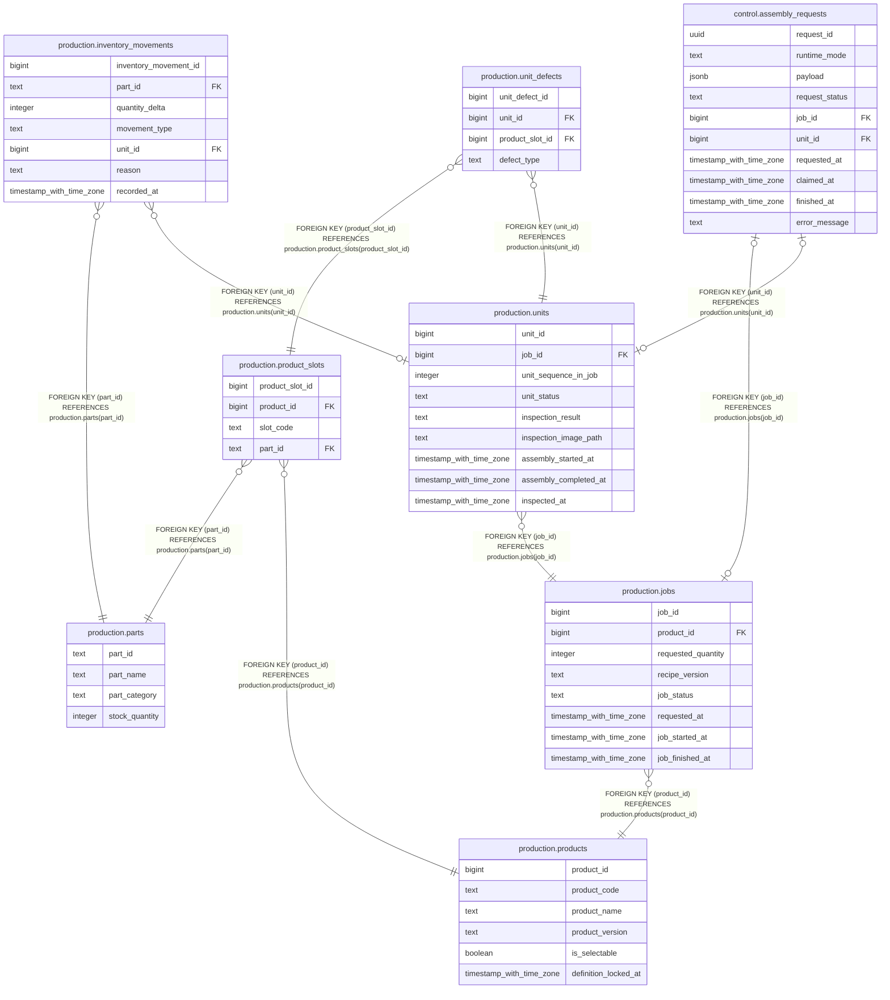

```mermaid
erDiagram

"production.product_slots" }o--|| "production.parts" : "FOREIGN KEY (part_id) REFERENCES production.parts(part_id)"
"production.product_slots" }o--|| "production.products" : "FOREIGN KEY (product_id) REFERENCES production.products(product_id)"
"production.jobs" }o--|| "production.products" : "FOREIGN KEY (product_id) REFERENCES production.products(product_id)"
"production.units" }o--|| "production.jobs" : "FOREIGN KEY (job_id) REFERENCES production.jobs(job_id)"
"production.inventory_movements" }o--|| "production.parts" : "FOREIGN KEY (part_id) REFERENCES production.parts(part_id)"
"production.inventory_movements" }o--o| "production.units" : "FOREIGN KEY (unit_id) REFERENCES production.units(unit_id)"
"control.assembly_requests" |o--o| "production.jobs" : "FOREIGN KEY (job_id) REFERENCES production.jobs(job_id)"
"control.assembly_requests" |o--o| "production.units" : "FOREIGN KEY (unit_id) REFERENCES production.units(unit_id)"
"production.unit_defects" }o--|| "production.product_slots" : "FOREIGN KEY (product_slot_id) REFERENCES production.product_slots(product_slot_id)"
"production.unit_defects" }o--|| "production.units" : "FOREIGN KEY (unit_id) REFERENCES production.units(unit_id)"

"production.parts" {
  text part_id
  text part_name
  text part_category
  integer stock_quantity
}
"production.products" {
  bigint product_id
  text product_code
  text product_name
  text product_version
  boolean is_selectable
  timestamp_with_time_zone definition_locked_at
}
"production.product_slots" {
  bigint product_slot_id
  bigint product_id FK
  text slot_code
  text part_id FK
}
"production.jobs" {
  bigint job_id
  bigint product_id FK
  integer requested_quantity
  text recipe_version
  text job_status
  timestamp_with_time_zone requested_at
  timestamp_with_time_zone job_started_at
  timestamp_with_time_zone job_finished_at
}
"production.units" {
  bigint unit_id
  bigint job_id FK
  integer unit_sequence_in_job
  text unit_status
  text inspection_result
  text inspection_image_path
  timestamp_with_time_zone assembly_started_at
  timestamp_with_time_zone assembly_completed_at
  timestamp_with_time_zone inspected_at
}
"production.inventory_movements" {
  bigint inventory_movement_id
  text part_id FK
  integer quantity_delta
  text movement_type
  bigint unit_id FK
  text reason
  timestamp_with_time_zone recorded_at
}
"control.assembly_requests" {
  uuid request_id
  text runtime_mode
  jsonb payload
  text request_status
  bigint job_id FK
  bigint unit_id FK
  timestamp_with_time_zone requested_at
  timestamp_with_time_zone claimed_at
  timestamp_with_time_zone finished_at
  text error_message
}
"production.unit_defects" {
  bigint unit_defect_id
  bigint unit_id FK
  bigint product_slot_id FK
  text defect_type
}
```
