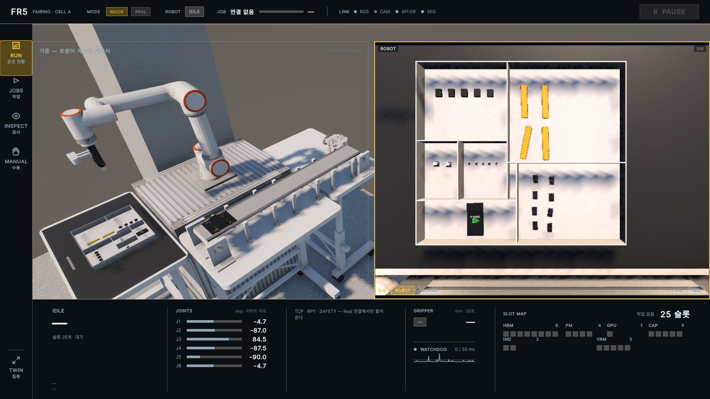
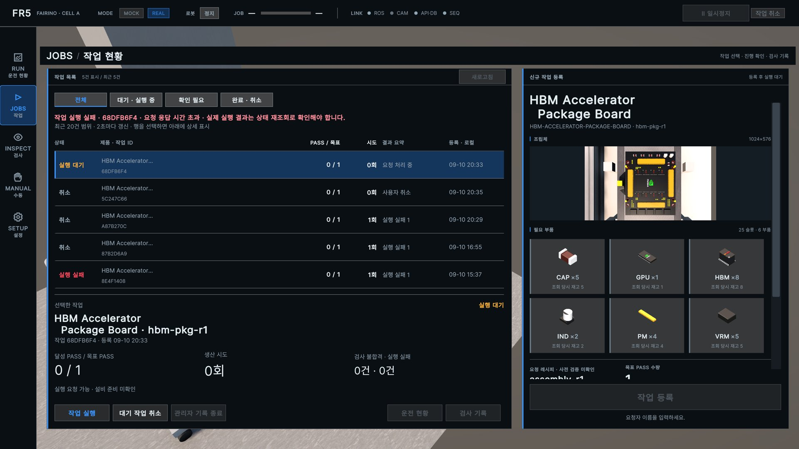
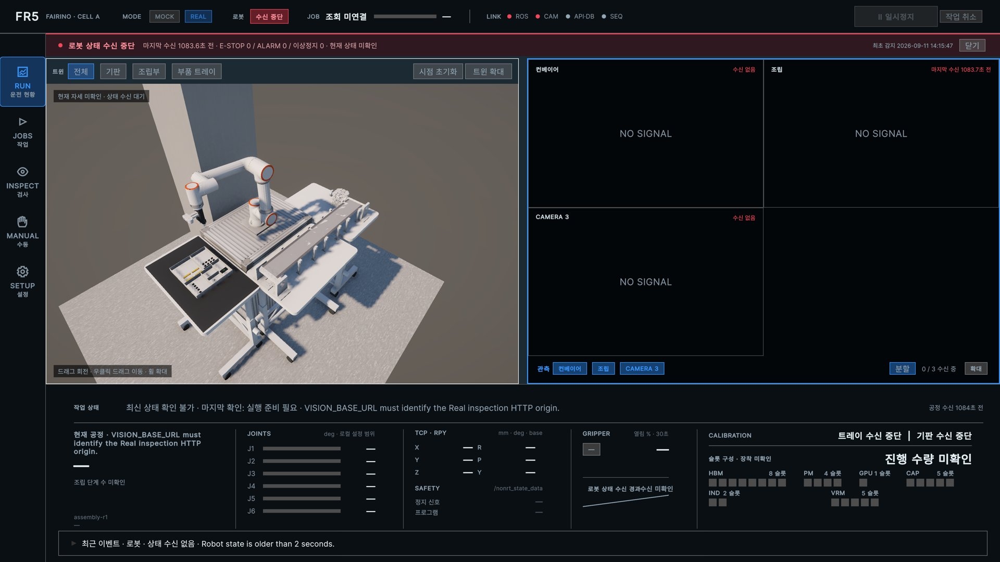
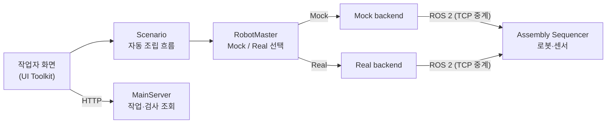

# UnityDT · 작업자 화면과 디지털 트윈

> 로봇 조립 셀을 3D로 재현하고, 작업자가 생산을 **등록 → 감시 → 결과 확인**까지 한곳에서 처리하는 Unity 애플리케이션입니다.



*RUN 화면(Mock 모드). 왼쪽은 조립 셀의 3D 트윈, 오른쪽은 로봇 카메라 영상, 아래는 관절 각도·그리퍼·25개 슬롯 장착 현황입니다.*

## 이 프로젝트가 하는 일

협동로봇 FAIRINO FR5가 반도체 패키지 보드(HBM Accelerator Package Board)에 부품 25개를 조립하고, 컨베이어로 옮겨 비전 검사를 받는 제조 셀이 있습니다. UnityDT는 이 셀의 **작업자 화면**입니다.

- 실제 설비의 상태를 3D 장면과 계기판으로 보여 줍니다.
- 작업자가 제품과 목표 수량을 골라 생산 작업을 등록하고 실행·일시정지·취소합니다.
- 검사 결과와 불량 위치를 확인합니다.
- **Mock 모드**로는 실제 로봇 없이도 같은 화면에서 전체 공정을 시연하고 검증할 수 있습니다.

### 디지털 트윈이란?

실제 설비의 상태를 가상 공간에 그대로 복제한 모델입니다. 이 프로젝트에서는 로봇이 보내는 관절 각도로 3D 로봇을 똑같이 움직이고, 카메라가 인식한 기판·부품 위치를 3D 장면에 배치합니다. 작업자는 현장에 가지 않고도 로봇이 지금 무엇을 하는지 볼 수 있습니다.

## 화면 구성

| 화면 | 작업자가 여기서 판단하는 것 |
|---|---|
| **RUN** 운전 현황 | 작업이 정상 진행 중인지, 개입이 필요한지 |
| **JOBS** 작업 | 제품·목표 PASS 수량으로 작업 등록, 실행·취소·검사 기록 확인 |
| **INSPECT** 검사 | 검사 결과와 불량 근거 확인 후 후속 조치 |
| **MANUAL** 수동 | 목표 자세를 반투명 "Ghost" 로봇으로 미리보기 |
| **SETUP** 설정 | 연결 상태·카메라·좌표 보정이 운전 전에 준비됐는지 |



*JOBS 화면. 제품을 고르면 필요한 부품 6종(HBM·PM·GPU·CAP·IND·VRM)과 조회 당시 재고가 표시되고, 목표 PASS 수량으로 작업을 등록합니다. 왼쪽 목록에서 작업 상태와 시도 횟수를 확인합니다.*



*Real 모드에서 로봇·카메라 신호가 끊긴 상황. 마지막 값을 현재 값처럼 보여 주지 않고 "수신 중단 · 상태 미확인"과 경과 시간을 표시합니다.*

## 어떻게 동작하나요?



### 설계에서 신경 쓴 점

1. **Mock과 Real을 같은 화면 코드로**
   화면과 공정 흐름(Scenario)은 `IRobotControl` 같은 인터페이스만 사용합니다. 실행 시 `RobotMaster`가 Mock 또는 Real 구현을 끼워 넣기 때문에, 화면 코드를 고치지 않고 시뮬레이션과 실제 설비를 오갈 수 있습니다.
2. **"요청 접수"와 "완료"를 구분**
   버튼을 눌러 요청이 전달됐다고 성공을 표시하지 않습니다. 설비가 실제로 끝났다고 알려 줄 때만 완료로 표시하고, 실패와 시간 초과는 숨기지 않고 보여 줍니다.
3. **오래된 데이터는 오래됐다고 표시**
   상태가 일정 시간 갱신되지 않으면 조작 버튼을 막고 마지막 수신 시각을 보여 줍니다. 화면이 멈춘 값을 사실처럼 보여 주는 일을 막기 위해서입니다.
4. **카메라 관측을 트윈에 부드럽게 반영**
   기판 위치는 흔들림을 줄이도록 보간해서 옮기고, 로봇이 부품을 잡고 놓는 이벤트에 맞춰 3D 부품을 그리퍼에 붙였다 뗍니다. 이는 표시용이며 생산 기록을 바꾸지 않습니다.
5. **Ghost 미리보기**
   수동 목표 자세를 반투명 로봇으로 먼저 보여 줘, 실제로 움직이기 전에 결과를 눈으로 확인합니다.

## 기술 스택

| 분야 | 사용 기술 |
|---|---|
| 엔진 | Unity 6 (6000.3), Universal Render Pipeline |
| UI | UI Toolkit (UXML 화면 7개 + USS 테마) |
| 통신 | Unity ROS-TCP Connector (ROS 2), HTTP (MainServer) |
| 테스트 | Unity Test Framework, PlayMode 통합 테스트 |

## 폴더 구조

```text
UnityDT/
├── Assets/
│   ├── Scenes/SampleScene.unity     # 조립 셀 장면
│   ├── UI/                          # FR5Shell·Run·Request·Inspect·Manual·Quality·Setup (UXML), 테마 USS
│   ├── src/
│   │   ├── Runtime/Scenario/        # 자동 조립 흐름
│   │   ├── Runtime/Robot/
│   │   │   ├── Interface/           # Mock·Real 공통 계약
│   │   │   ├── Mock/  Real/         # 구현체
│   │   │   ├── Status/              # 로봇·그리퍼 상태 수신
│   │   │   └── Assembly/            # 조립 진행 표시
│   │   ├── Runtime/RobotGhost/      # Ghost 미리보기
│   │   ├── Runtime/Camera/          # 영상 수신, 기판·트레이 관측 반영
│   │   ├── Runtime/ConveyBelt/      # Mock 컨베이어
│   │   └── Static/ItemManager.cs    # 기판·슬롯·부품 인스턴스 관리
│   └── Tests/PlayMode/              # Mock 조립 통합 테스트
└── Docs/                            # UI 책임·설계 원칙, README 이미지
```

## 실행

1. Unity Hub에서 `UnityDT` 폴더를 Unity **6000.3.21f1**로 엽니다.
2. `Assets/Scenes/SampleScene.unity`를 엽니다.
3. **Robotics > ROS Settings**에서 ROS 2를 선택하고, Endpoint가 실행되는 PC의 IP와 포트 `10000`을 입력합니다.
4. 서버와 Sequencer를 [최상단 실행 절차](../README.md#실행)에 따라 같은 모드(Mock/Real)로 실행한 뒤 Play를 누릅니다.

## 관련 문서

- [Unity UI 책임과 화면 구조](Docs/UI.md)
- [HMI 화면 설계 원칙](Docs/ui-design.md)
- [전체 시스템 아키텍처](../docs/architecture/index.md)
- [공개 API 목록](../README.md#공개-api)

---

## 구현 상세

아래는 개발·운영자를 위한 상세 동작 기준입니다.

<details>
<summary>역할과 설계 경계</summary>

- Scene과 Asset, 작업자 UI와 3D 상태 표현
- Scenario의 상위 업무 흐름
- `RobotMaster`에서 Mock/Real backend 선택과 계약 주입
- 자동 조립의 진행·완료·실패 표현
- 주입된 수동 제어 계약을 통한 작업자 조작

생산 DB 쓰기, Job·Unit 상태 전이, ROS 전송 중계와 설비의 실제 완료 판정은 소유하지 않습니다.

Scenario는 주입된 자동 조립 계약만 사용합니다. UI와 Scenario는 구체 Mock/Real 구현을 참조하거나 캐스팅하지 않습니다.

자동 조립과 수동 조작은 별도 계약입니다. 자동 흐름은 수동 명령을 조합해 만들지 않으며, 수동 UI는 생산 Job 상태를 변경하지 않습니다.

`IRobotScenarioControl.IsRunning`은 호출자 timeout 이후에도 추적 중인 작업을 표시합니다. Mock 완료 대기에서는 확인된 일시정지 시간을 제외하고, timeout 이후에도 종료 피드백을 받을 때까지 작업 ID와 재개 경로를 유지합니다.

요청 수락은 완료가 아닙니다. Unity는 backend가 실제 완료를 반환한 뒤에만 성공을 표시하고 실패와 timeout을 사용자에게 전달합니다.

</details>

<details>
<summary>조립체 씬 객체와 관측 반영</summary>

`ItemManager`가 프리팹 슬롯·공급 위치와 현재 Job의 기판 인스턴스를 소유합니다.
Real에서는 Play 중 유효하고 안정된 기판 관측으로 Job 없이도 PCB와 25개 슬롯을 표시합니다.
`BeginUnit(jobId, unitId)`는 관측 PCB가 있으면 같은 객체를 Unit에 연결하고, 없을 때만 생성합니다.
관측만으로 Job·Unit ID를 만들거나 실행 상태를 바꾸지 않습니다.
`CompleteUnit(jobId, unitId)`는 기판과 장착 부품을 현재 위치에 보존합니다.
다른 Job의 첫 Unit을 생성할 때 이전 완료품을 정리하며, 적재 위치 이동은 수행하지 않습니다.
`ItemManager`가 관리하는 완료 기판·장착 부품의 보존 범위는 현재 Unity 실행 세션입니다.
아래 `TrayPartCalibrator`의 마지막 시각화 저장·복원과는 별개이며, 앱 재시작 후 과거 완료품 전체 복원은 제공하지 않습니다.

기판 관측이 불안정하거나 끊기면 마지막 정상 배치를 유지하며 UI에 수신·반영 경과 시간을 표시합니다.
최초 기판 배치는 즉시 적용하고 이후 표시 자세는 시간 상수 0.4초의 지수 보간으로 갱신합니다
(0.4초에 목표 변화의 약 63% 반영). PCB와 슬롯은 같은 보간 기준을 사용하며 실제 기울기를 유지합니다.
무효 관측 또는 3초 이상 갱신 중단 시 마지막 표시 자세를 유지합니다. ROS 원본·로봇 목표는 변경하지 않습니다.
관측에는 PCB 개체 ID가 없으므로 Unit 완료 후에는 완료품을 보존하고 다음 Unit 확인까지
관측 PCB를 새로 만들지 않습니다. 새 프레임만으로 새 PCB라고 판단하지 않습니다.
Real 관측 수신기를 비활성화하면 Unit에 연결되지 않은 관측 객체만 정리합니다.
RUN 카메라 패널은 Real에서 컨베이어 정지선·조립 인식·CAMERA 3 원본 압축 영상을,
Mock에서 ROBOT·BOARD 영상을 표시합니다. 카메라 버튼은 해당 영상을 단독 표시하고,
분할 버튼은 두 열의 격자로 표시하며, 세 영상은 2×2 격자의 세 칸을 사용합니다.
카메라 확대 영역은 하단 계기 띠 위까지 표시해 카메라 조작 버튼을 유지합니다.

Scene의 `ItemManager`에는 기존 motherboard 프리팹, `TransSpots/BoardSpawnPoint`,
`Items`, `Items/CompletedBoards`를 연결합니다. 슬롯은 프리팹 내부 Transform을,
공급 위치는 `Items/SupplyPoints`의 고정 Transform을 참조합니다.
Mock은 Unit별 공급 부품을 새로 생성하므로 완료품의 장착 부품을 회수하지 않습니다.

Mock 피드백의 `unit_id`로 투입·완료를 연결합니다. Real의 `BeginUnit`·`CompleteUnit`도
동일한 ItemManager를 사용합니다. Real 자동조립은 공통 ROS service에 요청하고
`runtime_mode=real`과 일치하는 Job 상태·DB 저장 완료를 확인합니다.
Real은 Sequencer의 네 단계 공정 완료와 DB 동기화를 기다리고 준비 거절·실패·판정 보류를 호출자에게 전달합니다.
요청 수락이나 통신 연결만으로 성공을 반환하지 않습니다.

</details>

<details>
<summary>트레이 부품 시각화와 재시작 복원</summary>

`TrayPartCalibrator`는 생산 실행 여부와 무관하게 `/real/robot/event`를 수신합니다.
로컬 실행도 원래 트레이 객체·등록/관측 세대와 Pick 시작을 대조한 뒤 GRASP/RELEASE의
식별·연속 그리퍼 피드백이 유효할 때만 실측 TCP/원래 관측 기판으로 부모를 변경합니다.
GRASP는 렌더링된 메시 bounds 중심을 TCP 중심에 맞추고, 부품 윗면(+Y)이 공구 +Y의 반대를 향하도록
가장 가까운 90도 방향으로 정렬합니다. TCP 계층의 스케일과 무관하게 부품의 월드 크기를 유지합니다.
이는 시각화 정렬이며 실물 파지 위치 보정이 아닙니다. RELEASE는 당시 월드 자세를 유지해 기판에 연결하며
슬롯 중심으로 강제 이동하지 않습니다. 생산 Job·Unit 생성, 수량과 DB 기록에는 연결하지 않습니다.
빈·부분 검출은 삭제 근거가 아니므로 이전 객체를 보존합니다. 등록 세대가 바뀌면 기존
배치를 관측만으로 덮어쓰지 않습니다. 실행 전 수신한 유효 관측은 최대 1,024건·부품 자세
32,768개까지 메모리에 보관하며 오래된 후보부터 제외합니다. 첫 Pick의
`01_pre_pick_safe_vertical / PHASE_STARTED`에서 등록·관측·부품 식별자가 정확히 일치하면,
다른 실행에 연결되지 않은 표시 배치를 해당 관측으로 준비하고 예약합니다.
후보가 없거나 보관 한도를 넘겨 제외된 경우에는 최신 검출값으로 대신하지 않고 차단 사유를 표시합니다.
후보는 재시작·비활성화를 넘어 복원하지 않으며, 놓친 Pick 시작이나 GRASP를 소급 부착하지 않습니다.
Pick 예약 후에는 실행에 사용하는
트레이 배치 전체를 고정합니다. 원래 관측에 그 객체가 실제 포함됐는지를 대조하며,
새 세대 ID를 이전 실행 ID로 추정하지 않습니다. 예약·부착·배치된 객체는 수동 재생성도
차단합니다. 실행 기록이 있는 세션의 교체·정리는 자동 수행하지 않습니다. 실패·식별 변경·API
재시작은 마지막 관계를 유지하고 미확인으로 표시합니다. 트레이 패널의 로봇 시각화
상태는 생산 IDLE/진행 상태와 별개입니다.
연결 시 `/real/robot/status`의 부착 snapshot을 읽기 전용으로 대조합니다. 기존 관계와
식별이 일치할 때만 재확인하며, 관측하지 못한 파지의 상대 자세를 snapshot에 없는 정보로
복원하거나 새 부품을 만들어 대신 붙이지 않습니다. 해당 경우 복원 미확인으로 표시합니다.

시각화 배치는 `Application.persistentDataPath`의 `real-visualization-<hash>.json`에 저장합니다.
Scene·컴포넌트 이름·ROS 접속 주소별로 분리하며, 관측 갱신은 최대 1초 단위로 합쳐 저장하고
로봇 이벤트 처리와 비활성화 시에는 즉시 저장합니다. 임시 파일을 완성한 뒤 교체하며
이전 정상 파일을 `.bak`으로 보존합니다. 주 파일이 손상되면 백업 복원을 시도합니다.
재시작 시 baseLink 기준 마지막 자세를 먼저 표시하고 모두 미확인으로 취급합니다.
버전 2 캐시는 기판의 baseLink 상대 자세·크기, 25개 슬롯의 기판 상대 자세와 로컬 표시 식별자를 함께 저장합니다.
생산에 연결된 기판은 Backend가 같은 Job·Unit을 확인한 뒤 복원하며 캐시로 Unit을 만들지 않습니다.
기판 복원은 실물 재관측으로 취급하지 않습니다. 저장한 기판·실행·RELEASE와 snapshot이 일치한 배치 부품은
저장된 기판 상대 자세로 다시 연결합니다. 동일 실행·Pick의 파지 상태가 일치하고 recovery_required=false일 때만
저장된 TCP 상대 자세로 재연결합니다. 로컬 표시 식별자는 실물 PCB 개체 식별자가 아닙니다.
기판 정보가 없는 이전 캐시나 종료 중 놓친 GRASP/RELEASE의 상대 자세는 추정하지 않고 마지막 표시를 유지합니다.
복원된 트레이도 자동으로 현재 실물이라고 확정하지 않습니다.

기존 트레이 패널에 저장 화면 확인 중, 동기화 중, 일부 복원 미확인, 연결 대기를 표시합니다.
조회 중 callback은 최대 1,024개 보관하고, 일치한 부품의 snapshot 순번 이후 이벤트를 적용합니다.
조회가 5초를 넘으면 지연으로 표시합니다. 미확정이면 5초 간격으로 재조회하되 이전 요청이
끝나지 않은 동안에는 중복 요청하지 않습니다. 무한 로딩이나 근거 없는 진행률은 표시하지 않습니다.
이 복구는 시각화 전용이며 로봇 동작 재요청과 생산 DB 상태 변경을 수행하지 않습니다.

</details>

<details>
<summary>JOBS 실행 확인과 일시정지·재개·취소</summary>

JOBS의 작업 실행은 공통 Scenario 계약으로 현장 확인 UI를 전달합니다. Real에서는 운영자 ID와
그리퍼 비움·빈 PCB·트레이 25개·고정 지그 확인을 기본 미선택 상태로 받고, 해당 실행 UUID와
실제 확인 시각을 `scene_confirmation`으로 보냅니다. 취소·화면 비활성화는 확인 성공이 아닙니다.
Mock은 이 확인 UI를 호출하지 않습니다. 전송 결과가 불명확하면 기존 실행 식별자를 유지하며,
명시적으로 거절되면 다음 시도에서 새 확인을 받습니다. 다음 Unit 대기에도 새 확인을 받으며,
재접속 시 상태 조회로 진행을 복구합니다. 검사 결과와 이미지는 기존 INSPECT 화면에서 조회합니다.
UI 완료 대기는 기존 1800초 제한을 유지합니다. UI 대기 종료는 원격 설비 정지를 뜻하지 않습니다.

공통 셸의 일시정지 버튼은 정지 확인 후 재개 버튼으로 바뀝니다. Real 작업 취소 버튼은 Scenario → Sequencer → 로봇 production API를 사용합니다. 일시정지는 전달된 동작 종료 후 반영되며 취소는 실제 정지와 DB 반영까지 기다립니다. 요청 처리 중에는 중복 조작을 막고 미확인·거절 사유를 화면에 표시합니다. 현재 Real 제어 범위는 로봇 조립 단계이며 컨베이어·검사 단계 및 Mock 취소는 지원하지 않습니다.

JOBS의 요청자 입력은 신규 작업 등록에서 한 번 받습니다. 실행 준비 확인은 모달 대신 선택 작업
상세 영역에 표시하고 등록된 요청자를 사용하며, 실행 ID별 네 가지 현장 조건은 직접 확인합니다.
요청자가 없는 과거 Job은 임의 식별자를 채우지 않고 새 등록을 안내합니다.

검사 불량으로 `QUALITY_HOLD`를 받으면 기존 일시정지 버튼이 재개로 표시되며
작업 감시를 유지합니다. 재개는 다음 PCB의 새 현장 확인으로 연결되고, 취소는 해당
Job을 종료합니다. 품질 대기 시간은 Real 작업 완료 timeout에서 제외합니다.
JOBS 화면에서도 `PAUSED`를 불량 확인 대기로 표시합니다.

Real 조작 버튼은 Scenario 인터페이스를 통해 Sequencer의 조작 불가 사유를 받습니다. UI가 PAUSED만으로 재개 가능 여부를 추정하지 않습니다. 최신 status가 없거나 3초 이상 오래되면 버튼을 비활성화하며, 실행 대기가 실패한 뒤에도 상태 조회를 계속합니다. 처리 중 중복 클릭은 UI에서 제한하고 실제 명령의 최종 검증은 서버가 소유합니다.

공통 셸의 불량 알림은 현재 Job의 최근 FAIL Unit과 대책서 발송 상태별 건수를 표시합니다.
불량 상세 보기는 해당 Unit의 검사 화면을 직접 선택하며, 생산 재개·확인 팝업은 표시하지 않습니다.
조회 실패 시 마지막 알림에 상태 재확인 필요를 표시합니다.

</details>
