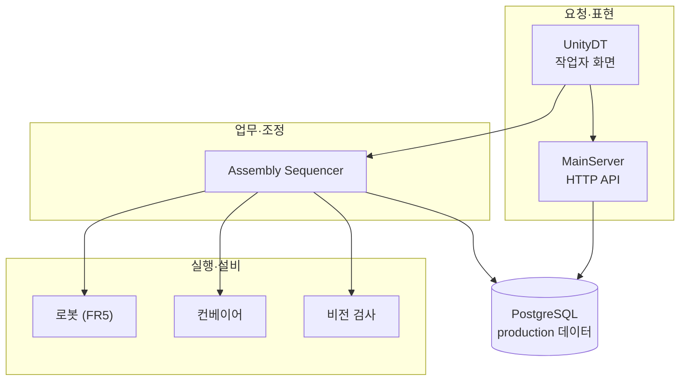

# docs · 시스템 설계 문서

> 이 브랜치 전체가 어떤 책임으로 나뉘고, 생산이 어떤 규칙으로 진행되는지 설명하는 설계 문서 모음입니다.

## 구성

| 문서 | 내용 |
|---|---|
| [architecture/index.md](architecture/index.md) | 세 계층 구조, 생산 실행 규칙, 완료·실패의 의미, 재시작과 안전 원칙 |
| [architecture/sw-architecture.drawio](architecture/sw-architecture.drawio) | 전체 소프트웨어 책임도 원본 |

## 한 장 요약

시스템은 세 계층으로 나뉩니다. 각 계층은 바로 아래 계층이 공개한 약속(API)만 사용합니다.

- **요청·표현**: 사람이 작업을 요청하고 결과를 봅니다. 설비를 직접 움직이지 않습니다.
- **업무·조정**: 요청 하나를 골라 설비에 순서대로 지시하고 결과를 기록합니다.
- **실행·설비**: 각 동작을 실제로 수행하고 성공·실패를 판정합니다.

## draw.io 파일 열기

`.drawio` 파일은 [diagrams.net](https://app.diagrams.net/) 또는 VS Code의 Draw.io Integration 확장으로 열어 편집할 수 있습니다.
