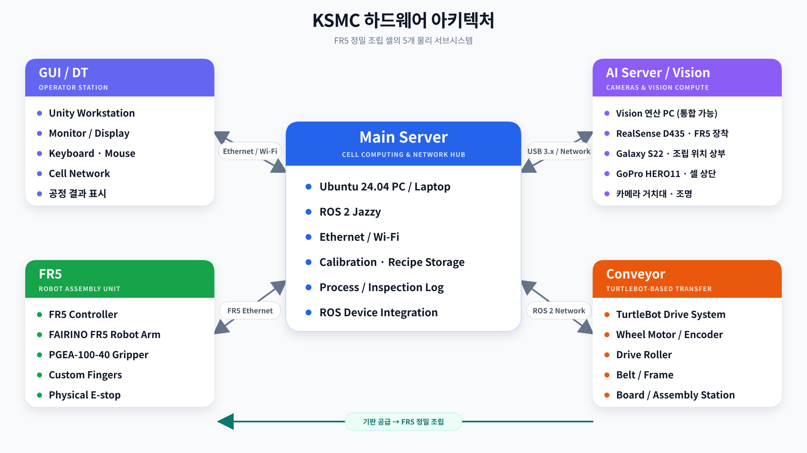
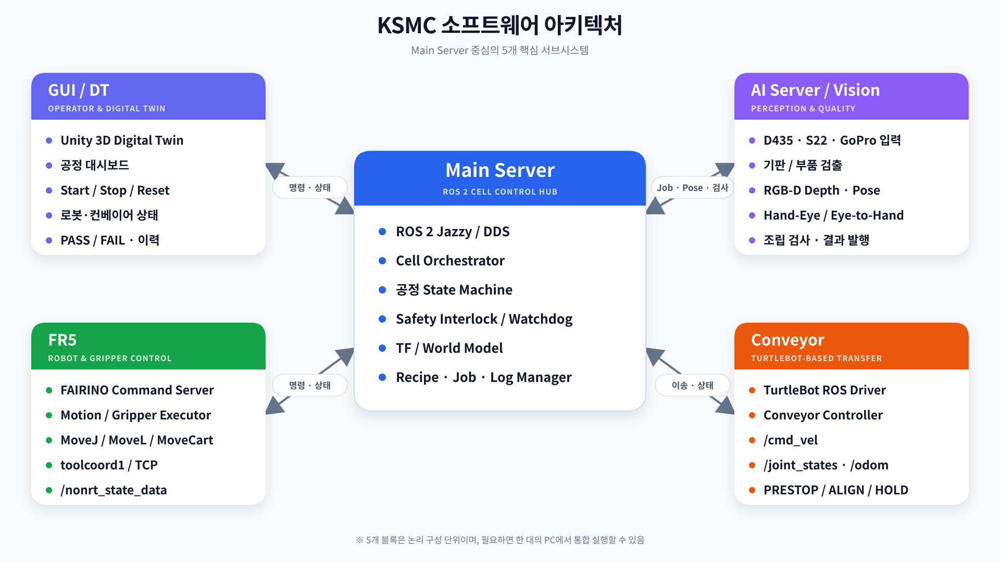

# KSMC 팀 시스템 아키텍처

프로젝트 전체를 `GUI/DT`, `Main Server`, `AI Server/Vision`, `FR5`,
`Conveyor`의 5개 서브시스템으로 나눈다. Main Server가 공정 제어의 중심이며,
나머지 블록은 명령과 상태 또는 비전 결과를 교환한다.

## 하드웨어 아키텍처



- **GUI/DT:** Unity 워크스테이션과 공정 표시 장치
- **Main Server:** Ubuntu 24.04, ROS 2 Jazzy, 네트워크 및 데이터 저장
- **AI Server/Vision:** D435, S22, GoPro와 비전 연산 환경
- **FR5:** FR5, PGEA-100-40, 커스텀 핑거, 물리 비상정지
- **Conveyor:** TurtleBot 구동계, 롤러, 벨트와 조립 스테이션

`AI Server/Vision`은 논리적으로 분리한 블록이다. 별도 연산 장비가 필요하지
않다면 Main Server와 같은 PC에서 실행할 수 있다.

## 소프트웨어 아키텍처



| 서브시스템 | 핵심 책임 |
|---|---|
| GUI/DT | 사용자 명령, 공정 상태, Digital Twin, PASS/FAIL 표시 |
| Main Server | 공정 상태 머신, 안전 인터록, 좌표계, Recipe·Job·Log 관리 |
| AI Server/Vision | 기판·부품 검출, RGB-D pose, 보정, 조립 검사 |
| FR5 | 로봇·그리퍼 명령 실행과 상태 발행 |
| Conveyor | 기판 이송·감속·정지와 구동 상태 발행 |

## 핵심 연결

| 연결 | 교환 정보 |
|---|---|
| GUI/DT ↔ Main Server | 작업 명령 / 공정 상태·결과 |
| AI Server/Vision ↔ Main Server | Vision job / Pose·검사 결과 |
| FR5 ↔ Main Server | 동작 명령 / 로봇 상태 |
| Conveyor ↔ Main Server | 이송 명령 / 컨베이어 상태 |

## 전체 공정

```text
기판 투입 → 컨베이어 이송·정지 → 기판/부품 인식 → FR5 Pick & Place
→ 조립 검사 → PASS/FAIL → GUI/DT 및 로그 기록
```

좌표 변환은 `base`, `flange`, `tcp`, `camera`, `board`, `part`, `target`
frame을 구분한다. TCP/toolcoord1과 D435의 Hand-Eye extrinsic은 서로 다른
변환이며 중복 적용하지 않는다.
