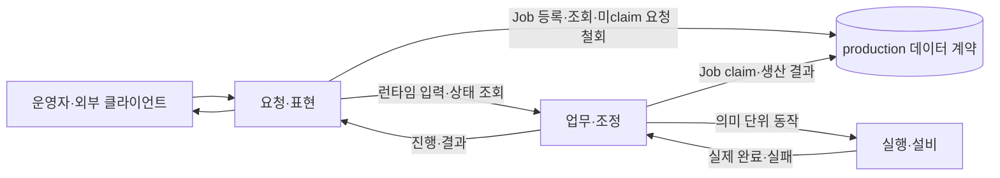

# 시스템 아키텍처

이 문서는 구현 기술이나 endpoint 이름이 아니라 시스템의 책임 배치, 생산 불변 조건과 실제 완료 경계를 정의합니다.

## 세 계층

| 계층 | 책임 | 포함 영역 |
|---|---|---|
| 요청·표현 | 사용자 의도 수집, 외부 입력 검증, 상태와 결과 표현 | UnityDT, MainServer |
| 업무·조정 | Job 선택, Unit 상태 전이, 생산 레시피 검증과 공정 순서 | Assembly Sequencer |
| 실행·설비 | 의미 단위 동작, 좌표 변환, 통신, timeout과 안전정지 | 로봇·비전·컨베이어 backend |

각 계층은 인접한 하위 계층의 공개 계약만 사용합니다. 전송 방식, 데이터베이스 제품과 프로세스 배치는 바뀔 수 있지만 이 책임과 실제 완료·실패 전달 경계는 유지합니다.

## 전체 구조

편집 가능한 전체 책임도: [SW Architecture (draw.io)](sw-architecture.drawio)

요청 계층은 생산 의도를 영속화하지만 설비를 직접 움직이지 않습니다. 조정 계층은 실행 가능한 요청 하나를 선택하고, 실행 계층은 각 동작의 실제 성공·실패를 판정합니다.

## 책임 배치

### 요청·표현

UnityDT는 작업자 조작, 3D 상태와 결과 표현을 담당합니다. MainServer는 외부 입력을 검증하고 생산 정보를 조회하며 Job을 등록합니다. 아직 Sequencer가 claim하지 않은 `PENDING` Job의 철회도 요청 계층이 소유하며, DB의 제한된 원자 연산만 사용해 `CANCELLED`로 전이합니다. MainServer는 claim 이후 Job·Unit 실행 상태를 전이하거나 설비 구현을 직접 호출하지 않습니다.

### 업무·조정

Assembly Sequencer는 대기 Job을 선택하고 Unit을 만들며 컨베이어의 조립 위치 이동, 로봇 전체 조립 요청, 컨베이어의 검사 위치 이동, 검사 순서를 조정합니다. 로봇의 준비 촬영·계획 생성·조립 내부 순서는 로봇 실행기가 소유합니다. Sequencer는 조립 전체의 실제 결과를 검증한 뒤 생산 상태에 반영하며 좌표 계산, 로봇 이동·파지 순서와 하드웨어 명령을 소유하지 않습니다.

공정 정지 요청은 다음 단계 진입을 차단하고 현재 실행 설비의 정지 확인을 기다립니다. 로봇 정지만으로 컨베이어까지 정지했다고 판정하지 않으며, 재개 가능 여부는 설비의 보존된 실행 상태를 따릅니다.

### 실행·설비

로봇 실행기는 조립 내부 이동·Pick·Place, 관절점·동작 profile, 파지·놓기 판정과 내부 확인 촬영을 소유합니다. 실제 정지·복구도 로봇 실행기의 책임입니다. Backend는 공개 API의 실행 ID·결과·중복 이벤트를 검증하고 완료·실패를 Sequencer에 전달합니다. 통신 timeout이나 요청 수락을 조립 완료로 바꾸지 않습니다. Backend와 로봇 실행기는 생산 수량과 DB 상태 전이를 소유하지 않습니다.

ROS-TCP Endpoint는 메시지만 전달합니다. 도메인 상태를 해석하거나 요청 수락을 실행 완료로 바꾸지 않습니다.

## production 데이터 계약

`DATA_STATION/DB`는 실행 프로세스가 아니라 MainServer와 Sequencer가 공유하는 PostgreSQL 계약의 원본입니다. 따라서 네 번째 계층이나 Real·Mock backend로 표현하지 않습니다.

- MainServer는 생산 사실을 조회하고 새 `PENDING` Job을 등록하며, 미claim `PENDING` 요청만 원자적으로 철회합니다.
- Sequencer는 Job claim 이후의 모든 Job·Unit 실행 상태, 검사와 재고 결과를 기록합니다.
- 스키마는 참조 무결성, 단일 실행과 역할별 최소 권한을 보장합니다.
- Backend와 Unity UI는 production 테이블을 직접 읽거나 쓰지 않습니다.

기준 DDL은 `DATA_STATION/DB/production_schema.sql`이며 업무 의미는 `DATA_STATION/DB/README.md`가 설명합니다.

## 생산 실행 불변 조건

- `production.jobs`가 영속 생산 요청의 유일한 진입점입니다.
- MainServer는 호출자가 만든 UUID `job_id`로 `PENDING` Job을 등록합니다.
- 미claim `PENDING` Job 취소와 Sequencer claim이 경합하면 DB에서 둘 중 하나만 성공합니다.
- 같은 `job_id`의 동일 요청은 기존 Job을 반환하고 다른 내용은 거절합니다.
- 동시에 `RUNNING`인 Job은 하나이며 한 Job의 `RUNNING` Unit도 하나입니다.
- `requested_quantity`는 생산 시도가 아니라 검사 PASS 목표 수량입니다.
- 검사 결과는 전체 실행 완료와 별도로 보존합니다. 검사 FAIL Unit도 workflow 성공 후 완료 처리하되 Job을 PAUSED로 저장하고, 명시적 재개 전에는 다음 Unit을 시작하지 않습니다.
- 설비 실행 실패 Unit은 검사 결과를 보존한 채 `FAILED`로 기록합니다. 목표 PASS에는 `COMPLETED`·`PASS` Unit만 포함합니다.

## 자동 실행 흐름

1. 요청 계층이 `job_id`와 생산 목표를 등록합니다.
2. Sequencer가 실행에 사용할 레시피·제품 슬롯 대응과 설비 준비를 검증합니다.
3. 준비가 확인된 Job 하나를 claim하고 Unit을 시작합니다.
4. Sequencer가 backend의 의미 단위 동작을 순서대로 요청합니다.
5. Backend가 각 동작의 실제 완료 또는 실패를 반환합니다.
6. Sequencer가 조립·검사·재고 결과를 기록합니다.
7. PASS 누적이 목표 수량에 도달하면 Job을 완료합니다.

설비 공정의 순서는 **컨베이어 조립 위치 이동 → 로봇 전체 Start → 컨베이어 검사 위치 이동 → 검사**입니다.
각 화살표는 앞 단계의 실제 완료 확인을 뜻하며, 요청 수락만으로 다음 단계를 시작하지 않습니다.
로봇 전체 Start의 내부 촬영·계획 생성·Pick/Place는 로봇 실행기가 완결합니다.
외부 조정 계층은 로봇 내부 단계를 호출하거나 중복 실행하지 않습니다.
검사 후 별도의 로봇 PCB 이송·배출 동작은 이 공정에 포함하지 않습니다.
검사 판정과 필요한 DB 기록이 확정되어야 Unit 완료를 처리하며, UNKNOWN은 완료로 처리하지 않습니다.

## 완료와 실패

| 결과 | 의미 |
|---|---|
| 실행 성공 | 요청한 물리 동작과 검사가 실제로 끝남 |
| 검사 FAIL | 실행은 완료됐지만 품질 목표를 통과하지 못함 |
| 실행 실패 | 설비 동작을 완료하지 못함 |
| timeout | 제한 시간 안에 실제 완료를 확인하지 못함 |
| 안전정지 | 실행 상태를 유지한 채 신규 동작을 차단함 |

요청 수락은 실행 완료가 아닙니다. 비동기 진행과 결과는 `job_id`로 현재 작업과 대조하며 실패 원인을 잃지 않고 상위 계층까지 전달합니다. 조회 실패는 설비나 저장된 생산 상태를 변경하지 않습니다.

생산 상태의 소유자는 Sequencer, 관절·TCP·파지 등 관측 상태의 소유자는 설비 API입니다. Unity는 식별이 유효한 파지·놓기 이벤트로 부품 부착·분리를 표현하지만 시각화 결과로 DB 성공을 결정하지 않습니다. 확인되지 않은 파지와 정밀 배치를 확정 상태로 표시하지 않습니다.

Job 등록과 실행 허가는 구분합니다. 영속 PENDING Job을 등록했다는 사실만으로 설비 동작을 허가하지 않습니다. 재시작 후 실행 준비와 명시적 실행 요청을 다시 확인합니다.

## 레시피와 데이터 경계

생산 레시피는 제품·부품·슬롯 의미와 생산 공정 순서를 소유합니다. 로봇 레시피는 조립 내부 순서와 실행 profile을 소유하며, 같은 순서를 양쪽에서 실행하지 않습니다. 실행 시작 전에 요청한 생산 레시피와 로봇이 준비한 레시피·계획의 대응을 검증하고 실행 중 고정합니다.

| 데이터 | 소유자 |
|---|---|
| 제품·부품·슬롯·Job·Unit·검사·재고 사실 | production 데이터 계약 |
| 생산 레시피와 공정 순서 | Assembly Sequencer와 Git |
| 로봇 조립 내부 순서·관절점·동작 profile | 로봇 실행기와 해당 레시피 원본 |
| 설비 좌표·보정·안전 상한 | 실행 backend와 설비 설정 |
| 실시간 관절·TCP·진행 스트림 | 런타임 상태 |
| 작업자 화면 상태 | UnityDT |
| 부품 데이터시트와 불량대책서 | MainServer 파일 계약 |

레시피 본문, 설비 좌표, 실시간 스트림과 단계 checkpoint는 production DB에 복제하지 않습니다.

## Real과 Mock

Real과 Mock은 실행 backend와 그 공개 통신 경계가 실제로 나뉘는 곳에서만 구분합니다. 상위 Scenario, Job·Unit, 생산 레시피 의미, production 데이터와 성공·실패 의미는 공통입니다. Mock의 실행 설정을 Real 로봇 설정 원본으로 취급하지 않습니다.

Scenario와 UI는 선택된 구현을 검사하거나 캐스팅하지 않습니다. 지원되지 않는 동작은 명시적으로 실패하며 임시 성공이나 다른 모드로 자동 fallback하지 않습니다.

## 재시작과 안전

- 재시작 시 실행 중이던 Unit은 실패로 마감하지만 Job은 유지합니다.
- 설비 준비와 reset을 확인한 뒤 같은 Job의 새 Unit을 레시피 처음부터 실행합니다.
- 불명확한 중간 동작은 자동 재개하지 않습니다.
- 안전정지 중에는 Job과 Unit을 `RUNNING`으로 유지하고 신규 동작을 차단합니다.
- 안전 상태 해제만으로 자동 재개하지 않습니다.
- 물리 안전회로의 역할을 소프트웨어 상태나 UI가 대신하지 않습니다.

구체 통신 계약은 [공개 API 목록](../../README.md#공개-api)에서 제공 컴포넌트 문서로 연결합니다.
