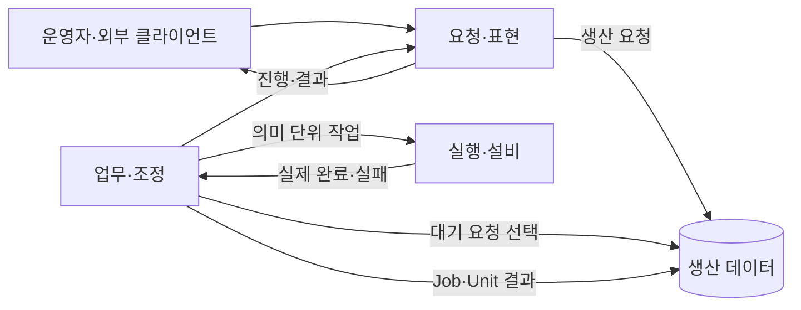

# 시스템 아키텍처

이 문서는 구현 기술이 아니라 시스템의 책임 배치와 완료 경계를 정의합니다.

## 전체 구조

요청과 실행은 분리됩니다. 요청 계층은 생산 의도를 영속화하지만 설비를 직접 움직이지 않습니다. 조정 계층은 하나의 요청을 선택해 실행 순서를 관리하고, 실행 계층은 개별 동작의 실제 성공·실패를 판정합니다.

## 책임 배치

### 요청·표현

UnityDT는 작업자 조작, 3D 상태와 결과 표현을 담당합니다. MainServer는 외부 입력을 검증하고 생산 정보를 조회하며 Job을 등록합니다. 두 영역 모두 생산 실행 상태를 직접 전이하거나 설비 구현을 호출하지 않습니다.

### 업무·조정

Assembly Sequencer는 대기 Job을 선택하고 Unit을 만들며 레시피 순서를 조정합니다. 단계별 재시도·중단·건너뛰기 정책은 여기에서 결정하지만 좌표 계산, 통신 프로토콜과 하드웨어 명령은 포함하지 않습니다.

### 실행·설비

로봇, 비전, 컨베이어 backend는 의미 단위 공개 동작을 제공합니다. 입력 검증, 단위와 좌표 변환, 통신 재시도, timeout, 완료 감지, 정리와 안전정지는 이 경계 안에서 끝나야 합니다.

전송 Endpoint는 메시지만 전달합니다. 도메인 상태를 해석하거나 완료를 만들어내지 않습니다.

## 자동 실행 흐름

1. 요청 계층이 클라이언트 `job_id`로 생산 목표를 등록합니다.
2. Sequencer가 실행 가능한 Job 하나를 선택하고 Unit을 시작합니다.
3. Sequencer가 고정된 레시피를 검증하고 순서대로 의미 단위 동작을 요청합니다.
4. 각 backend가 실제 완료 또는 실패를 반환합니다.
5. Sequencer가 조립과 검사 결과를 Unit에 기록합니다.
6. PASS 누적이 목표 수량에 도달하면 Job을 완료합니다.

검사 FAIL은 정상적으로 끝난 생산 시도이며 실행 실패와 구분합니다. 이 구분이 유지되어야 생산 수량, 품질 지표와 장애 원인이 섞이지 않습니다.

## Mock과 Real

Mock과 Real은 같은 상위 계약을 구현합니다. 차이는 좌표의 출처, 설비 통신과 완료 감지 방식에만 있습니다. Scenario와 UI는 선택된 구현을 알지 못하며 동일한 성공·실패 의미를 사용합니다.

Real 구현이 준비되지 않은 동작은 명시적으로 실패해야 합니다. 요청 수락이나 임시 상태를 성공으로 대체하지 않습니다.

## 재시작과 안전

- 대기 Job은 프로세스 재시작과 관계없이 유지합니다.
- 실행 중이던 Unit은 불명확한 동작을 이어가지 않고 실패로 마감합니다.
- 같은 Job의 다음 Unit은 설비 준비를 확인한 뒤 레시피 처음부터 시작합니다.
- 안전정지 중에는 실행 상태를 유지하고 신규 동작을 차단합니다.
- 물리 안전회로의 역할을 소프트웨어 상태나 UI가 대신하지 않습니다.

## 데이터와 파일

생산 DB에는 확정된 생산 사실과 참조 무결성에 필요한 기준정보만 둡니다. 레시피, 좌표, 실시간 스트림과 화면 상태는 각 소유 위치에 남깁니다. 데이터베이스 종류나 메시지 전달 방식이 바뀌어도 이 분리는 유지합니다.
