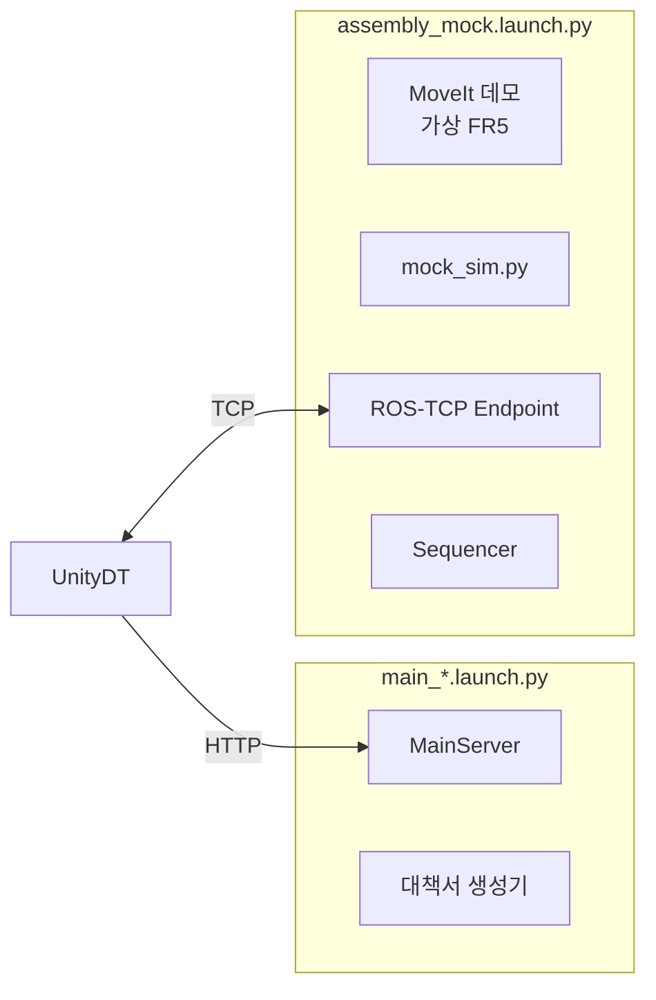

# launch · 실행 진입점

> 서버 쪽 프로그램을 Mock(시뮬레이션) 또는 Real(실제 설비) 모드로 한 번에 띄우는 ROS 2 launch 파일 모음입니다.

## 역할

여러 프로그램을 올바른 설정으로 함께 실행하는 **시작 버튼** 역할을 합니다. 모드별로 두 개씩, 터미널 두 개에서 각각 실행합니다.

```bash
# Mock
ros2 launch launch/main_mock.launch.py
ros2 launch launch/assembly_mock.launch.py

# Real
ros2 launch launch/main_real.launch.py
ros2 launch launch/assembly_real.launch.py
```

## 각 파일이 시작하는 것

| 파일 | 시작하는 프로그램 | ROS domain |
|---|---|---|
| `main_mock.launch.py` | MainServer HTTP API, 불량대책서 생성기 | 42 |
| `main_real.launch.py` | MainServer HTTP API, 불량대책서 생성기 | 5 |
| `assembly_mock.launch.py` | FR5 MoveIt 데모(가상 로봇), Mock 설비 `mock_sim.py`, ROS-TCP Endpoint, Assembly Sequencer (Mock) | 42 |
| `assembly_real.launch.py` | ROS-TCP Endpoint(선택), Assembly Sequencer (Real) | 5 |



Real Assembly 런치는 MoveIt이나 로봇 드라이버를 띄우지 않습니다. 실제 로봇·컨베이어·비전 서버는 각 설비 PC에서 먼저 실행되어 있어야 합니다.

## 설정은 어디서 오나요?

- DB 접속 문자열과 검사 자료 경로는 [`install_Server.sh`](../install_Server.sh)가 만든 `launch/.env.mock`, `launch/.env.real`에서 읽습니다. 이 파일은 Git에 올라가지 않으며, 소유자만 읽을 수 있는 권한(600)이 아니면 실행을 거부합니다.
- 우선순위는 launch 인자 → 이미 설정된 환경 변수 → `.env` 파일 순입니다.
- Mock과 Real은 서로 다른 ROS domain을 쓰기 때문에 같은 네트워크에서도 메시지가 섞이지 않습니다.

## 주요 launch 인자

| 인자 | 파일 | 기본값 | 의미 |
|---|---|---|---|
| `endpoint_ip`, `endpoint_port` | assembly_* | `0.0.0.0`, `10000` | Unity가 접속할 Endpoint 주소 |
| `start_endpoint` | assembly_real | `true` | 이미 실행 중인 Endpoint가 있으면 `false` |
| `inspection_fail_probability` | assembly_mock | `0.2` | Mock 검사가 불합격을 낼 확률 |
| `random_seed` | assembly_mock | `-1` | Mock 검사 난수 시드 (`-1`은 무작위) |
| `start_delay` | assembly_mock | `5` | MoveIt 준비 후 Mock 설비 시작까지 대기(초) |
| `recipe` | assembly_mock | `assembly-r1.yaml` | Mock 조립 레시피 |

## 관련 문서

- [최상단 실행 절차](../README.md#실행)
- [Farino_AIO_Mock](../Farino_AIO_Mock/README.md)
- [Assembly Sequencer](../ASSEMBLY_SEQUENCER/README.md)
