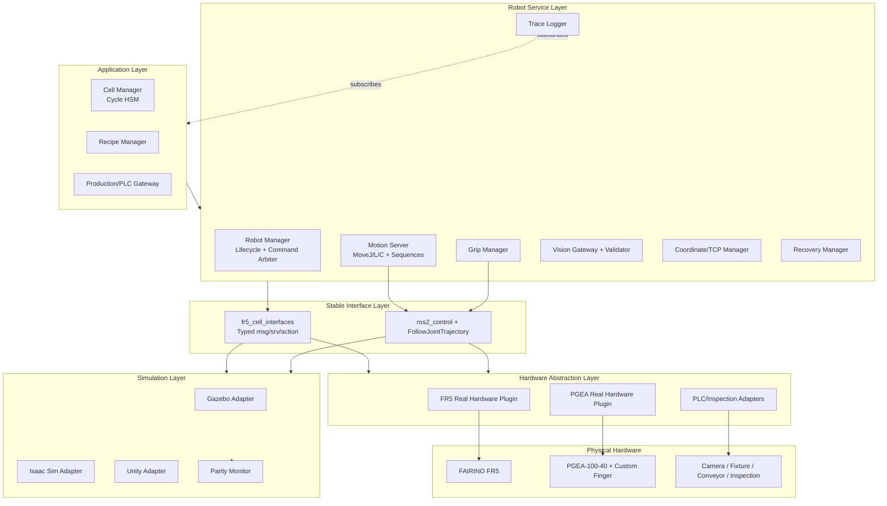
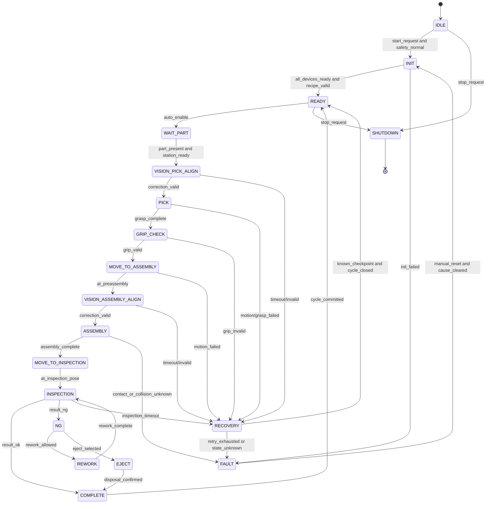
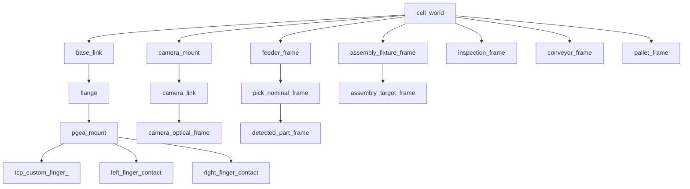

# FR5 Robot Control Software Architecture for Electronic Assembly Cell

## 1. Document control

- Status: Draft architecture baseline
- Scope owner: Robot control
- Platform: FAIRINO FR5, ROS 2 Jazzy, Ubuntu, DH Robotics PGEA-100-40
- Evidence workspace: `/home/lucas/fr5_jazzy_test_ws` (read-only reference; separate from this target project)
- Production approval: Not granted
- Numeric parameters: Provisional until mechanical/process calibration and acceptance gates pass

This document defines package boundaries, runtime contracts, safety guards, motion semantics, state transitions, configuration, traceability, and real/simulation parity. It does not replace the safety PLC, risk assessment, robot manufacturer safety functions, or mechanical validation.

## 2. Executive decisions

1. Keep vendor packages isolated. Process code must not call FAIRINO string-command services directly.
2. Use typed ROS messages/actions/services in `fr5_cell_interfaces` as the stable contract.
3. Separate equipment lifecycle, safety supervision, and production cycle state. Do not implement one flat state machine.
4. Separate motion primitives from process sequences and from state orchestration.
5. Treat the Custom Finger as a versioned tool with its own CAD, collision model, TCP, payload, CoG, grip envelope, and approved part recipes.
6. PGEA must have a real driver and feedback contract. A mock gripper in the real launch is lab-only.
7. Choose the runtime backend at launch/configuration; upper layers use the same namespace and interfaces for real and simulation.
8. Use Gazebo as the first ROS-control integration baseline, Isaac Sim as an optional high-fidelity/perception backend, and Unity only after interface-parity qualification.
9. Store canonical operational records in SQLite, structured event payloads as JSON, and generate CSV exports.
10. Every command and event is correlated by `cycle_id`, `command_id`, recipe version, tool version, and calibration version.

## 3. Evidence-based review of the current workspace

### Existing strengths

- FR5, PGEA visual model, MoveIt, and FAIRINO v3.9.7 hardware packages already build in one Jazzy workspace.
- Arm and gripper have been split into separate `ros2_control` systems, preventing the six-joint FAIRINO driver from consuming the gripper joint.
- `use_fake_hardware` switches the arm plugin between mock and real hardware.
- `ServoMoveStart()` and `ServoMoveEnd()` are paired in the FAIRINO hardware lifecycle.

### Current blockers before industrial use

| Finding | Evidence | Consequence | Required disposition |
|---|---|---|---|
| Custom Finger is not modeled | `fairino5_v6.urdf` uses two `0.015 × 0.015 × 0.018 m` boxes | Collision, TCP, and hook clearance are not trustworthy | Obtain CAD/scan; create visual and simplified convex collision meshes |
| Real launch still mocks the gripper | `FakeSystem_gripper` uses `mock_components/GenericSystem` | RViz gripper motion is not proof of PGEA actuation or feedback | Add real PGEA adapter and backend switch |
| Vendor command API is stringly typed | `RemoteCmdInterface.srv` carries a command string | No compile-time units/range/schema safety | Wrap vendor SDK behind typed interfaces |
| Motion streaming contract is inconsistent | control loop is 100 Hz while `ServoJ` uses fixed `cmdT=0.008`; idle streaming and non-real-time scheduling were observed | These are credible contributors to WebApp Running/Stopped oscillation and jitter, but the single root cause is not proven without controller-side logs | Correlate controller logs with command cadence; qualify timing, idle behavior, return codes, watchdog, and real-time scheduling |
| Driver error paths are incomplete | read error expression does not return; finite check excludes the last array endpoint | Faults may be masked | Harden driver and add unit/HIL tests |
| MoveIt controller config has duplicate keys | `action_ns` and `default` repeated | Configuration ambiguity | Normalize generated configuration |
| No root operational documentation/test contract | workspace is primarily vendor/generated packages | Commissioning knowledge is not controlled | Adopt the documentation and verification layout below |

The existing configuration is a useful lab integration baseline, not the final production architecture.

## 4. Target repository tree

```text
fr5_robot_control_ws/
├── README.md
├── DESIGN.md
├── src/
│   ├── vendor/
│   │   ├── fairino_hardware_v3_9_7/       # pinned upstream; minimal patches only
│   │   └── fairino_msgs/                  # vendor compatibility messages
│   ├── fr5_cell_interfaces/
│   │   ├── msg/
│   │   │   ├── AlarmEvent.msg
│   │   │   ├── CellState.msg
│   │   │   ├── CycleContext.msg
│   │   │   ├── GripperState.msg
│   │   │   ├── InspectionResult.msg
│   │   │   ├── InterlockState.msg
│   │   │   ├── MotionEvent.msg
│   │   │   ├── RecipeState.msg
│   │   │   ├── RobotState.msg
│   │   │   ├── StateTransition.msg
│   │   │   ├── VisionDetection.msg
│   │   │   └── ValidatedCorrection.msg
│   │   ├── srv/
│   │   │   ├── AcknowledgeAlarm.srv
│   │   │   ├── ActivateRecipe.srv
│   │   │   ├── GetCapabilities.srv
│   │   │   ├── GetCellSnapshot.srv
│   │   │   ├── LoadRecipe.srv
│   │   │   └── SetTool.srv
│   │   └── action/
│   │       ├── AcquireVisionCorrection.action
│   │       ├── ExecuteMotion.action
│   │       ├── ExecuteProcessSequence.action
│   │       ├── Grasp.action
│   │       ├── RecoverFault.action
│   │       └── RunCycle.action
│   ├── fr5_description/
│   │   ├── urdf/
│   │   │   ├── fr5.urdf.xacro
│   │   │   ├── pgea_100_40.urdf.xacro
│   │   │   ├── custom_finger.urdf.xacro
│   │   │   └── cell_frames.urdf.xacro
│   │   ├── ros2_control/fr5_control.xacro
│   │   ├── meshes/{visual,collision}/
│   │   ├── config/tool_geometry.yaml
│   │   └── rviz/cell_model.rviz
│   ├── fr5_moveit_config/
│   │   ├── config/
│   │   │   ├── fr5.srdf.xacro
│   │   │   ├── joint_limits.yaml
│   │   │   ├── kinematics.yaml
│   │   │   ├── moveit_controllers.yaml
│   │   │   ├── pilz_cartesian_limits.yaml
│   │   │   └── planning_pipelines.yaml
│   │   └── launch/move_group.launch.py
│   ├── fr5_robot_hardware/
│   │   ├── include/fr5_robot_hardware/
│   │   │   ├── fairino_client.hpp
│   │   │   ├── fairino_system_interface.hpp
│   │   │   ├── robot_state_decoder.hpp
│   │   │   └── watchdog.hpp
│   │   ├── src/
│   │   │   ├── fairino_client.cpp
│   │   │   ├── fairino_system_interface.cpp
│   │   │   └── robot_state_decoder.cpp
│   │   └── test/
│   ├── pgea_gripper_hardware/
│   │   ├── include/pgea_gripper_hardware/
│   │   │   ├── pgea_client.hpp
│   │   │   ├── pgea_system_interface.hpp
│   │   │   └── pgea_protocol.hpp
│   │   ├── src/
│   │   │   ├── pgea_client.cpp
│   │   │   ├── pgea_system_interface.cpp
│   │   │   └── pgea_protocol.cpp
│   │   └── test/
│   ├── fr5_safety_supervisor/
│   │   ├── include/fr5_safety_supervisor/interlock_evaluator.hpp
│   │   ├── src/safety_supervisor_node.cpp
│   │   ├── src/interlock_evaluator.cpp
│   │   └── config/interlock_matrix.yaml
│   ├── fr5_motion/
│   │   ├── include/fr5_motion/
│   │   │   ├── motion_executor.hpp
│   │   │   ├── motion_request_validator.hpp
│   │   │   ├── trajectory_validator.hpp
│   │   │   ├── workspace_guard.hpp
│   │   │   └── primitives/{move_j,move_l,move_c}.hpp
│   │   ├── src/
│   │   │   ├── motion_executor_node.cpp
│   │   │   ├── motion_request_validator.cpp
│   │   │   ├── trajectory_validator.cpp
│   │   │   └── primitives/{move_j,move_l,move_c}.cpp
│   │   └── test/
│   ├── fr5_process_sequences/
│   │   ├── include/fr5_process_sequences/
│   │   │   ├── pick_sequence.hpp
│   │   │   ├── place_sequence.hpp
│   │   │   ├── assembly_sequence.hpp
│   │   │   ├── inspection_sequence.hpp
│   │   │   └── recovery_sequence.hpp
│   │   ├── src/process_sequence_server.cpp
│   │   └── test/
│   ├── fr5_grip_manager/
│   │   ├── include/fr5_grip_manager/
│   │   │   ├── grip_strategy.hpp
│   │   │   ├── grip_strategy_registry.hpp
│   │   │   ├── grip_validator.hpp
│   │   │   └── slip_detector.hpp
│   │   ├── src/grip_manager_node.cpp
│   │   └── test/
│   ├── fr5_coordinate_manager/
│   │   ├── include/fr5_coordinate_manager/
│   │   │   ├── calibration_registry.hpp
│   │   │   ├── pose_validator.hpp
│   │   │   ├── tcp_manager.hpp
│   │   │   └── transform_composer.hpp
│   │   ├── src/coordinate_manager_node.cpp
│   │   └── test/
│   ├── fr5_vision_interface/
│   │   ├── include/fr5_vision_interface/
│   │   │   ├── correlation_guard.hpp
│   │   │   ├── freshness_guard.hpp
│   │   │   ├── offset_guard.hpp
│   │   │   └── vision_validator.hpp
│   │   ├── src/vision_gateway_node.cpp
│   │   └── test/
│   ├── fr5_recipe_manager/
│   │   ├── fr5_recipe_manager/
│   │   │   ├── recipe_loader.py
│   │   │   ├── recipe_schema.py
│   │   │   ├── recipe_server.py
│   │   │   └── recipe_validator.py
│   │   ├── schemas/recipe.schema.json
│   │   └── test/
│   ├── fr5_robot_manager/
│   │   ├── include/fr5_robot_manager/
│   │   │   ├── command_arbiter.hpp
│   │   │   ├── equipment_lifecycle.hpp
│   │   │   └── system_snapshot.hpp
│   │   ├── src/robot_manager_node.cpp
│   │   └── test/
│   ├── fr5_cell_manager/
│   │   ├── include/fr5_cell_manager/
│   │   │   ├── cell_state_machine.hpp
│   │   │   ├── cycle_context.hpp
│   │   │   ├── state_transition_table.hpp
│   │   │   └── transition_guard.hpp
│   │   ├── src/cell_manager_node.cpp
│   │   └── test/
│   ├── fr5_recovery_manager/
│   │   ├── include/fr5_recovery_manager/
│   │   │   ├── error_classifier.hpp
│   │   │   ├── recovery_policy.hpp
│   │   │   └── retry_budget.hpp
│   │   ├── src/recovery_manager_node.cpp
│   │   └── test/
│   ├── fr5_plc_interface/              # handshake gateway only; not safety logic
│   ├── fr5_inspection_interface/       # typed result gateway only; not AI internals
│   ├── fr5_trace_logger/
│   │   ├── fr5_trace_logger/
│   │   │   ├── logger_node.py
│   │   │   ├── sqlite_store.py
│   │   │   ├── json_event_writer.py
│   │   │   ├── csv_exporter.py
│   │   │   └── retention_manager.py
│   │   ├── migrations/
│   │   └── test/
│   ├── fr5_digital_twin/
│   │   ├── include/fr5_digital_twin/parity_monitor.hpp
│   │   ├── src/parity_monitor_node.cpp
│   │   ├── config/parity_limits.yaml
│   │   └── test/
│   ├── fr5_simulation/
│   │   ├── gazebo/{launch,worlds,models,config}/
│   │   ├── isaac_sim/{launch,usd,config}/
│   │   └── unity/{bridge,config}/
│   ├── fr5_cell_bringup/
│   │   ├── launch/
│   │   │   ├── cell.launch.py
│   │   │   ├── real.launch.py
│   │   │   ├── gazebo.launch.py
│   │   │   ├── isaac_sim.launch.py
│   │   │   ├── maintenance.launch.py
│   │   │   └── replay.launch.py
│   │   └── config/
│   │       ├── backends/{real,gazebo,isaac_sim}.yaml
│   │       ├── robot/fr5.yaml
│   │       ├── motion/speed_profiles.yaml
│   │       ├── safety/workspace_limits.yaml
│   │       ├── tools/custom_finger.yaml
│   │       ├── vision/validation.yaml
│   │       ├── logging/logger.yaml
│   │       └── sites/site_a.yaml
│   └── fr5_cell_test_support/
│       ├── fixtures/
│       ├── fault_injection/
│       ├── fakes/
│       ├── scenarios/
│       └── test_data/
├── recipes/
│   ├── schema/recipe.schema.json
│   ├── draft/
│   ├── approved/
│   └── retired/
├── docs/
│   ├── architecture/
│   ├── api/
│   ├── motion/
│   ├── gripper/
│   ├── calibration/
│   ├── recovery/
│   ├── safety/
│   ├── operation/
│   ├── troubleshooting/
│   └── adr/
├── scripts/
│   ├── build_workspace.sh
│   ├── validate_recipe.py
│   ├── calibrate_tcp.py
│   ├── verify_frames.py
│   ├── run_sil_scenarios.py
│   ├── replay_cycle.py
│   └── export_logs.py
├── test/
│   ├── sil/
│   ├── integration/
│   ├── hil/
│   ├── endurance/
│   └── acceptance/
├── data/                                # versioned, non-sensitive reference data
│   ├── calibration_templates/
│   ├── sample_vision/
│   └── replay_fixtures/
└── runtime/                             # gitignored; deployment maps to /var paths
    ├── logs/                            # production: /var/log/fr5_cell
    ├── data/                            # production: /var/lib/fr5_cell
    ├── rosbag2/
    └── crash/
```

Do not create one package for every file prematurely. The package boundaries above correspond to deployable ownership and failure boundaries. Small pure libraries may begin in their owning package and split only when reuse is proven.

## 5. Software architecture



### Boundary rules

- `fr5_cell_manager` may call process actions but never the FAIRINO SDK.
- `fr5_motion` owns planning/execution validation but not product sequencing.
- `fr5_process_sequences` owns Pick/Place/Assembly composition but not lifecycle or PLC mode.
- `fr5_robot_manager` is the single command arbiter and equipment readiness source.
- `fr5_safety_supervisor` is a software interlock layer only. Safety-rated E-stop, guard door, STO, and safe speed remain in certified hardware/controller logic.
- Logger failure must raise a degraded/fault policy according to traceability requirements; it must never block a safety stop.
- GUI, notebooks, and ad-hoc scripts cannot command hardware directly.

## 6. Package and node contracts

| Package | Primary node | Owns | Does not own |
|---|---|---|---|
| `fr5_robot_hardware` | `ros2_control_node` plugin | SDK session, joint feedback, command transport, watchdog | process sequence |
| `pgea_gripper_hardware` | `ros2_control_node` plugin or dedicated lifecycle node | width/force/speed command, status/current/fault | grip strategy |
| `fr5_safety_supervisor` | `safety_supervisor` | software interlock evaluation, command permit | certified safety function |
| `fr5_motion` | `motion_executor` | MoveJ/L/C validation, planning, execution, cancellation | Pick/Place business flow |
| `fr5_process_sequences` | `process_sequence_server` | Approach/Pick/Retract/Place/Assembly/Inspection sequence | cell state authority |
| `fr5_grip_manager` | `grip_manager` | strategy selection, grasp completion and slip validation | raw bus protocol |
| `fr5_coordinate_manager` | `coordinate_manager` | TF/calibration/TCP/payload registry, transform composition | camera detection |
| `fr5_vision_interface` | `vision_gateway` | correlation, freshness, confidence, frame, bounds validation | AI inference internals |
| `fr5_recipe_manager` | `recipe_manager` | schema, approval, activation, immutable snapshot | live motion execution |
| `fr5_robot_manager` | `robot_manager` | equipment lifecycle, readiness, command arbitration | production routing |
| `fr5_cell_manager` | `cell_manager` | cycle HSM and PLC handshakes | safety-rated stop |
| `fr5_recovery_manager` | `recovery_manager` | fault classification, retry budget, recovery action | automatic reset of safety faults |
| `fr5_trace_logger` | `trace_logger` | SQLite transaction log, JSON payload, CSV export | process decisions |
| `fr5_digital_twin` | `parity_monitor` | state/trajectory/event comparison | alternate application API |

## 7. ROS interface catalog

### Topics

| Name | Type | Publisher | QoS/semantics |
|---|---|---|---|
| `/cell/state` | `CellState` | cell manager | reliable, transient-local, last known state |
| `/cell/state_transition` | `StateTransition` | cell manager | reliable event stream |
| `/robot/state` | `RobotState` | robot manager | reliable, keep-last; includes age/source/mode |
| `/gripper/state` | `GripperState` | grip manager | reliable; width/current/force estimate/fault/part-present |
| `/safety/interlocks` | `InterlockState` | safety supervisor | reliable, transient-local |
| `/vision/detection_raw` | `VisionDetection` | vision gateway | reliable; untrusted measurement, never commands motion directly |
| `/vision/correction_validated` | `ValidatedCorrection` | vision gateway | reliable; validation result, accepted detections are single-use |
| `/inspection/result` | `InspectionResult` | inspection gateway | reliable; cycle-correlated |
| `/recipe/active` | `RecipeState` | recipe manager | reliable, transient-local, immutable version/hash |
| `/alarm/event` | `AlarmEvent` | all through alarm router | reliable, latched according to severity |
| `/events/motion` | `MotionEvent` | motion server | reliable event stream |
| `/diagnostics` | `diagnostic_msgs/DiagnosticArray` | all device nodes | standard health telemetry |

High-rate raw joint state remains `/joint_states`; production decisions consume the validated `RobotState` snapshot rather than sampling raw topics independently.

### Actions

| Action | Goal | Completion evidence |
|---|---|---|
| `ExecuteMotion` | primitive, target, profile, constraints, correlation | final tolerance, controller result, stop reason, trajectory ID |
| `ExecuteProcessSequence` | named sequence plus immutable recipe snapshot | every step result, held-part state, final checkpoint |
| `Grasp` | strategy, width/force/speed limits, validation policy | final width/current/feedback, micro-lift/slip result |
| `AcquireVisionCorrection` | trigger, frame, product/cycle/calibration IDs, timeout | accepted correction or structured rejection reason |
| `RecoverFault` | fault ID and approved policy | known checkpoint or manual-intervention result |
| `RunCycle` | cycle context and active recipe hash | OK, NG, ABORTED, FAULT with trace reference |

Use actions for operations that take time, need feedback, cancellation, and final evidence. Use services only for short atomic configuration/query operations. Never expose `MoveJ`, `MoveL`, or gripper close as uncorrelated fire-and-forget topics.

### Required common fields

Every command/result carries:

```text
command_id
cycle_id
product_id
recipe_id + recipe_revision + recipe_hash
tool_id + tool_version
calibration_id + calibration_hash
source_stamp + received_stamp
frame_id
requester
```

All numeric messages define SI units. Angles are radians internally. Human-facing degrees/mm are converted at boundaries.

## 8. Motion architecture

```text
Cell state request
  -> Process Sequence
     -> Motion primitive request
        -> Request validation
        -> TF snapshot and recipe binding
        -> Planning and collision check
        -> Trajectory validation
        -> Safety permit check
        -> Controller execution
        -> Final tolerance and state verification
        -> MotionEvent + trace transaction
```

### Primitive ownership

- `MoveJ`: joint-space transport, Home, Ready, Safe, station-to-station travel.
- `MoveL`: tool-axis Approach/Retract, pick descent, placement, qualified insertion.
- `MoveC`: only when a process requires a defined arc; never use merely to smooth an unknown path.
- `Servo`: isolated optional capability for qualified visual/force servoing. It is not the default MoveIt execution path.

### Sequence ownership

| Sequence | Required steps |
|---|---|
| Home | validate empty/held-part policy → collision-free joint motion → tolerance check |
| Safe | select checkpoint based on current region and held-part state; there is no universal blind safe pose |
| Pick | pre-pick → validated approach → pre-close → final grasp → grip check → micro-lift → slip check → retract |
| Place | pre-place → linear approach → release → release verification → hook-clear disengagement → retract |
| Inspection | move to qualified camera pose → settle → trigger → correlated result |
| Assembly | pre-assembly → fine vision gate → qualified insertion mode → completion evidence → retreat |
| Recovery | fault-specific, checkpoint-oriented, bounded by retry budget |

### Mandatory motion guards

- robot mode, enable, safety and software interlocks valid;
- active recipe/tool/payload/calibration all approved and mutually compatible;
- target finite, normalized, in workspace, outside forbidden zones;
- frame exists and transform age is within policy;
- joint limits include configurable margins;
- path collision-free with current planning-scene age within policy;
- speed/acceleration/jerk profile allowed for state and held part;
- communication watchdog healthy;
- cancellation and stop semantics defined before execution;
- final joint/TCP tolerance verified after controller success.

## 9. Hierarchical state model

A single flat list is unsafe because process, equipment, and safety states have different authority.

### Safety overlay

```text
NORMAL
PROTECTIVE_STOP
EMERGENCY_STOP
SAFETY_FAULT
```

Any non-`NORMAL` state revokes motion permits. `EMERGENCY_STOP` and safety faults require hardware/controller conditions to clear plus explicit manual reset. Software never auto-resets them.

### Equipment lifecycle

```text
OFFLINE -> INITIALIZING -> STANDBY -> READY
              |              |         |
              +-----------> FAULTED <---+
READY -> SHUTTING_DOWN -> OFFLINE
```

Lifecycle nodes configure resources without moving, activate only after validation, and transition to a known inactive/faulted state on transport failure.

### Production cycle HSM



`MOVE` is split by intent, and `VISION` is split into pick alignment and assembly alignment. Product `NG` is not an equipment fault. Physical collision, communication loss while moving, or unknown assembly contact cannot automatically resume.

### Global invariants

- New cycle cannot start during recovery or while a prior cycle is uncommitted.
- Recipe cannot change outside `IDLE`, `STANDBY`, or `READY` with no active cycle.
- Unknown robot, gripper, held-part, frame, or calibration state blocks motion.
- Vision data is single-use and bound to the active cycle and trigger.
- Interrupted `MOVE` and `ASSEMBLY` never continue from the previous trajectory blindly.
- Shutdown with a held part requires an approved park/drop policy or manual intervention.

## 10. Vision interface

The proposed payload `x`, `y`, `theta`, `confidence`, `timestamp`, `product_id`, and `cycle_id` is necessary but insufficient. Add:

```text
std_msgs/Header header        # capture time and frame_id
string detection_id           # one-use identity
string camera_id
string calibration_id
uint32 source_sequence
float64 x_m
float64 y_m
float64 theta_rad
float64 confidence
float64[9] covariance_xytheta
string product_id
string cycle_id
```

### Validation order

1. Schema/type and finite-number check.
2. `cycle_id`, `product_id`, trigger/detection ID correlation.
3. Capture timestamp is after the active trigger and age is below recipe limit.
4. Clock synchronization health is valid; receive time is recorded separately.
5. Confidence and covariance pass recipe thresholds.
6. `camera_id`, `frame_id`, and calibration version match the active cell/recipe.
7. Offset and jump limits pass in the workpiece frame.
8. TF exists and its age/version pass.
9. Composed target is in workspace and outside forbidden zones.
10. Target and approach/retract plan are collision-free.
11. Result is atomically marked consumed; replay is rejected.

Structured rejection codes include `STALE`, `CYCLE_MISMATCH`, `PRODUCT_MISMATCH`, `LOW_CONFIDENCE`, `HIGH_UNCERTAINTY`, `OFFSET_LIMIT`, `FRAME_MISMATCH`, `CALIBRATION_MISMATCH`, `TF_STALE`, `WORKSPACE_LIMIT`, `COLLISION`, and `ALREADY_CONSUMED`.

Thresholds belong to approved recipes and are derived from fixture, camera, part, and process capability studies. Do not copy example confidence/offset numbers into production without evidence.

## 11. Digital Twin and backend parity

```text
Application / Process / Recipe / Recovery
                  |
          Stable typed ROS API
                  |
         Motion + Grip services
                  |
        ros2_control interfaces
          /                 \
 Real plugins          Simulation plugins
 FR5 + PGEA       Gazebo / Isaac / Unity adapter
```

### Backend selection

```bash
ros2 launch fr5_cell_bringup cell.launch.py backend:=real site:=site_a
ros2 launch fr5_cell_bringup cell.launch.py backend:=gazebo site:=site_a
ros2 launch fr5_cell_bringup cell.launch.py backend:=isaac_sim site:=site_a
```

Backend launch files must expose identical action, service, topic names and status semantics. Upper layers are not remapped to `/twin/*`; only the hardware/simulation plugin changes.

### Parity contract

Compare, per cycle and trajectory ID:

- target and actual joint/TCP path;
- velocity/acceleration limits;
- collision scene and tool geometry versions;
- gripper width and object-attachment state;
- state transitions and fault codes;
- expected I/O sequence;
- completion and cancellation semantics;
- cycle duration estimate versus actual.

A Digital Twin is a validation environment, not a safety-rated authority. Simulator success cannot override real interlocks. A simulation backend must never share the real hardware command namespace in the same ROS domain without explicit isolation.

## 12. Coordinate system contract



### Transform rules

- Use REP-103 right-handed SI conventions; optical frames follow camera optical convention.
- Fixed installation frames are static and versioned by site calibration.
- Detected part frames are dynamic, timestamped, cycle-bound, and never published as timeless static transforms.
- Compose corrections in the intended workpiece plane, not by adding camera `X/Y/θ` directly to base coordinates.

Conceptually:

```text
T_base_tcp_goal = T_base_workpiece_nominal
                · DeltaT_vision_in_workpiece
                · T_workpiece_grasp_from_recipe
```

The exact multiplication order is frozen in the interface document and covered by golden transform tests. Every pose message includes `frame_id` and timestamp.

## 13. Configuration and recipe system

### Configuration ownership

```text
fr5_cell_bringup/config/
├── backends/real.yaml
├── backends/gazebo.yaml
├── backends/isaac_sim.yaml
├── robot/fr5.yaml
├── motion/speed_profiles.yaml
├── safety/workspace_limits.yaml
├── safety/interlock_matrix.yaml
├── tools/custom_finger.yaml
├── frames/site_a_frames.yaml
├── vision/validation.yaml
├── logging/logger.yaml
└── sites/site_a.yaml
```

Robot limits, safety-related limits, and hardware addresses are deployment configuration. Product-dependent grip, motion, vision, and inspection values are recipe data. Calibration results are immutable versioned artifacts. Do not merge all three into one YAML.

### Recipe schema

```yaml
schema_version: 1
identity:
  recipe_id: CONNECTOR_A
  product_id: CONNECTOR_A
  version: 1.0.0
  status: DRAFT        # DRAFT -> VALIDATED -> APPROVED -> ACTIVE -> RETIRED
compatibility:
  site_id: site_a
  robot_model: FR5
  tool_id: custom_hook_finger
  tool_version: TBD
  calibration_id: TBD
payload:
  mass_kg: TBD
  cog_m: [TBD, TBD, TBD]
vision:
  pick:
    roi: TBD
    min_confidence: TBD
    max_age_ms: TBD
    max_covariance: TBD
    offset_limit_m: [TBD, TBD]
    theta_limit_rad: TBD
  assembly:
    enabled: TBD
    min_confidence: TBD
    max_age_ms: TBD
grip:
  strategy: TBD
  contact_zone: TBD
  open_width_m: TBD
  target_width_m: TBD
  force_limit_n_per_jaw: TBD
  speed_mps: TBD
  settle_ms: TBD
  micro_lift_m: TBD
  validation:
    width_window_m: [TBD, TBD]
    current_window_a: [TBD, TBD]
    slip_limit_m: TBD
motion:
  named_poses:
    home: TBD
    ready: TBD
    pre_pick: TBD
    pre_assembly: TBD
    inspection: TBD
  profiles:
    transport: TBD
    approach: TBD
    assembly: TBD
  approach_m: TBD
  retract_m: TBD
inspection:
  program_id: TBD
  timeout_ms: TBD
  rework_allowed: false
recovery:
  grip_retry_budget: TBD
  vision_retry_budget: TBD
  reject_destination: TBD
```

Recipe activation is transactional: validate schema → verify compatible tool/calibration/site → pre-plan named motions in the Digital Twin → approval/signature → activate only with no cycle active → publish immutable hash. Rollback activates a previously approved version; it never edits an active recipe in place.

## 14. Logging and data retention

| Format | Role | Reason |
|---|---|---|
| SQLite | canonical local operational store | transactions, joins, indexed fault/cycle queries, single deployable file |
| JSON Lines | raw structured event spool and replay payload | preserves evolving event detail and is append-friendly |
| CSV | controlled export/reporting | accessible to quality and production engineers, not canonical |
| rosbag2 | bounded diagnostic capture | high-rate ROS evidence around selected faults/commissioning tests |

### Core tables

```text
cycles
state_transitions
motions
vision_results
grips
inspection_results
alarms
recoveries
interlock_events
recipe_activations
calibration_activations
operator_events
```

Every record includes wall-clock UTC, monotonic time where relevant, cycle/command IDs, product/recipe/tool/calibration versions, state, result, duration, source node, software build ID, and structured detail. Use schema migrations, WAL mode, disk quotas, retention policy, integrity checks, and export checksums. A cycle commits only after its final outcome and linked evidence are persisted according to site policy.

## 15. Error and recovery policy

| Error | Immediate response | Automatic recovery | Terminal outcome |
|---|---|---|---|
| Grip fail | stop sequence, hold at safe pick checkpoint | open → retreat → optional re-vision → bounded regrip | reject part or latched fault |
| Slip after lift | stop transfer, maintain grip if safe | approved safe return/regrip once | reject/manual intervention |
| Vision timeout | discard pending result | bounded retrigger if part is stationary | recovery/fault |
| Low confidence | reject correction | bounded retrigger with same cycle | recovery/fault |
| Offset over limit | do not move | optional one recapture; never clamp silently | misload/calibration fault |
| Emergency stop | hardware safety response, cancel commands, latch state | none | manual reset → INIT |
| Communication lost | revoke command permit, mark state unknown | read-only reconnect only after safe stop confirmed | fault/manual verification |
| Joint/workspace limit | reject before execution or controlled stop | alternate path only if pre-approved | fault |
| Predicted collision | reject plan | alternate pre-approved path | fault |
| Physical collision | immediate stop and evidence capture | none by default | manual inspection |
| Inspection NG | preserve product trace | route to approved rework/eject flow | NG, not equipment fault |

Retry counters are per failure class and per cycle. Repeating the same fault across cycles escalates to equipment fault based on site policy. Recovery ends at `READY`, `WAIT_PART`, a defined reject checkpoint, or `FAULT`; it never jumps back to an ambiguous interrupted state.

## 16. PLC and external-system boundary

PLC/safety hardware owns safety chain, cell mode, door/guard signals, station occupancy, external actuator authority, and cycle-level hard interlocks. Robot software owns FR5/PGEA readiness, motion/grip/vision validation, robot-safe sequence execution, and robot recovery.

Minimum handshake:

```text
PLC -> Robot:
  mode, safety_ok, auto_enable, cycle_start, cycle_stop,
  reset_request, part_present, fixture_ready, conveyor_ready,
  inspection_station_ready

Robot -> PLC:
  robot_ready, robot_busy, cycle_active, cycle_complete,
  held_part_state, grip_ok, vision_ok, recovery_active,
  fault_active, fault_code, current_state, heartbeat
```

`reset_request` is only a request. The robot leaves `FAULT` only after the cause is independently verified clear and initialization guards pass.

## 17. Documentation ownership

```text
README.md                                  build/run/status and support entry point
DESIGN.md                                  durable product/operation decisions
docs/architecture/FR5_ROBOT_CONTROL_ARCHITECTURE.md
docs/api/ROS_INTERFACES.md                 exact fields, QoS, units, error codes
docs/motion/MOTION_LIBRARY.md              primitive and sequence contracts
docs/gripper/CUSTOM_FINGER_GRIP_STRATEGY.md
docs/calibration/TCP_PAYLOAD_CALIBRATION.md
docs/calibration/VISION_HAND_EYE.md
docs/recovery/RECOVERY_MATRIX.md
docs/safety/INTERLOCK_MATRIX.md
docs/operation/STARTUP_SHUTDOWN.md
docs/operation/RECIPE_CHANGEOVER.md
docs/troubleshooting/FR5_PGEA.md
docs/verification/COMMISSIONING_AND_ACCEPTANCE.md
docs/adr/                                  architecture decision records
```

Each production release freezes software build, interface schema, recipe hashes, calibration hashes, safety configuration reference, and acceptance report.

## 18. Implementation sequence

1. Freeze interface vocabulary, units, IDs, fault codes, and ownership boundaries.
2. Obtain Custom Finger CAD/mechanical properties; replace URDF placeholders and calibrate TCP/payload.
3. Harden FR5 hardware interface and qualify command timing/watchdog/stop behavior.
4. Implement and HIL-qualify the real PGEA adapter with feedback.
5. Implement typed interfaces, safety supervisor, robot manager, and trace logger.
6. Implement motion primitives and validation before process sequences.
7. Implement recipe and coordinate managers with immutable calibration binding.
8. Implement split vision alignment gates and cycle state machine.
9. Implement bounded recovery policies and fault injection.
10. Establish Gazebo API parity, then qualify optional Isaac Sim/Unity backends.
11. Run SIL → Digital Twin → HIL dry-run → grip validation → integrated cell → endurance gates.

## 19. Production-release stop conditions

Production speed and automatic assembly remain blocked until all are true:

- Custom Finger CAD/collision model, material, mass, CoG, fasteners, and allowable moment are approved.
- Actual TCP and payload are calibrated and versioned.
- PGEA communication method and feedback fields are proven on the installed unit.
- Each part recipe passes damage, slip, release, and repeatability studies.
- Camera calibration and coordinate transform capability meet process tolerance.
- Every state/fault has a deterministic, tested outcome.
- Safety PLC/interlock matrix and reset behavior are validated by the responsible safety engineer.
- Real/simulation API parity and HIL fault-injection tests pass.
- Trace database integrity, retention, disk-full behavior, and cycle correlation pass.
- Endurance and capability evidence meet the process owner's approved limits.


## 20. Official technical references

- ROS 2 Jazzy topic, service, and action selection: <https://docs.ros.org/en/jazzy/How-To-Guides/Topics-Services-Actions.html>
- ROS 2 managed lifecycle: <https://docs.ros.org/en/jazzy/p/rclcpp_lifecycle/>
- ros2_control concepts and hardware components: <https://control.ros.org/jazzy/doc/ros2_control/doc/index.html>
- MoveIt move_group architecture: <https://moveit.picknik.ai/main/doc/concepts/move_group.html>
- MoveIt Planning Scene Monitor: <https://moveit.picknik.ai/main/doc/examples/planning_scene_monitor/planning_scene_monitor_tutorial.html>
- Gazebo gz_ros2_control: <https://control.ros.org/master/doc/gz_ros2_control/doc/index.html>
- Isaac Sim ROS 2 Bridge: <https://docs.isaacsim.omniverse.nvidia.com/latest/py/source/extensions/isaacsim.ros2.bridge/docs/index.html>
- Unity ROS-TCP-Connector: <https://github.com/Unity-Technologies/ROS-TCP-Connector>
- DH Robotics PGEA product data: <https://en.dh-robotics.com/product/pgea>

References describe framework and stock-device capabilities. Installed firmware, communication options, Custom Finger load envelope, and site behavior still require local verification.
