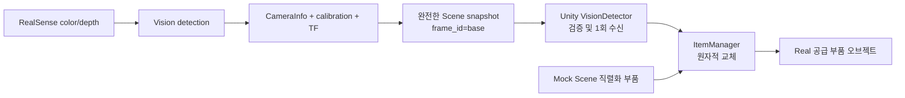

# Real 모드 초기 Scene 동기화 계획

## 1. 목표

현재 `SampleScene`에 미리 배치된 공급 부품은 Mock 실행에는 그대로 사용한다.
Real 실행에서는 미리 배치된 부품을 실제 현황으로 오인하지 않도록 숨기고, 카메라가 확인한
초기 부품 목록과 Pose를 기준으로 Unity 오브젝트를 한 번 생성한다.

초기 버전의 범위는 다음과 같이 제한하는 것이 안전하다.

- Real 모드 진입 시 공급 부품을 한 번 동기화한다.
- 동기화가 끝난 뒤에는 비전 프레임마다 오브젝트를 다시 만들거나 움직이지 않는다.
- 로봇, 컨베이어, 카메라, 트레이 같은 고정 설비는 Scene에 유지한다.
- PCB 조립 슬롯은 카메라 검출물이 아니라 제품 레시피/트윈 데이터이므로 기존 Scene 구성을 유지한다.
- 실제 조립 중 부품 이동은 초기 비전이 아니라 Real 조립 피드백이 반영하도록 분리한다.

## 2. 현재 구현에서 확인된 사실

### Scene 부품 소유자

[`ItemManager.cs`](UnityDT/Assets/src/Static/ItemManager.cs)가 현재 다음 두 데이터를 함께 소유한다.

- `assemblySlots`: PCB의 조립 위치와 필요한 부품 타입
- `itemGroups`: 타입별 공급 부품 Transform, 그리퍼 설정, 픽업 오프셋

`SampleScene`에는 다음 공급 부품이 직렬화되어 있다.

| 타입 | 현재 Scene 수량 |
| --- | ---: |
| HBM | 8 |
| PM | 4 |
| GPU | 1 |
| CAP | 5 |
| IND | 2 |
| VRM | 5 |

Mock 조립은 [`MockAssemblyScenarioControl.cs`](UnityDT/Assets/src/Runtime/Robot/Mock/MockAssemblyScenarioControl.cs)에서
`ItemManager.ItemGroups`와 `AssemblySlots`를 읽어 관측값을 만들고, PICKED/PLACED 피드백에 따라
해당 Transform을 이동한다. 따라서 Mock의 직렬화 배열은 유지해야 한다.

HUD의 [`FR5RunBinder.cs`](UnityDT/Assets/UI/FR5RunBinder.cs)는 `AssemblySlots`를 읽어 부품별
조립 칸 수를 표시한다. Real 초기 부품 생성 때문에 `AssemblySlots`를 비우거나 카메라 검출 결과로
교체하면 HUD와 레시피 의미까지 달라지므로 공급 부품과 조립 슬롯을 분리해서 다뤄야 한다.

### Real 경로

[`RealAssemblyScenarioControl.cs`](UnityDT/Assets/src/Runtime/Robot/Real/RealAssemblyScenarioControl.cs)는
현재 `NotSupportedException`을 반환한다. 즉, Real 자동 조립과 실제 조립 피드백 반영은 아직
구현된 것으로 전제할 수 없다.

[`RobotMaster.cs`](UnityDT/Assets/src/Runtime/Robot/RobotMaster.cs)는 Mock/Real backend 선택과 계약 주입만
담당하고 있다. 좌표 변환, ROS 메시지 해석, 오브젝트 생성은 여기에 넣지 않는다.

### 카메라·비전 경로

- Scene에 실제 연결된 카메라 코드는 [`CamVisionReceiver.cs`](UnityDT/Assets/src/Runtime/Camera/CamVisionReceiver.cs)뿐이며,
  압축 영상을 HUD에 표시한다.
- [`VisionDetector.cs`](UnityDT/Assets/src/Runtime/Camera/VisionDetector.cs),
  [`Calibration.cs`](UnityDT/Assets/src/Runtime/Camera/Calibration.cs),
  [`CamMaster.cs`](UnityDT/Assets/src/Runtime/Camera/CamMaster.cs)는 현재 Scene/Prefab에서 참조되지 않는다.
- 현재 외부 `/part_detector`의 `vision_interfaces/msg/Detections`에는 부품명, class ID, 점수,
  2D 박스, 평면 각도, depth, 카메라 기준 XYZ가 있다.
- 이 메시지에는 로봇 `base` 기준 Pose와 완전한 quaternion이 없으며, Unity 저장소에는
  `vision_interfaces` 메시지 소스/생성 C# 타입도 없다.
- 카메라 내부 파라미터, aligned depth, depth-to-color extrinsics와 카메라→로봇 보정 파일은
  존재하지만 현재 `/part_detector` → Unity 오브젝트 생성 경로로 연결되어 있지 않다.

따라서 현재 검출 토픽을 Unity가 바로 구독해 `camera_x_m` 값을 Transform에 넣는 방식은 사용할 수 없다.
좌표계와 회전이 불완전하고, 카메라 보정이 Unity와 ROS 양쪽에 중복될 위험이 있다.

## 3. 권장 책임 분리



### ROS Vision 노드

ROS 쪽에서 다음을 완결한다.

- color/depth/CameraInfo를 사용한 3D 위치 계산
- 카메라 좌표에서 로봇 `base` 좌표로 변환
- 평면 각도를 실제 부품 Pose quaternion으로 변환
- 검출 점수, depth 유효성, calibration 유효성 판정
- 한 메시지가 현장의 전체 초기 부품 목록을 뜻하는 완전한 스냅샷 발행

카메라→로봇 변환의 source of truth는 ROS 한 곳에만 둔다. Unity의 수동 offset으로 같은 보정을
다시 적용하지 않는다.

### Unity `VisionDetector`

현재 호출자와 Scene 연결이 없는 기존 `VisionDetector`를 Real 초기 스냅샷 수신 경계로 재사용한다.
이 컴포넌트가 맡을 일은 다음으로 제한한다.

- Real 모드에서만 ROS 구독
- 최신 스냅샷의 `frame_id`, 시간, 수치, quaternion, 부품 타입 검증
- 유효한 스냅샷 하나를 `ItemManager`에 전달
- 성공 후 추가 비전 프레임 무시
- timeout 또는 잘못된 입력을 호출자/로그에 실패로 전달

오브젝트 생성 자체와 타입별 템플릿 관리는 `VisionDetector`가 아니라 기존 소유자인
`ItemManager`가 담당한다.

### Unity `ItemManager`

Mock용 직렬화 데이터는 그대로 유지하고, Real 실행 중에만 사용하는 비직렬화 runtime item 목록을
추가하는 것이 최소 변경이다.

- 각 `ItemGroup.Items`의 첫 오브젝트를 해당 타입의 시각/Collider 템플릿으로 재사용한다.
- Real 초기화가 시작되면 Scene에 미리 배치된 모든 공급 부품을 숨긴다.
- 전체 스냅샷을 먼저 검증하고, 후보 오브젝트를 비활성 상태로 모두 생성한다.
- 모든 생성이 성공한 뒤 한 번에 활성화하고 runtime item 목록을 교체한다.
- 실패하면 일부 오브젝트만 남기지 않고 Real 공급 부품을 모두 숨긴 상태로 유지한다.
- Mock에서는 기존 `Items` 배열을 그대로 반환한다.

초기 구현에서는 별도 prefab registry나 ScriptableObject를 만들지 않는다. 현재 Scene 오브젝트를
템플릿으로 쓰기 어려워지는 시점에만 독립 Prefab으로 분리한다.

## 4. 권장 ROS 스냅샷 계약

현재 `vision_interfaces/msg/Detections`는 카메라 기준 검출 결과이므로 의미를 바꾸지 않는다.
Unity용으로 다음과 같은 별도 전체 스냅샷 계약을 두는 것이 안전하다.

```text
SceneSnapshot
  std_msgs/Header header        # frame_id는 반드시 "base"
  ScenePart[] parts             # 현재 존재하는 전체 공급 부품

ScenePart
  string part_id                # HBM, PM, GPU, CAP, IND, VRM
  geometry_msgs/Pose pose       # base 기준, 단위 m
  float32 score
```

권장 토픽명은 `/vision/scene/snapshot`이다. 이는 신규 ROS 메시지/토픽 계약이므로 구현 전에
사용자 승인이 필요하다. 실제 `/part_detector`와 `vision_interfaces` 소스가 현재 저장소에 없으므로,
외부 비전 패키지의 관리 위치도 먼저 확정해야 한다.

초기 전체 교체만 한다면 persistent object ID는 필요 없다. 이후 실행 중 증분 동기화까지 요구될 때
`object_id`를 추가한다. 지금 미리 tracker와 ID 수명주기를 만들 필요는 없다.

발행은 다음 조건을 만족해야 한다.

- 카메라와 calibration이 준비된 뒤에만 발행한다.
- 빈 트레이는 `parts=[]`인 유효한 스냅샷으로 발행한다.
- 준비되지 않은 상태를 빈 스냅샷으로 위장하지 않는다.
- Unity가 늦게 연결되어도 받을 수 있도록 낮은 주기로 최신 전체 스냅샷을 반복 발행한다.
- 한 스냅샷 안에서 중복 프레임의 같은 물체를 여러 번 넣지 않는다.

## 5. Real 초기 실행 순서

1. `RobotMaster`가 기존 방식으로 Real backend를 선택한다.
2. Real 계층이 활성화되면 `VisionDetector`가 스냅샷 구독을 시작한다.
3. 미리 배치된 공급 부품은 즉시 숨겨 가짜 현황이 화면에 보이지 않게 한다.
4. 제한 시간 안에 유효한 최신 스냅샷을 기다린다.
5. 다음 항목을 모두 검증한다.
   - `header.frame_id == "base"`
   - 위치와 회전 값이 모두 finite
   - quaternion 길이가 0이 아니며 정규화 가능
   - `part_id`가 `ItemManager`의 정확한 타입명과 일치
   - 점수와 Pose 유효성 조건 충족
   - 타입별 템플릿 존재
6. 모든 부품을 비활성 상태로 생성하고 Pose를 ROS FLU에서 Unity 좌표로 한 번 변환한다.
7. 전체 성공 시 기존 runtime 목록을 교체하고 새 오브젝트를 한 번에 활성화한다.
8. 초기화 완료 상태를 기록하고 같은 실행 중 추가 스냅샷은 무시한다.
9. Real 자동 조립은 이 초기화 완료를 확인한 뒤에만 시작할 수 있게 한다.

## 6. 실패 정책

Real 모드에서는 오류가 났을 때 Scene의 가짜 사전 배치 부품으로 자동 fallback하지 않는다.
이는 실제 재고와 화면이 다르다는 사실을 숨겨 로봇 작업 판단을 잘못 만들 수 있다.

| 실패 | 처리 |
| --- | --- |
| 카메라/ROS timeout | 초기화 실패, 공급 부품 숨김 유지 |
| calibration 미준비 | 스냅샷 발행 금지, Unity 준비 상태 유지 |
| 잘못된 `frame_id` | 전체 스냅샷 거부 |
| NaN/무한대/잘못된 quaternion | 전체 스냅샷 거부 |
| 알 수 없는 `part_id` | 전체 스냅샷 거부 및 타입명 기록 |
| 일부 오브젝트 생성 실패 | 생성 후보 정리 후 전체 적용 취소 |
| 같은 스냅샷 재수신 | 무시하여 중복 생성 방지 |

재시도는 조립 시작 전 유휴 상태에서만 허용한다. 조립 도중 카메라 결과로 오브젝트 위치를 갱신하면
로봇 피드백과 Unity 상태가 서로 다른 대상을 가리킬 수 있다.

## 7. 구현 단계

### Phase 1 — 입력 계약 확정

- Real 초기화 대상이 공급 부품만인지, PCB와 트레이 Pose까지 포함하는지 확정한다.
- `part_id`를 `HBM`, `PM`, `GPU`, `CAP`, `IND`, `VRM`으로 통일한다.
- `/vision/scene/snapshot` 메시지와 `base`/meter/quaternion 계약을 승인한다.
- 외부 `/part_detector` 소스 저장소와 메시지 생성 위치를 확정한다.

완료 기준: ROS 스냅샷 한 건만 보고 Unity가 추가 추론 없이 모든 공급 부품 Pose를 만들 수 있다.

### Phase 2 — ROS snapshot 발행

- 현재 detector 결과에 depth와 CameraInfo를 적용한다.
- 저장된 camera→robot calibration 또는 TF로 `base` Pose를 만든다.
- 한 프레임의 전체 부품 목록을 `/vision/scene/snapshot`으로 발행한다.
- 잘못된 depth, 낮은 점수, calibration 미준비 시 정상 스냅샷을 발행하지 않는다.

완료 기준: RViz 또는 CLI에서 모든 부품의 `base` Pose와 타입을 검증할 수 있다.

### Phase 3 — Unity 원자적 초기화

예상 최소 수정 범위는 다음과 같다.

- [`VisionDetector.cs`](UnityDT/Assets/src/Runtime/Camera/VisionDetector.cs): batch snapshot 수신·검증·1회 적용
- [`ItemManager.cs`](UnityDT/Assets/src/Static/ItemManager.cs): Real runtime item 생성·교체
- [`SampleScene.unity`](UnityDT/Assets/Scenes/SampleScene.unity): Real 계층에 `VisionDetector`와 참조 연결
- 승인된 `vision_interfaces` 소스에 대응하는 Unity ROS C# 메시지 생성물

`RobotMaster`, Scenario, GUI에는 좌표 변환이나 생성 로직을 넣지 않는다.

완료 기준: Mock은 기존 Scene 그대로 동작하고, Real은 사전 배치 부품을 표시하지 않은 채 스냅샷과
동일한 타입·수량·Pose의 오브젝트만 한 번 생성한다.

### Phase 4 — Real 조립 상태 연결

초기 Scene 동기화와 별도 단계로 진행한다.

- `RealAssemblyScenarioControl.ExecuteAsync()`가 실제 ROS 작업 완료까지 기다리도록 구현한다.
- PICKED/PLACED/FAILED 피드백으로 초기 생성된 runtime item을 이동하거나 상태 변경한다.
- 초기 비전 스냅샷은 작업 시작 후 객체 추적 용도로 사용하지 않는다.

완료 기준: `ExecuteAsync()` 성공 시점과 Unity 조립 결과가 실제 로봇 완료 상태와 일치한다.

## 8. 검증 계획

### 자동/로컬 확인

- Unity C# 컴파일
- 같은 스냅샷을 두 번 적용해도 오브젝트 수가 증가하지 않는지 확인
- 알 수 없는 타입 또는 잘못된 Pose 하나가 포함되면 부분 적용 없이 실패하는지 확인
- 빈 유효 스냅샷에서 모든 Real 공급 부품이 숨겨지는지 확인
- Mock 모드에서 기존 25개 공급 부품과 조립 흐름이 그대로 유지되는지 확인

비정상 분기와 원자적 교체에는 최소 한 개의 runnable self-check 또는 작은 테스트를 남긴다.

### 실제 장비 확인

- 카메라를 움직이지 않은 상태에서 Unity 위치와 실제 부품 위치 비교
- 같은 타입의 부품이 여러 개일 때 수량과 각도가 모두 일치하는지 확인
- 카메라 미연결, ROS 지연, calibration 누락 시 가짜 부품이 나타나지 않는지 확인
- Unity를 detector보다 늦게 실행해도 최신 스냅샷을 받는지 확인
- 초기화 뒤 카메라 검출이 흔들려도 Unity 오브젝트가 움직이지 않는지 확인

## 9. 구현 전 결정이 필요한 사항

1. Real 초기 동기화 대상: 공급 부품만 권장. PCB는 필요하면 root Pose만 추가 동기화하고,
   조립 슬롯은 PCB 자식으로 유지한다.
2. 신규 `/vision/scene/snapshot` 계약 승인 여부.
3. 현재 외부 `part_detector`와 `vision_interfaces`의 소스 위치 및 수정 담당 저장소.
4. 검출 타입명이 현재 `ItemManager` 타입명과 정확히 같은지 여부.

가장 작은 1차 구현은 "Real 시작 시 전체 공급 부품 스냅샷 한 번 적용"이다. 실시간 tracking,
증분 add/update/delete, persistent object ID, 별도 prefab registry는 실제 요구가 생길 때 추가한다.
